# ABOUTME: Documentation of YAML configuration architecture issue discovered during testing
# ABOUTME: Includes flowcharts and options for future resolution

# YAML Configuration Architecture Issue

**Issue ID:** YAML-ARCH-001  
**Date Identified:** 2025-01-18  
**Status:** 🔴 DOCUMENTED - NEEDS RESOLUTION  
**Priority:** MEDIUM  
**Impact:** 10+ tests failing due to configuration merging  

---

## Executive Summary

During test suite improvements, we discovered that test-specific YAML configurations are not properly merging with base configurations. The root cause is architectural: the `engine()` function loads test YAML files, but `configure()` then re-loads configurations from base configs, effectively overwriting test-specific values.

**Affected Tests:** ~10 tests (CSV utilities, visualization, web scraping)  
**Symptom:** `KeyError` for keys that exist in test YAML but not in base config  
**Example:** `KeyError: 'encoding'` in csv_with_latin1_test.py  

---

## Current Architecture Flow

```mermaid
graph TB
    A[Test calls engine with test.yml] --> B[engine loads test.yml]
    B --> C[test.yml parsed into cfg dict]
    C --> D{Has encoding key?}
    D -->|Yes| E[cfg = {csv_utilities: {encoding: latin1}}]
    E --> F[Pass cfg to app_manager.configure]
    F --> G[configure calls unify_application_and_default_and_custom_yamls]
    G --> H[unify loads BASE config from scratch]
    H --> I[base.yml = {csv_utilities: {flag: True}}]
    I --> J[Merges base + custom]
    J --> K{Has customYaml?}
    K -->|pytest: uses inputfile| L[Loads test.yml AGAIN]
    L --> M[Merges base + test]
    M --> N[Final cfg = base merged with test]
    K -->|No| O[Final cfg = base only]
    O --> P[KeyError: encoding not found!]
    N --> Q[Returns cfg to engine]
    Q --> R[Router accesses cfg encoding]
    R --> S{Key exists?}
    S -->|No - from base only| T[FAIL: KeyError]
    S -->|Yes - proper merge| U[PASS: Test succeeds]
    
    style T fill:#f66,stroke:#933,color:#fff
    style U fill:#6f6,stroke:#393,color:#fff
    style P fill:#f66,stroke:#933,color:#fff
```

### Problem Visualization

```mermaid
sequenceDiagram
    participant Test as test_run_process()
    participant Engine as engine()
    participant AppMgr as ApplicationManager
    participant YmlLoader as YAML Loader
    
    Test->>Engine: engine("test.yml")
    Note over Engine: Step 1: Load test config
    Engine->>YmlLoader: Load test.yml
    YmlLoader-->>Engine: cfg = {encoding: 'latin1', ...}
    Note over Engine: ✅ Config has 'encoding'
    
    Engine->>AppMgr: configure(cfg, ..., inputfile)
    Note over AppMgr: Step 2: Configure (overwrites!)
    AppMgr->>AppMgr: unify_application_and_default_and_custom_yamls()
    AppMgr->>YmlLoader: Load base_configs/csv_utilities.yml
    YmlLoader-->>AppMgr: base_cfg = {flag: True}
    Note over AppMgr: ❌ No 'encoding' in base
    
    AppMgr->>AppMgr: get_custom_file(inputfile="test.yml")
    Note over AppMgr: inputfile is set, loads test.yml
    AppMgr->>YmlLoader: Load test.yml (AGAIN)
    YmlLoader-->>AppMgr: custom_cfg = {encoding: 'latin1', ...}
    
    AppMgr->>AppMgr: merge(base_cfg, custom_cfg)
    Note over AppMgr: Should work BUT...
    AppMgr-->>Engine: cfg_merged (should have encoding)
    
    Engine->>Engine: csv_utilities_router.router(cfg)
    Note over Engine: Tries to access cfg['csv_utilities']['encoding']
    Engine-->>Test: ❌ KeyError: 'encoding'
    
    Note over Test: FAIL: Key not found!
```



---

## Root Cause Analysis

### The Double-Load Problem

1. **First Load (Good):** `engine()` loads `test.yml` → creates complete config with all test values
2. **Second Load (Bad):** `configure()` ignores the first load and re-loads from base config
3. **Third Load (Attempted Fix):** `get_custom_file()` tries to load test.yml again via `customYaml`
4. **Result:** Depending on merge logic, test values may or may not survive

### Why It's Failing

The issue manifests when:
- Base config doesn't have a key (e.g., 'encoding')
- Test config has the key
- Merge happens but key is missing from base
- Result depends on merge implementation in `update_deep_dictionary()`

### Code Evidence

**In engine.py:**
```python
def engine(inputfile: str = None, cfg: dict = None, config_flag: bool = True) -> dict:
    cfg_argv_dict = {}
    if cfg is None:
        inputfile, cfg_argv_dict = app_manager.validate_arguments_run_methods(inputfile)
        cfg = wwyaml.ymlInput(inputfile, updateYml=None)  # ✅ LOADS test.yml correctly
        cfg = AttributeDict(cfg)
        
    # ... get basename ...
    
    if config_flag:
        fm = FileManagement()
        cfg_base = app_manager.configure(cfg, library_name, basename, cfg_argv_dict, inputfile)
        # ❌ configure() re-loads configs, potentially losing test-specific values
```

**In ApplicationManager.py:**
```python
def unify_application_and_default_and_custom_yamls(
    self, run_dict, library_name, basename, cfg_argv_dict, inputfile=None
):
    # Determines path to base config
    application_input_file_path = os.path.join(
        os.getcwd(), "src", library_name, "tests", "test_data", basename + ".yml"
    )
    self.ApplicationInputFile = application_input_file_path
    self.get_custom_file(run_dict, inputfile)
    
    if not os.path.isfile(self.ApplicationInputFile):
        # ❌ Loads base config from package
        filename = os.path.join("base_configs", "modules", basename, basename + ".yml")
        data = pkgutil.get_data(library_name, self.ApplicationInputFile)
        self.ApplicationInputFile_dict = yaml.safe_load(data)
    
    # ❌ Calls generateYMLInput which re-loads everything
    cfg = self.generateYMLInput(run_dict, cfg_argv_dict)
    return cfg
```

---

## Options for Resolution

### Option 1: Document & Pause (RECOMMENDED) ⭐

**Approach:** Acknowledge the architectural issue and defer deep refactoring

```mermaid
graph LR
    A[Current State<br/>280 → 287 tests passing] --> B[Document Issue<br/>with Flowcharts]
    B --> C[Create Trigger Note]
    C --> D[Continue with Other Fixes]
    D --> E[Revisit When:<br/>- More tests affected<br/>- Architecture refactor planned<br/>- Clear fix pattern emerges]
    
    style A fill:#6f6,stroke:#393
    style B fill:#69f,stroke:#369
    style E fill:#ff9,stroke:#996
```



**Rationale:**
- ✅ Significant progress made (+7 tests from inputfile fix)
- ✅ Issue well-documented with clear reproduction
- ✅ Other high-value fixes available (CLI tests, module-level execution)
- ✅ Architecture change needs careful design
- ✅ Limited current impact (10 tests vs 55 total failures)

**Benefits:**
- 🚀 Maintain momentum on easier fixes
- 📊 Gather more data on the pattern before major refactor
- 🎯 Focus on high-ROI improvements first
- 🛡️ Avoid introducing bugs in core config system

**Trigger Conditions for Revisit:**
1. **Impact Threshold:** >20 tests affected by this issue
2. **Architecture Review:** Planning major refactor of config system
3. **Clear Pattern:** Similar issues in multiple modules suggest unified fix
4. **User Request:** Specific requirement for affected functionality

**Next Steps if Chosen:**
1. ✅ Create this documentation (DONE)
2. ✅ Add to `FIXES_SUMMARY_2025.md` as "Known Issue"
3. Continue with Priority 2: Module-level execution fixes (14 files)
4. Continue with Priority 3: CLI test updates (33 tests)

---

### Option 2: Fix Architecture Now (HIGHER RISK)

**Approach:** Refactor configuration loading to eliminate double-load


**Detailed Sub-Options:**

#### Approach A: Use run_dict (SIMPLEST)

Modify `unify_application_and_default_and_custom_yamls()` to check if `run_dict` already has complete config:

```python
def unify_application_and_default_and_custom_yamls(
    self, run_dict, library_name, basename, cfg_argv_dict, inputfile=None
):
    # NEW: Check if run_dict is already a complete config
    if run_dict is not None and 'basename' in run_dict:
        # Config already loaded by engine(), just use it
        cfg = run_dict
        
        # Only merge with base if specific keys are missing
        if self._needs_base_defaults(cfg, basename):
            cfg = self._merge_with_base_defaults(cfg, basename)
        
        return cfg
    
    # EXISTING: Original loading logic for non-pytest scenarios
    application_input_file_path = os.path.join(
        os.getcwd(), "src", library_name, "tests", "test_data", basename + ".yml"
    )
    # ... rest of existing code ...
```

**Pros:**
- ✅ Minimal changes
- ✅ Preserves existing behavior for production
- ✅ Clear pytest vs production separation

**Cons:**
- ❌ Requires careful testing of edge cases
- ❌ May miss some base config values
- ❌ Needs helper methods (`_needs_base_defaults`, `_merge_with_base_defaults`)

#### Approach B: Skip Base Load Flag

Add explicit flag to skip redundant loading:

```python
def configure(self, run_dict, library_name, basename, cfg_argv_dict, inputfile=None, skip_reload=False):
    if skip_reload:
        # Use run_dict as-is, already loaded
        cfg = run_dict
    else:
        cfg = self.unify_application_and_default_and_custom_yamls(
            run_dict, library_name, basename, cfg_argv_dict, inputfile
        )
    # ... rest of configuration ...
```

**Pros:**
- ✅ Explicit control over loading behavior
- ✅ Easy to understand
- ✅ Minimal disruption to existing code

**Cons:**
- ❌ Adds complexity to API
- ❌ Need to update all call sites
- ❌ Flag proliferation anti-pattern

#### Approach C: Full Refactor (NOT RECOMMENDED)

Complete redesign of configuration system:
- Single-load principle
- Layered configuration (base → defaults → test → CLI args)
- Dependency injection for config source

**Pros:**
- ✅ Clean architecture
- ✅ Eliminates all confusion
- ✅ Easier to test and maintain long-term

**Cons:**
- ❌ HIGH RISK - touches core system
- ❌ Affects all modules and tests
- ❌ Requires extensive testing
- ❌ May introduce subtle bugs
- ❌ Large time investment

---

## Recommendation Matrix

| Criteria | Option 1 (Document) | Option 2A (Use run_dict) | Option 2B (Flag) | Option 2C (Refactor) |
|----------|-------------------|------------------------|----------------|-------------------|
| **Risk Level** | 🟢 Low | 🟡 Medium | 🟡 Medium | 🔴 High |
| **Time Required** | 30 min | 1-2 hours | 1 hour | 4-8 hours |
| **Tests Fixed** | 0 immediate | ~10 | ~10 | ~10 |
| **Maintenance** | 🟢 None | 🟡 Slight increase | 🟡 Slight increase | 🔴 Major |
| **Future Proof** | 🟡 Deferred | 🟢 Good | 🟡 Okay | 🟢 Excellent |
| **Regression Risk** | 🟢 None | 🟡 Low | 🟡 Low | 🔴 High |

**Weighted Recommendation:** **Option 1 (Document & Pause)** ⭐

**Reasoning:**
1. We've already improved from 271 → 287+ tests passing
2. 10 failing tests out of 55 total failures = 18% of remaining work
3. Other easier fixes available (CLI tests, module-level execution)
4. Architecture change requires careful design and testing
5. Current documentation provides clear path forward when ready

---

## Implementation Plan (If Option 2A Chosen)

### Phase 1: Analysis (30 min)
1. ✅ Map all calls to `configure()` in codebase
2. ✅ Identify which calls already have loaded config
3. ✅ Document expected behavior for each scenario

### Phase 2: Implementation (45 min)
1. Add `_is_complete_config()` helper method
2. Modify `unify_application_and_default_and_custom_yamls()` 
3. Add `_merge_with_base_defaults()` for selective merging
4. Update docstrings

### Phase 3: Testing (45 min)
1. Run affected CSV tests
2. Run full test suite
3. Verify no regressions in passing tests
4. Check coverage improvements

### Phase 4: Validation (30 min)
1. Review changes with git diff
2. Update documentation
3. Commit with detailed message

**Total Estimated Time:** 2.5 hours

---

## Test Cases Affected

### Currently Failing (Expected to Fix with Option 2)

| Test File | Error | Expected Outcome |
|-----------|-------|------------------|
| `csv_with_latin1_test.py` | KeyError: 'encoding' | ✅ PASS |
| `test_csv_utilities/*.py` | Various KeyErrors | ✅ PASS (partial) |
| `test_visualization/*.py` | KeyError: 'settings' | ✅ PASS (some) |
| `test_web_scraping/*.py` | Config merge issues | ✅ PASS (partial) |

**Estimated Fix:** ~10 tests

---

## Tracking & Triggers

### Reopen This Issue When:

1. **Threshold Reached:**
   ```
   if failing_tests_due_to_yaml_arch > 20:
       reopen_issue("YAML-ARCH-001")
   ```

2. **Pattern Detected:**
   ```
   if multiple_modules_affected and similar_keyerrors:
       reopen_issue("YAML-ARCH-001")
       recommend("Option 2A: Use run_dict")
   ```

3. **Architecture Review:**
   ```
   if planning_major_refactor:
       reopen_issue("YAML-ARCH-001")
       recommend("Option 2C: Full Refactor")
   ```

4. **User Requirement:**
   ```
   if user_needs_affected_functionality:
       reopen_issue("YAML-ARCH-001")
       prioritize_high()
   ```

### Related Issues

- `TEST-001`: sys.argv contamination (FIXED ✅)
- `TEST-002`: Module-level execution (OPEN)
- `TEST-003`: CLI test assertions (OPEN)
- `YAML-ARCH-001`: This issue (DOCUMENTED)

---

## References

### Key Files
- `src/assetutilities/engine.py` - Entry point, loads test YAML
- `src/assetutilities/common/ApplicationManager.py` - Config management
- `tests/modules/csv_utilities/csv_with_latin1_test.py` - Reproduction case
- `docs/FIXES_SUMMARY_2025.md` - Overall test improvements

### Related Documentation
- `docs/TEST_BASELINE_2025.md` - Initial baseline
- `docs/TROUBLESHOOTING_PROGRESS.md` - Session progress
- `docs/SESSION_COMPLETE_REPORT.md` - Final session report

### Commits
- `bc2a739` - Fix pytest sys.argv issues
- `991b007` - Pass inputfile through to ApplicationManager (this issue)

---

## Conclusion

The YAML configuration architecture issue is **well-understood and documented**. The recommended approach is **Option 1: Document & Pause**, allowing us to:

1. ✅ Maintain momentum on easier fixes
2. ✅ Gather more data on config patterns
3. ✅ Focus on high-ROI improvements
4. ✅ Avoid risk of regression in core system

**When this issue is encountered again** (triggered by conditions above), this documentation provides:
- Clear understanding of the problem
- Visual flowcharts of current behavior
- Three well-analyzed solution options
- Implementation plan ready to execute

**Status:** 📋 DOCUMENTED - Ready for future action when triggered

---

**Last Updated:** 2025-01-18  
**Next Review:** When trigger conditions met (see Tracking & Triggers section)  
**Owner:** Test Suite Improvement Team  
