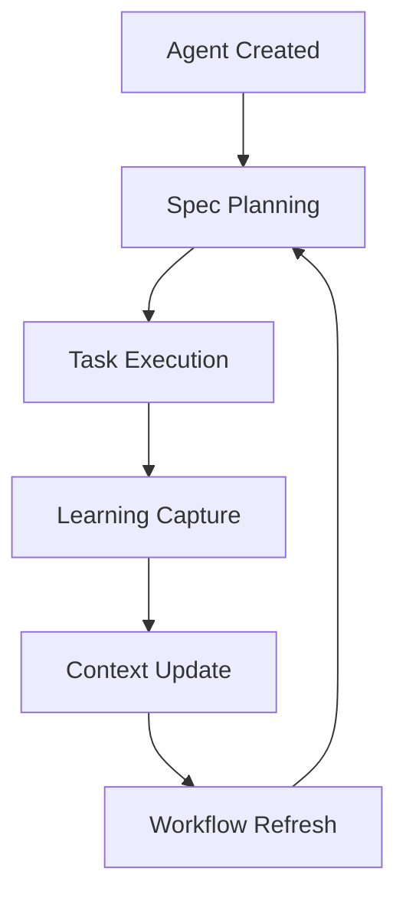

# Agent OS: Create Module Agent Command

The `/create-module-agent` command provides a streamlined interface for creating specialized AI agents within the Agent OS ecosystem. It automates the creation of module-specific agents with optimized context, documentation references, and integration with the enhanced create-specs workflow.

## Table of Contents

- [Quick Start](#quick-start)
- [Command Syntax](#command-syntax)
- [Features](#features)
- [Usage Examples](#usage-examples)
- [Configuration](#configuration)
- [Integration with Enhanced Specs](#integration-with-enhanced-specs)
- [Troubleshooting](#troubleshooting)

## Quick Start

### Basic Usage

```bash
# Create a simple module agent
/create-module-agent finance-analytics

# Create an agent with specific type and repositories
/create-module-agent devops --type infrastructure --repos assetutilities,pyproject-starter
```

### Interactive Mode

```bash
# Start interactive mode for guided setup
agent-os --interactive

# Or use the command directly
python -m assetutilities.agent_os.commands.create_module_agent
```

## Command Syntax

```
/create-module-agent <module_name> [options]
```

### Arguments

- `module_name` (required): Name of the module agent to create

### Options

| Option | Description | Default | Example |
|--------|-------------|---------|---------|
| `--type <type>` | Agent type | `general-purpose` | `--type infrastructure` |
| `--repos <list>` | Comma-separated repository list | `[]` | `--repos assetutilities,pyproject-starter` |
| `--context-cache <bool>` | Enable context caching | `true` | `--context-cache false` |
| `--templates <list>` | Comma-separated template list | `[]` | `--templates monitoring,api` |

### Agent Types

- `general-purpose`: Default multi-purpose agent
- `infrastructure`: DevOps and infrastructure management
- `api`: API development and integration
- `data-processing`: Data analysis and transformation
- `monitoring`: System monitoring and alerting
- `security`: Security analysis and compliance
- `custom`: User-defined custom type

## Features

### 🚀 Enhanced Specs Integration

Automatic integration with the enhanced create-specs workflow:

- **Prompt Evolution Tracking**: Learn from interactions to optimize responses
- **Executive Summary Generation**: Business impact analysis for all tasks
- **Mermaid Diagrams**: Auto-generated visual documentation
- **Cross-Repository References**: Seamless integration with shared components
- **Task Tracking**: Intelligent task decomposition and progress monitoring

### 🔧 Automated Structure Generation

Creates a complete agent structure:

```
agents/<module_name>/
├── agent.yaml                 # Agent configuration
├── context/
│   ├── repository/            # Repository documentation
│   ├── external/              # External API docs
│   └── optimized/             # Cached context
├── templates/
│   ├── responses/             # Response templates
│   └── prompts/               # Prompt templates
└── workflows/
    └── enhanced_specs.yaml    # Workflow integration
```

### 📚 Documentation Integration

Automatic scanning and linking of:

- Repository documentation
- API specifications
- External resources
- Cross-repository references

### 🔄 Workflow Refresh System

Continuous learning and adaptation:

- **Change Detection**: Monitor implementation changes
- **Automatic Updates**: Keep specs current with code
- **Learning Integration**: Capture and apply insights
- **Performance Optimization**: Continuous improvement

## Usage Examples

### Example 1: Finance Analytics Agent

```bash
/create-module-agent finance-analytics \
  --type data-processing \
  --repos worldenergydata,assetutilities
```

**Creates:**
- Data processing agent specialized for finance
- Integration with worldenergydata and assetutilities repositories
- Optimized context for financial data analysis
- Templates for financial reporting and analysis

### Example 2: Infrastructure Agent

```bash
/create-module-agent devops \
  --type infrastructure \
  --repos assetutilities,pyproject-starter \
  --templates monitoring,deployment
```

**Creates:**
- Infrastructure management agent
- Cross-repository access to utilities and project templates
- Monitoring and deployment template integration
- DevOps workflow optimization

### Example 3: API Development Agent

```bash
/create-module-agent user-api \
  --type api \
  --repos assetutilities \
  --templates rest-api,validation
```

**Creates:**
- API development specialized agent
- REST API and validation templates
- Integration with utility libraries
- API documentation and testing workflows

### Example 4: Interactive Setup

```bash
# Start interactive mode
agent-os --interactive

# Follow prompts:
# Module name: customer-service
# Agent type: [1] general-purpose
# Include repositories? y
# Include assetutilities? y
# Include custom repository? n
# Use custom templates? n
# Enable context caching? y
```

## Configuration

### Agent Configuration (agent.yaml)

```yaml
name: finance-analytics
type: data-processing
version: 1.0.0
created_at: 2025-08-06T10:00:00
description: AI agent for finance-analytics module

repositories:
  - worldenergydata
  - assetutilities

templates:
  - financial-analysis
  - reporting

context_optimization:
  enabled: true
  cache_ttl: 3600
  embedding_model: sentence-transformers/all-MiniLM-L6-v2

workflows:
  enhanced_specs:
    enabled: true
    auto_update: true
    learning: true
```

### Enhanced Specs Integration (workflows/enhanced_specs.yaml)

```yaml
integration:
  type: enhanced_create_specs
  version: 2.0.0
  source: "@assetutilities:src/modules/agent-os/enhanced-create-specs/"

features:
  prompt_evolution: true
  executive_summaries: true
  mermaid_diagrams: true
  task_tracking: true
  cross_repo_references: true

workflow_refresh:
  enabled: true
  triggers: ["file_change", "time_interval", "manual"]
  interval: "1w"
```

## Integration with Enhanced Specs

### Automatic Workflow Connection

When you create a module agent, it automatically integrates with the enhanced create-specs workflow:

1. **Spec Creation**: Use `/create-spec` with agent-optimized context
2. **Task Execution**: Enhanced task breakdown and monitoring
3. **Progress Tracking**: Real-time progress and performance metrics
4. **Learning Integration**: Continuous improvement from execution

### Workflow Refresh Cycle



### Cross-Repository Integration

Agents can seamlessly reference and integrate with:

- Shared utility libraries
- Common patterns and templates
- Cross-project documentation
- Version-compatible components

## CLI Interface

### Command Line Usage

```bash
# Direct command execution
agent-os create-module-agent my-agent --type api

# Interactive mode
agent-os --interactive

# Help and documentation
agent-os create-module-agent --help
agent-os --help
```

### Progress Indicators

The CLI provides visual feedback during creation:

```
⠋ Creating module agent...
✅ Successfully created module agent 'my-agent' at /path/to/agents/my-agent
```

### Error Handling

Clear error messages and recovery suggestions:

```bash
❌ Invalid module name: my@agent
💡 Module names should contain only letters, numbers, hyphens, and underscores.

❌ Error creating module agent: Permission denied
💡 Check write permissions for the agents directory.
```

## Troubleshooting

### Common Issues

#### 1. Module Name Validation

**Problem**: `Invalid module name` error

**Solution**: Use only alphanumeric characters, hyphens, and underscores:
- ✅ `finance-analytics`
- ✅ `user_api` 
- ✅ `module123`
- ❌ `my@module`
- ❌ `module with spaces`

#### 2. Repository Access

**Problem**: Repository references not working

**Solutions**:
- Ensure repository names are correct and accessible
- Check cross-repository configuration in `.agent-os/cross-repo-config.yaml`
- Verify network connectivity for external repositories

#### 3. Context Caching Issues

**Problem**: Context not loading or updating

**Solutions**:
- Clear context cache: `rm -rf agents/<module>/context/optimized/`
- Regenerate context: Re-run the create command
- Check cache permissions and disk space

#### 4. Template Loading

**Problem**: Custom templates not found

**Solutions**:
- Verify template names match available templates
- Check template directory permissions
- Use `--templates help` to list available templates

### Debug Mode

Enable verbose logging for troubleshooting:

```bash
agent-os create-module-agent my-agent --verbose
```

### Getting Help

- **Command help**: `agent-os create-module-agent --help`
- **Interactive help**: Type `help` in interactive mode
- **Documentation**: Check the `docs/` directory
- **Issues**: Report problems in the project issue tracker

## Advanced Usage

### Custom Agent Types

Define custom agent types by creating configuration templates:

```yaml
# templates/custom-agent.yaml
type: custom-analysis
description: Custom data analysis agent
context_optimization:
  specialized: true
  domain_specific: true
workflows:
  custom_patterns: true
```

### Batch Agent Creation

Create multiple agents programmatically:

```python
from assetutilities.agent_os.commands.create_module_agent import CreateModuleAgentCommand

command = CreateModuleAgentCommand()

agents_config = [
    {"name": "finance", "type": "data-processing", "repos": ["worldenergydata"]},
    {"name": "devops", "type": "infrastructure", "repos": ["assetutilities"]},
    {"name": "api", "type": "api", "repos": ["pyproject-starter"]},
]

for config in agents_config:
    result = command.execute([
        "/create-module-agent", config["name"],
        "--type", config["type"],
        "--repos", ",".join(config["repos"])
    ])
    print(f"Created {config['name']}: {result.success}")
```

### Integration with External Tools

Integrate agent creation with external workflows:

```bash
# CI/CD pipeline integration
if [ "$BRANCH" == "main" ]; then
  agent-os create-module-agent production-monitor \
    --type monitoring \
    --repos $MONITORED_REPOS
fi

# Development workflow
make create-agent MODULE=new-feature TYPE=api REPOS=assetutilities
```

## Performance Optimization

### Context Caching

Enable and optimize context caching:

```yaml
context_optimization:
  enabled: true
  cache_ttl: 3600      # 1 hour cache
  max_cache_size: 100  # MB
  compression: true
  embedding_cache: true
```

### Repository Filtering

Optimize repository access:

```yaml
repositories:
  assetutilities:
    include_paths: ["src/", "docs/"]
    exclude_paths: ["tests/", ".git/"]
    max_file_size: 1048576  # 1MB
```

### Memory Management

Configure memory usage:

```yaml
memory:
  max_context_size: 10485760  # 10MB
  gc_threshold: 0.8
  cleanup_interval: 3600      # 1 hour
```

---

**Need more help?** Check the [Developer Guide](./developer_guide.md) or open an issue in the project repository.