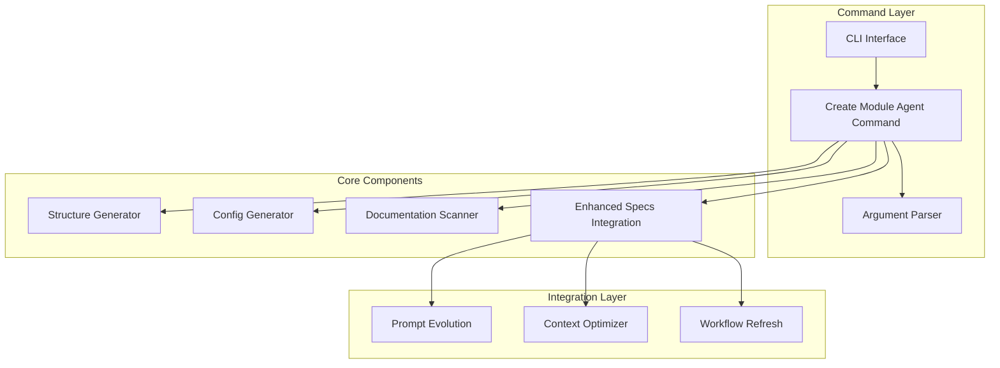

# Developer Guide: Create Module Agent

This guide provides technical documentation for developers working with the `/create-module-agent` command implementation.

## Architecture Overview

The create module agent system is composed of several key components that work together to provide a comprehensive agent creation and management solution.



## Core Components

### 1. CreateModuleAgentCommand

**Location**: `src/assetutilities/agent_os/commands/create_module_agent.py`

The main command class that orchestrates the agent creation process.

```python
class CreateModuleAgentCommand:
    """Main command implementation."""
    
    def __init__(self, base_dir: Optional[Path] = None):
        self.base_dir = base_dir or Path.cwd()
        self.agents_dir = self.base_dir / "agents"
        
        # Initialize components
        self.parser = ArgumentParser()
        self.structure_generator = AgentStructureGenerator(self.agents_dir)
        self.config_generator = ConfigGenerator()
        self.doc_scanner = DocumentationScanner()
```

#### Key Methods

- `execute(args: List[str]) -> CommandResult`: Main execution method
- `_create_workflow_integration()`: Sets up enhanced specs integration
- `_create_default_templates()`: Creates default response and prompt templates
- `_save_documentation_references()`: Saves repository documentation references

### 2. Enhanced Specs Integration

**Location**: `src/assetutilities/agent_os/integration/enhanced_specs.py`

Provides integration with the enhanced create-specs workflow system.

```python
class EnhancedSpecsIntegration:
    """Integrates agents with enhanced create-specs workflow."""
    
    def create_enhanced_specs_config(self, module_name: str, repos: List[str]) -> Dict[str, Any]:
        """Create enhanced specs configuration for an agent."""
        
    def setup_workflow_refresh(self, module_name: str) -> Dict[str, Any]:
        """Setup workflow refresh integration."""
        
    def integrate(self, module_name: str, repos: List[str]) -> Dict[str, Any]:
        """Perform complete integration with enhanced specs workflow."""
```

### 3. Prompt Evolution Tracking

**Location**: `src/assetutilities/agent_os/integration/prompt_evolution.py`

Tracks and optimizes prompt performance over time.

```python
class PromptEvolutionTracker:
    """Track and optimize prompt evolution for agents."""
    
    def track_prompt(self, prompt_content: str, template_name: str, 
                    parameters: Dict[str, Any], response_quality: float,
                    execution_time: float, tokens_used: int) -> None:
        """Track a prompt execution."""
        
    def _suggest_improvements(self, prompt_content: str, response_quality: float,
                            execution_time: float, tokens_used: int, 
                            success: bool) -> List[str]:
        """Suggest improvements based on prompt performance."""
```

### 4. CLI Interface

**Location**: `src/assetutilities/agent_os/cli/main.py`

Provides command-line interface with interactive mode support.

```python
class AgentOSCLI:
    """Main CLI class for Agent OS commands."""
    
    def run_interactive(self) -> int:
        """Run in interactive mode."""
        
    def execute_create_module_agent(self, args: List[str]) -> int:
        """Execute create-module-agent command."""
```

## Data Structures

### ParsedArgs

```python
@dataclass
class ParsedArgs:
    """Parsed command arguments."""
    module_name: str
    type: str
    repos: List[str]
    context_cache: bool
    templates: List[str]
```

### CommandResult

```python
@dataclass
class CommandResult:
    """Result of command execution."""
    success: bool
    message: str
    data: Optional[Dict[str, Any]] = None
```

### PromptEntry

```python
@dataclass
class PromptEntry:
    """Single prompt evolution entry."""
    timestamp: str
    prompt_content: str
    template_name: str
    parameters: Dict[str, Any]
    response_quality: float
    execution_time: float
    tokens_used: int
    improvements: List[str]
    context_size: int
    success: bool
```

## Configuration Files

### Agent Configuration (agent.yaml)

```yaml
name: module_name
type: agent_type
version: 1.0.0
created_at: ISO_TIMESTAMP
description: Agent description

repositories: []
templates: []

context_optimization:
  enabled: true
  cache_ttl: 3600
  embedding_model: sentence-transformers/all-MiniLM-L6-v2

workflows:
  enhanced_specs:
    enabled: true
    auto_update: true
    learning: true

documentation:
  internal_sources: []
  external_sources: []
  auto_refresh: true
```

### Enhanced Specs Integration (workflows/enhanced_specs_full.yaml)

```yaml
integration:
  type: enhanced_create_specs
  version: 2.0.0
  source: "@assetutilities:src/modules/agent-os/enhanced-create-specs/"

configuration:
  agent_module: module_name
  agent_path: "@agents/module_name/"
  features:
    prompt_evolution: true
    executive_summaries: true
    mermaid_diagrams: true
    task_tracking: true
    cross_repo_references: true
  repositories: []

workflow_refresh:
  enabled: true
  module: module_name
  triggers:
    - type: file_change
      paths: ["src/", "specs/"]
    - type: time_interval
      interval: "1w"
  actions:
    - detect_changes
    - update_spec
    - validate_updates
    - execute_if_changed

hooks:
  pre_spec_creation:
    handler: validate_context
    actions: [load_agent_context, resolve_references, prepare_templates]
  post_spec_creation:
    handler: update_references
    actions: [update_cross_references, generate_diagrams, create_summaries]

metadata:
  created_at: ISO_TIMESTAMP
  module_name: module_name
  repositories: []
  version: 1.0.0
```

## File Structure

The generated agent structure follows this pattern:

```
agents/<module_name>/
├── agent.yaml                         # Main agent configuration
├── context/
│   ├── repository/
│   │   ├── internal.md                # Internal repository documentation  
│   │   └── references.yaml            # Repository references
│   ├── external/
│   │   ├── web_sources.yaml          # External web documentation
│   │   └── api_docs.md               # External API documentation
│   ├── optimized/
│   │   ├── cache.json                # Cached context
│   │   └── embeddings.bin            # Vector embeddings
│   ├── prompt_evolution.md           # Prompt performance tracking
│   └── prompt_evolution.json         # Prompt history data
├── templates/
│   ├── responses/
│   │   └── default.md                # Default response template
│   └── prompts/
│       └── default.md                # Default prompt template
└── workflows/
    ├── enhanced_specs.yaml           # Simple workflow config
    ├── enhanced_specs_full.yaml      # Complete integration config
    └── refresh_config.json           # Workflow refresh configuration
```

## Extension Points

### Custom Agent Types

Add new agent types by extending the type validation:

```python
# In ArgumentParser._validate_module_name()
VALID_AGENT_TYPES = {
    'general-purpose': 'Multi-purpose agent',
    'infrastructure': 'DevOps and infrastructure',
    'api': 'API development',
    'data-processing': 'Data analysis',
    'monitoring': 'System monitoring',
    'security': 'Security analysis',
    'custom': 'User-defined type'
}
```

### Custom Templates

Add template support in `_create_default_templates()`:

```python
def _create_default_templates(self, agent_dir: Path, agent_type: str) -> None:
    """Create default templates for the agent."""
    
    # Load custom templates based on agent type
    if agent_type in CUSTOM_TEMPLATES:
        template_config = CUSTOM_TEMPLATES[agent_type]
        self._create_custom_templates(agent_dir, template_config)
    else:
        self._create_standard_templates(agent_dir, agent_type)
```

### Integration Hooks

Add custom integration hooks:

```python
class CustomIntegrationHook:
    """Custom integration hook."""
    
    def pre_agent_creation(self, config: Dict[str, Any]) -> Dict[str, Any]:
        """Execute before agent creation."""
        # Custom logic here
        return config
    
    def post_agent_creation(self, agent_dir: Path, config: Dict[str, Any]) -> None:
        """Execute after agent creation."""
        # Custom logic here
        pass
```

## Testing

### Unit Tests

Located in `tests/agent_os/commands/test_create_module_agent.py`:

- `TestArgumentParser`: Test argument parsing logic
- `TestAgentStructureGenerator`: Test directory structure creation
- `TestConfigGenerator`: Test configuration file generation
- `TestCreateModuleAgentCommand`: Test main command execution

### Integration Tests

Located in `tests/agent_os/integration/test_enhanced_specs_integration.py`:

- `TestEnhancedSpecsIntegration`: Test enhanced specs integration
- `TestPromptEvolutionTracker`: Test prompt evolution tracking
- `TestEndToEndIntegration`: Test complete workflow integration

### CLI Tests

Located in `tests/agent_os/cli/test_cli_integration.py`:

- `TestCLIIntegration`: Test CLI functionality
- `TestInteractiveMode`: Test interactive mode
- `TestProgressIndicators`: Test progress display
- `TestCLIErrorHandling`: Test error scenarios

### Running Tests

```bash
# Run all tests
pytest tests/agent_os/

# Run specific test file
pytest tests/agent_os/commands/test_create_module_agent.py

# Run with coverage
pytest tests/agent_os/ --cov=src/assetutilities/agent_os --cov-report=html

# Run integration tests only
pytest tests/agent_os/integration/
```

## Error Handling

### Validation Errors

```python
def validate_module_name(self, name: str) -> bool:
    """Validate module name format."""
    if not name:
        raise ValueError("Module name cannot be empty")
    
    if not re.match(r'^[a-zA-Z0-9_-]+$', name):
        raise ValueError(f"Invalid module name: {name}. Use only letters, numbers, hyphens, and underscores.")
    
    return True
```

### File System Errors

```python
def create_structure(self, module_name: str) -> Path:
    """Create agent folder structure with error handling."""
    try:
        agent_dir = self.base_dir / module_name
        agent_dir.mkdir(parents=True, exist_ok=True)
        return agent_dir
    except PermissionError:
        raise RuntimeError(f"Permission denied creating directory: {agent_dir}")
    except OSError as e:
        raise RuntimeError(f"Failed to create directory: {e}")
```

### Integration Errors

```python
def integrate(self, module_name: str, repos: List[str]) -> Dict[str, Any]:
    """Perform complete integration with error handling."""
    try:
        # Integration logic
        config = self.create_enhanced_specs_config(module_name, repos)
        self.save_config(config)
        return config
    except Exception as e:
        raise RuntimeError(f"Integration failed: {e}")
```

## Performance Considerations

### Context Caching

```python
class ContextOptimizer:
    """Optimize and cache agent context for better performance."""
    
    def __init__(self, agent_path: Path):
        self.cache_dir = agent_path / "context" / "optimized"
        self.cache_ttl = 3600  # 1 hour
        
    def get_cached_context(self, key: str) -> Optional[Dict[str, Any]]:
        """Retrieve cached context if valid."""
        cache_file = self.cache_dir / f"{key}.json"
        
        if not cache_file.exists():
            return None
            
        # Check cache age
        if time.time() - cache_file.stat().st_mtime > self.cache_ttl:
            return None
            
        with open(cache_file, 'r') as f:
            return json.load(f)
```

### Memory Management

```python
def cleanup_old_entries(self, max_entries: int = 100) -> None:
    """Keep only the most recent prompt entries."""
    if len(self.prompt_history) > max_entries:
        self.prompt_history = self.prompt_history[-max_entries:]
        self._save_history()
```

### Async Operations

For future enhancements, consider async operations for I/O intensive tasks:

```python
async def scan_repositories_async(self, repos: List[str]) -> Dict[str, Dict[str, Any]]:
    """Asynchronously scan repositories for documentation."""
    tasks = [self.scan_single_repo(repo) for repo in repos]
    results = await asyncio.gather(*tasks)
    return dict(zip(repos, results))
```

## Debugging

### Debug Logging

Enable debug logging:

```python
import logging

logging.basicConfig(
    level=logging.DEBUG,
    format='%(asctime)s - %(name)s - %(levelname)s - %(message)s'
)

logger = logging.getLogger(__name__)

def execute(self, args: List[str]) -> CommandResult:
    """Execute with debug logging."""
    logger.debug(f"Executing create-module-agent with args: {args}")
    
    try:
        # Command execution
        logger.debug("Command completed successfully")
        return result
    except Exception as e:
        logger.error(f"Command failed: {e}", exc_info=True)
        raise
```

### Debugging Tools

- **Print debugging**: Use strategic print statements
- **Pdb**: Python debugger for step-through debugging
- **IDE debugging**: Use IDE breakpoints and watch variables
- **File system inspection**: Check generated files and directories

### Common Debug Scenarios

1. **Configuration issues**: Check YAML file generation and parsing
2. **Path resolution**: Verify file and directory paths are correct
3. **Integration failures**: Check network connectivity and repository access
4. **Permission errors**: Verify write permissions for target directories

## Future Enhancements

### Planned Features

1. **Advanced Context Optimization**
   - Semantic chunking of documentation
   - Vector embeddings for similarity search
   - Context summarization

2. **Enhanced Template System**
   - Template inheritance
   - Dynamic template generation
   - Template marketplace integration

3. **Workflow Automation**
   - Automatic spec generation from code analysis
   - CI/CD pipeline integration
   - Automated testing and validation

4. **Performance Improvements**
   - Async I/O operations
   - Parallel processing
   - Caching optimizations

### Contributing

To contribute to the create-module-agent system:

1. **Fork the repository** and create a feature branch
2. **Write tests** for new functionality
3. **Update documentation** including this developer guide
4. **Follow code style** guidelines in `.agent-os/standards/code-style.md`
5. **Submit a pull request** with clear description of changes

### Code Style Guidelines

- Use type hints for all function parameters and return values
- Follow PEP 8 style guidelines
- Use descriptive variable and function names
- Add docstrings for all public methods
- Include error handling and validation
- Write comprehensive tests for new functionality

---

**Questions?** Open an issue in the project repository or check the main documentation.