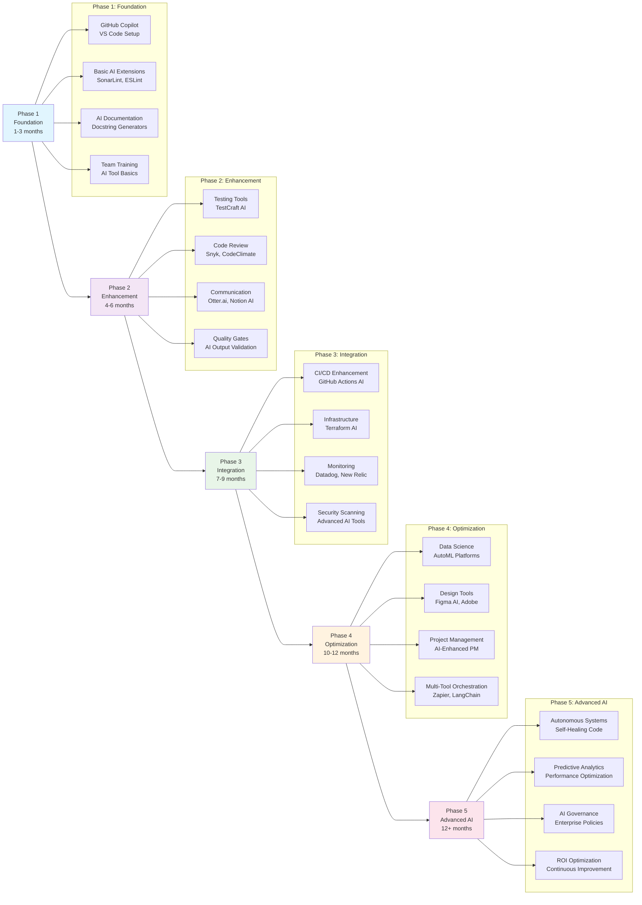
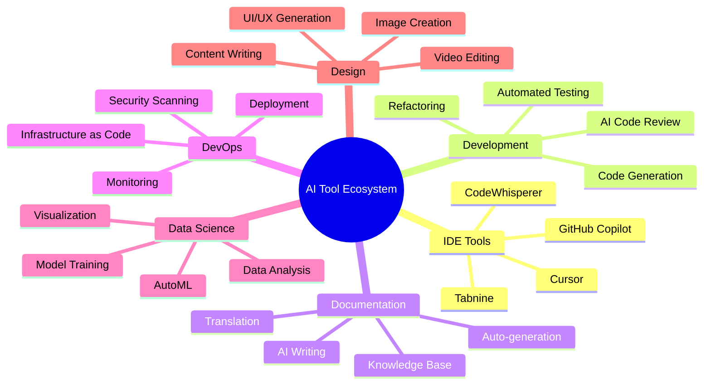

# AI Tool Ecosystem

## Table of Contents

1. [Summary](#summary)
2. [Overview](#overview)
3. [IDE & Code Editors](#ide--code-editors)
4. [Development Tools](#development-tools)
5. [Testing & Quality Assurance](#testing--quality-assurance)
6. [Documentation & Communication](#documentation--communication)
7. [DevOps & Infrastructure](#devops--infrastructure)
8. [Data Science & Analytics](#data-science--analytics)
9. [Design & Content Creation](#design--content-creation)
10. [Project Management](#project-management)
11. [Security & Compliance](#security--compliance)
12. [Integration Patterns](#integration-patterns)
13. [Tool Selection Guide](#tool-selection-guide)

## Summary

The AI Tool Ecosystem represents a comprehensive framework for integrating artificial intelligence across the entire software development lifecycle. This guide provides a structured approach to adopting AI tools, starting with basic IDE assistance and progressing to advanced enterprise-wide AI integration.

### Phased AI Tool Ecosystem Implementation



### Implementation Timeline & Priorities

| Phase | Duration | Primary Focus | Key Tools | Success Metrics |
|-------|----------|---------------|-----------|-----------------|
| **Phase 1** | 1-3 months | IDE & Basic AI | GitHub Copilot, VS Code Extensions | 30% faster coding, team adoption >80% |
| **Phase 2** | 4-6 months | Testing & Quality | AI Test Generation, Code Review | 50% reduction in bugs, automated testing |
| **Phase 3** | 7-9 months | DevOps Integration | CI/CD AI, Infrastructure Tools | Deployment frequency +200%, reliability +95% |
| **Phase 4** | 10-12 months | Advanced Features | Data Science, Design AI | Complete workflow automation |
| **Phase 5** | 12+ months | Enterprise AI | Autonomous Systems, Governance | Self-optimizing development processes |

### Quick Start Checklist

#### Phase 1 - Foundation (Start Here)
- [ ] Install GitHub Copilot in VS Code (`Ctrl+Shift+X`)
- [ ] Configure GitHub Copilot Chat (`Ctrl+Shift+I`)
- [ ] Add AI-powered linting (SonarLint, ESLint)
- [ ] Set up AI documentation tools
- [ ] Train team on basic AI assistance

#### Critical Success Factors
1. **Start Small**: Begin with IDE tools before expanding
2. **Measure Impact**: Track productivity gains and tool adoption
3. **Team Buy-in**: Ensure developers see immediate value
4. **Quality Gates**: Validate AI outputs before production
5. **Iterative Approach**: Gradually expand AI tool usage

### ROI Expectations by Phase

**Phase 1 ROI**: 20-30% productivity increase, 3-month payback  
**Phase 2 ROI**: 40-50% quality improvement, 6-month payback  
**Phase 3 ROI**: 200% deployment efficiency, 9-month payback  
**Phase 4 ROI**: Complete workflow automation, 12-month payback  
**Phase 5 ROI**: Autonomous development processes, ongoing optimization

## Overview

The AI tool ecosystem encompasses a wide range of artificial intelligence-powered applications that enhance software development, productivity, and business operations. This guide categorizes AI tools by their primary use cases and provides practical examples for implementation.

### Ecosystem Map



## IDE & Code Editors

### Primary AI-Powered IDEs

#### GitHub Copilot (Microsoft)
**Category**: Code completion and generation  
**Best For**: General-purpose programming, all languages  
**Key Features**:
- Real-time code suggestions
- Whole function generation
- Comment-to-code conversion
- Multi-language support

**Installation & Setup**:
```bash
# VS Code Extension
# 1. Open VS Code (Ctrl+Shift+X)
# 2. Search "GitHub Copilot"
# 3. Install and authenticate with GitHub account
```

**Usage Examples**:
```python
# q: What is the purpose of this code?
# a: Function to calculate asset depreciation using different methods

def calculate_depreciation(asset_value, useful_life, method="straight_line"):
    """
    Calculate asset depreciation using various methods
    """
    # Copilot will suggest implementation based on context
    if method == "straight_line":
        return asset_value / useful_life
    elif method == "declining_balance":
        # AI suggests declining balance calculation
        return asset_value * 0.2  # 20% declining rate
```

#### GitHub Copilot Chat
**Category**: Conversational AI for development  
**Activation**: `Ctrl+Shift+I` in VS Code  
**Use Cases**:
- Explain complex code
- Debug issues
- Generate test cases
- Refactor suggestions

**Example Workflow**:
```bash
# Chat commands
/explain    # Explain selected code
/fix        # Suggest fixes for errors
/test       # Generate unit tests
/doc        # Create documentation
```

#### Tabnine
**Category**: AI code completion  
**Pricing**: Free tier + Pro versions  
**Strengths**:
- Privacy-focused (on-premise option)
- Team learning capabilities
- IDE-agnostic

```javascript
// Tabnine example - JavaScript
function processAssetData(assets) {
    // Tabnine suggests based on function name and context
    return assets
        .filter(asset => asset.status === 'active')
        .map(asset => ({
            id: asset.id,
            value: asset.current_value,
            depreciation: calculateDepreciation(asset)
        }));
}
```

#### Amazon CodeWhisperer
**Category**: ML-powered code generation  
**Integration**: VS Code, IntelliJ, CLI  
**Features**:
- Real-time suggestions
- Security scanning
- Comment-driven development

#### Cursor
**Category**: AI-first code editor  
**Built on**: VS Code foundation  
**Unique Features**:
- Built-in AI chat
- Codebase-aware suggestions
- Natural language editing

### IDE Extensions & Plugins

#### AI-Powered Extensions for VS Code

**Code Analysis & Review**:
- **SonarLint**: AI-enhanced code quality
- **ESLint**: AI-suggested rule configurations
- **CodeGuru Reviewer**: Amazon's AI code review

**Documentation Generation**:
- **AI Docstring Generator**: Python documentation
- **Better Comments**: AI-enhanced comment formatting
- **Auto Comment Blocks**: Intelligent comment generation

**Testing Assistance**:
- **Test Pilot**: AI-generated test cases
- **Jest Runner**: AI-enhanced test execution
- **Coverage Gutters**: AI-suggested coverage improvements

### Configuration Examples

#### VS Code Settings for AI Tools
```json
{
    "github.copilot.enable": {
        "*": true,
        "yaml": false,
        "plaintext": false
    },
    "github.copilot.inlineSuggest.enable": true,
    "tabnine.experimentalAutoImports": true,
    "codewhisperer.includeSuggestionsWithCodeReferences": false
}
```

#### Multi-AI Setup Workflow
```bash
# Install multiple AI assistants
code --install-extension GitHub.copilot
code --install-extension TabNine.tabnine-vscode
code --install-extension AmazonWebServices.aws-toolkit-vscode

# Configure priorities in settings.json
```

## Development Tools

### Code Generation & Automation

#### OpenAI Codex-based Tools
**Examples**:
- **Replit Ghostwriter**: Browser-based coding assistant
- **CodeT5**: Text-to-code generation
- **Polycoder**: Open-source alternative

#### Specialized Code Generators

**API Development**:
- **Postman AI**: API test generation
- **Insomnia Designer**: AI-powered API design
- **Swagger Codegen AI**: Enhanced code generation

**Database Tools**:
- **DataGrip AI**: Intelligent SQL completion
- **Supabase AI**: Database schema generation
- **Prisma AI**: ORM code generation

### Code Review & Analysis

#### AI-Powered Code Review Platforms

**DeepCode (Snyk)**:
```yaml
# .snyk file configuration
version: v1.0.0
language-settings:
  python:
    patterns:
      - "**/*.py"
    exclude:
      - "**/tests/**"
ai-suggestions:
  security: high
  performance: medium
  maintainability: high
```

**CodeClimate AI**:
- Automated code quality analysis
- Technical debt identification
- Maintainability scoring

**Codacy AI**:
- Pull request analysis
- Security vulnerability detection
- Code duplication identification

### Refactoring Tools

#### AI-Enhanced Refactoring

**IntelliJ IDEA AI**:
- Intelligent code restructuring
- Variable name suggestions
- Method extraction recommendations

**ReSharper AI**:
- C# code improvements
- Performance optimization suggestions
- Architecture recommendations

## Testing & Quality Assurance

### Automated Test Generation

#### Unit Test Generation Tools

**TestCraft AI**:
```python
# AI-generated test example
import pytest
from asset_manager import AssetCalculator

class TestAssetCalculator:
    """AI-generated test suite for AssetCalculator"""
    
    def test_depreciation_calculation(self):
        # AI analyzes function and generates comprehensive tests
        calculator = AssetCalculator()
        result = calculator.calculate_depreciation(10000, 5, "straight_line")
        assert result == 2000
        
    def test_edge_cases(self):
        # AI identifies edge cases automatically
        calculator = AssetCalculator()
        with pytest.raises(ValueError):
            calculator.calculate_depreciation(-1000, 5)
```

**Facebook Sapienz**:
- Automated Android app testing
- AI-driven test case generation
- Crash detection and analysis

#### Integration Testing

**Mabl**:
- AI-powered browser testing
- Self-healing test scripts
- Visual regression detection

**Applitools**:
- Visual AI testing
- Cross-browser compatibility
- Responsive design validation

### Performance Testing

**Load Testing AI Tools**:
- **K6 with AI**: Intelligent load pattern generation
- **BlazeMeter AI**: Performance bottleneck identification
- **NeoLoad AI**: Realistic user behavior simulation

## Documentation & Communication

### AI Writing Assistants

#### Technical Documentation

**GitBook AI**:
- Automatic documentation generation
- Content suggestions
- Multi-language support

**Notion AI**:
```markdown
# AI-generated documentation example
## Asset Utilities Module

### Overview
The Asset Utilities module provides comprehensive functionality for managing, calculating, and analyzing asset data across various business contexts.

### Key Features
- Depreciation calculations using multiple methods
- Asset lifecycle tracking
- Performance analytics and reporting
- Integration with external financial systems

### Usage Examples
// AI suggests contextual examples based on codebase
```

**Confluence AI**:
- Smart templates
- Content recommendations
- Automated summaries

#### Code Documentation

**AI Docstring Generators**:
```python
def calculate_net_present_value(cash_flows, discount_rate):
    """
    Calculate the Net Present Value (NPV) of a series of cash flows.
    
    This function computes the NPV using the formula:
    NPV = Σ(CF_t / (1 + r)^t) where t ranges from 0 to n
    
    Args:
        cash_flows (list[float]): Series of cash flows over time periods
        discount_rate (float): The discount rate (as decimal, e.g., 0.1 for 10%)
        
    Returns:
        float: The calculated Net Present Value
        
    Raises:
        ValueError: If discount_rate is negative or cash_flows is empty
        
    Examples:
        >>> calculate_net_present_value([-1000, 300, 400, 500], 0.1)
        85.96
        
    Note:
        Negative cash flows typically represent initial investments,
        while positive flows represent returns or income.
    """
    # AI-generated comprehensive docstring
```

### Communication Tools

#### Meeting & Collaboration

**Otter.ai**:
- Meeting transcription
- Action item extraction
- Summary generation

**Grain**:
- Video call insights
- Automatic note-taking
- Key moment identification

**Microsoft Copilot (Teams)**:
- Meeting summaries
- Chat assistance
- Document collaboration

## DevOps & Infrastructure

### Infrastructure as Code (IaC)

#### AI-Enhanced IaC Tools

**Terraform with AI**:
```hcl
# AI-suggested Terraform configuration
resource "aws_instance" "web_server" {
  # AI recommends optimal instance type based on requirements
  ami           = data.aws_ami.ubuntu.id
  instance_type = "t3.medium"  # AI-optimized for cost/performance
  
  # AI-generated security group rules
  vpc_security_group_ids = [aws_security_group.web.id]
  
  # AI-suggested monitoring configuration
  monitoring = true
  
  tags = {
    Name        = "WebServer"
    Environment = var.environment
    # AI adds compliance tags automatically
    Compliance  = "SOC2"
    Backup      = "daily"
  }
}
```

**Pulumi AI**:
- Natural language to infrastructure code
- Best practice recommendations
- Cost optimization suggestions

### CI/CD Pipeline Enhancement

#### AI-Powered Pipeline Tools

**GitHub Actions with AI**:
```yaml
name: AI-Enhanced CI/CD Pipeline
on: [push, pull_request]

jobs:
  ai-code-analysis:
    runs-on: ubuntu-latest
    steps:
      - uses: actions/checkout@v3
      
      # AI-powered code quality analysis
      - name: AI Code Review
        uses: github/super-linter@v4
        env:
          DEFAULT_BRANCH: main
          GITHUB_TOKEN: ${{ secrets.GITHUB_TOKEN }}
          
      # AI-generated test execution
      - name: AI Test Generation
        run: |
          python -m pytest --ai-generate-missing-tests
          python -m coverage run -m pytest
          python -m coverage report --ai-suggest-improvements
          
      # AI security scanning
      - name: AI Security Analysis
        uses: github/codeql-action/analyze@v2
        with:
          languages: python
          ai-enhanced: true
```

**Jenkins AI Plugins**:
- **Blue Ocean AI**: Intelligent pipeline visualization
- **Pipeline AI**: Smart build optimization
- **Test Results Analyzer AI**: Failure pattern detection

### Monitoring & Observability

#### AI-Driven Monitoring

**Datadog AI**:
- Anomaly detection
- Predictive alerts
- Root cause analysis

**New Relic AI**:
- Performance insights
- Error grouping and analysis
- Capacity planning

**Splunk AI**:
```python
# AI-generated Splunk query for asset monitoring
search_query = """
index=asset_management
| where asset_status="active"
| eval performance_score = if(utilization > 0.8, "high", 
                           if(utilization > 0.5, "medium", "low"))
| stats count by performance_score, asset_type
| eval ai_recommendation = case(
    performance_score="high", "Consider load balancing",
    performance_score="low", "Optimize resource allocation",
    1=1, "Monitor trends"
)
"""
```

## Data Science & Analytics

### AutoML Platforms

#### No-Code/Low-Code AI

**H2O.ai AutoML**:
```python
# AI-automated machine learning pipeline
import h2o
from h2o.automl import H2OAutoML

# Initialize H2O cluster
h2o.init()

# Load asset performance data
asset_data = h2o.import_file("asset_performance.csv")

# AI automatically selects features and models
aml = H2OAutoML(max_models=20, seed=1, max_runtime_secs=3600)
aml.train(
    x=["asset_type", "age", "maintenance_cost", "utilization"],
    y="failure_probability",
    training_frame=asset_data
)

# AI-generated model leaderboard
leaderboard = aml.leaderboard.as_data_frame()
print("AI-recommended best model:", leaderboard.head())
```

**DataRobot**:
- Automated feature engineering
- Model selection and tuning
- Deployment automation

**Azure AutoML**:
- Automated model training
- Hyperparameter optimization
- Model interpretability

### Data Analysis Tools

#### AI-Enhanced Analytics

**Tableau with Einstein AI**:
- Automatic insight discovery
- Natural language queries
- Predictive analytics

**Power BI AI**:
```python
# Power BI AI integration example
import pandas as pd
from azure.cognitiveservices.anomalydetector import AnomalyDetectorClient

# AI-powered anomaly detection in asset performance
def detect_asset_anomalies(asset_data):
    """
    AI detects unusual patterns in asset performance metrics
    """
    client = AnomalyDetectorClient(endpoint, credentials)
    
    # AI analyzes time series data
    request = {
        'series': asset_data.to_dict('records'),
        'granularity': 'daily',
        'sensitivity': 95
    }
    
    response = client.detect_entire_series(request)
    return response.is_anomaly
```

## Design & Content Creation

### UI/UX Design Tools

#### AI-Powered Design Assistants

**Figma AI**:
- Auto-layout suggestions
- Design system recommendations
- Accessibility improvements

**Adobe Sensei**:
- Automated asset tagging
- Content-aware fill
- Design optimization

**Uizard**:
- Sketch to design conversion
- AI-powered wireframing
- Design iteration suggestions

### Content Generation

#### AI Writing Tools

**GitHub Copilot for Documentation**:
```markdown
<!-- AI-generated technical documentation -->
# Asset Management API

## Overview
The Asset Management API provides comprehensive endpoints for managing organizational assets, including creation, updating, monitoring, and reporting capabilities.

## Authentication
```bash
# AI suggests authentication examples
curl -H "Authorization: Bearer YOUR_TOKEN" \
     -H "Content-Type: application/json" \
     https://api.assetmanager.com/v1/assets
```

## Endpoints

### GET /assets
Retrieve a list of all assets with optional filtering and pagination.

**Parameters:**
- `status` (optional): Filter by asset status (active, inactive, maintenance)
- `type` (optional): Filter by asset type (equipment, software, infrastructure)
- `page` (optional): Page number for pagination (default: 1)
- `limit` (optional): Number of items per page (default: 20)
```

**Copy.ai**:
- Marketing content generation
- Technical writing assistance
- Multi-language support

## Project Management

### AI-Enhanced PM Tools

#### Intelligent Project Planning

**Asana Intelligence**:
- Task priority recommendations
- Deadline predictions
- Resource allocation optimization

**Monday.com AI**:
```python
# AI-powered project timeline generation
project_config = {
    "name": "Asset Management System Upgrade",
    "scope": [
        "Database migration",
        "API modernization", 
        "Frontend redesign",
        "Security enhancements"
    ],
    "team_size": 8,
    "complexity": "high",
    "deadline": "2025-12-31"
}

# AI generates realistic timeline and milestones
ai_timeline = generate_project_timeline(project_config)
print("AI-recommended project phases:", ai_timeline.phases)
print("Critical path identified:", ai_timeline.critical_path)
```

**Jira with AI**:
- Story point estimation
- Sprint planning optimization
- Bug triage automation

### Risk Management

**AI Risk Assessment Tools**:
- **Palantir Foundry**: Predictive risk modeling
- **IBM Watson Risk**: Comprehensive risk analysis
- **Microsoft Project AI**: Schedule risk identification

## Security & Compliance

### AI Security Tools

#### Code Security Analysis

**Snyk AI**:
```yaml
# .snyk policy file with AI recommendations
version: v1.0.0
patch: {}
ignore: {}

# AI-suggested security policies
policies:
  - id: "SNYK-JS-LODASH-567746"
    action: "ignore"
    reason: "AI analysis: Low risk in current context"
    expires: "2025-12-31T23:59:59.999Z"
    
  - id: "SNYK-PYTHON-REQUESTS-1"
    action: "patch"
    reason: "AI recommends immediate patching - high severity"
```

**GitHub Advanced Security**:
- AI-powered vulnerability detection
- Secret scanning with ML
- Dependency analysis

#### Compliance Automation

**Compliance AI Tools**:
- **LogicGate**: AI-driven GRC platform
- **MetricStream**: Intelligent compliance monitoring
- **ServiceNow GRC AI**: Automated compliance workflows

## Integration Patterns

### AI Tool Orchestration

#### Multi-Tool Workflows

**Zapier AI**:
```python
# AI-orchestrated workflow example
workflow_config = {
    "trigger": "GitHub push",
    "actions": [
        {
            "tool": "GitHub Copilot",
            "action": "analyze_code_quality"
        },
        {
            "tool": "Snyk",
            "action": "security_scan"
        },
        {
            "tool": "Slack",
            "action": "notify_team",
            "condition": "if security_issues_found"
        }
    ]
}
```

**Microsoft Power Automate**:
- AI-driven workflow automation
- Cross-platform integration
- Intelligent decision making

### API Integration Strategies

#### AI Service Orchestration

**LangChain Integration**:
```python
from langchain.agents import initialize_agent
from langchain.tools import Tool

# AI agent that coordinates multiple development tools
def create_development_assistant():
    tools = [
        Tool(
            name="Code Review",
            description="Analyze code quality and suggest improvements",
            func=github_copilot_review
        ),
        Tool(
            name="Test Generation", 
            description="Generate comprehensive test suites",
            func=ai_test_generator
        ),
        Tool(
            name="Documentation",
            description="Create technical documentation",
            func=ai_doc_generator
        )
    ]
    
    agent = initialize_agent(
        tools, 
        llm, 
        agent="zero-shot-react-description",
        verbose=True
    )
    
    return agent

# Usage
dev_assistant = create_development_assistant()
result = dev_assistant.run(
    "Review my Python code, generate tests, and create documentation"
)
```

## Tool Selection Guide

### Decision Matrix

#### Choosing the Right AI Tools

**Evaluation Criteria**:
```python
ai_tool_evaluation = {
    "criteria": {
        "ease_of_use": {"weight": 0.2, "scale": "1-10"},
        "integration": {"weight": 0.25, "scale": "1-10"}, 
        "cost": {"weight": 0.15, "scale": "1-10"},
        "accuracy": {"weight": 0.25, "scale": "1-10"},
        "support": {"weight": 0.15, "scale": "1-10"}
    },
    "tools": {
        "github_copilot": {
            "ease_of_use": 9,
            "integration": 10,
            "cost": 7,
            "accuracy": 8,
            "support": 9,
            "total_score": 8.6
        },
        "tabnine": {
            "ease_of_use": 8,
            "integration": 8,
            "cost": 8,
            "accuracy": 7,
            "support": 7,
            "total_score": 7.6
        }
    }
}
```

### Implementation Roadmap

#### Phased AI Tool Adoption

**Phase 1: Foundation (Months 1-3)**
- Install GitHub Copilot in VS Code
- Set up basic AI-powered linting
- Implement AI-assisted documentation

**Phase 2: Enhancement (Months 4-6)**
- Add automated testing tools
- Integrate AI code review
- Deploy AI monitoring solutions

**Phase 3: Optimization (Months 7-12)**
- Implement AI-driven CI/CD
- Add predictive analytics
- Optimize AI tool orchestration

### Best Practices

#### AI Tool Management

**Configuration Management**:
```json
{
    "ai_tools_config": {
        "primary_code_assistant": "github_copilot",
        "backup_code_assistant": "tabnine",
        "documentation_ai": "notion_ai",
        "testing_ai": "testcraft",
        "security_ai": "snyk",
        "monitoring_ai": "datadog",
        "settings": {
            "auto_suggestions": true,
            "privacy_mode": false,
            "learning_enabled": true,
            "telemetry": "minimal"
        }
    }
}
```

**Team Guidelines**:
1. **Standardize AI tool usage** across the team
2. **Regular training** on new AI capabilities
3. **Privacy and security** considerations for AI tools
4. **Quality gates** for AI-generated content
5. **Fallback procedures** when AI tools are unavailable

### ROI Measurement

#### AI Tool Effectiveness Metrics

**Development Productivity**:
- Code completion acceptance rate
- Time saved on documentation
- Bug detection improvement
- Test coverage increase

**Quality Metrics**:
- Reduced defect density
- Improved code maintainability
- Enhanced security posture
- Better compliance adherence

**Cost Analysis**:
```python
# AI tool ROI calculation
def calculate_ai_tool_roi(tool_costs, productivity_gains, time_period_months):
    """
    Calculate ROI for AI tool investments
    """
    monthly_cost = tool_costs['subscription'] + tool_costs['training']
    total_cost = monthly_cost * time_period_months
    
    productivity_value = (
        productivity_gains['time_saved_hours'] * 
        productivity_gains['hourly_rate'] * 
        time_period_months
    )
    
    roi_percentage = ((productivity_value - total_cost) / total_cost) * 100
    
    return {
        "total_investment": total_cost,
        "total_value": productivity_value,
        "roi_percentage": roi_percentage,
        "payback_months": total_cost / (productivity_value / time_period_months)
    }

# Example calculation
roi_result = calculate_ai_tool_roi(
    tool_costs={"subscription": 200, "training": 100},
    productivity_gains={"time_saved_hours": 40, "hourly_rate": 75},
    time_period_months=12
)
```

---

*Last Updated: June 30, 2025*  
*Version: 1.0*


