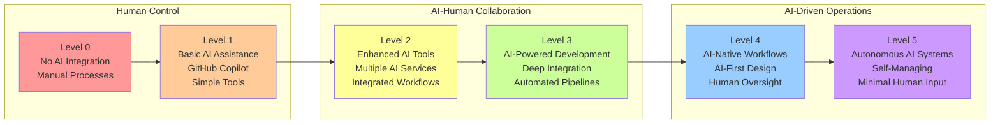

# AI Usage Levels Overview

## Table of Contents

1. [Summary](#summary)
2. [Introduction](#introduction)
3. [Level 0: No AI Integration](#level-0-no-ai-integration)
4. [Level 1: Basic AI Assistance](#level-1-basic-ai-assistance)
5. [Level 2: Enhanced AI Tools](#level-2-enhanced-ai-tools)
6. [Level 3: AI-Powered Development](#level-3-ai-powered-development)
7. [Level 4: AI-Native Workflows](#level-4-ai-native-workflows)
8. [Level 5: Autonomous AI Systems](#level-5-autonomous-ai-systems)
9. [Implementation Strategy](#implementation-strategy)
10. [Best Practices](#best-practices)

## Summary

The AI Usage Levels framework provides a structured approach to AI adoption, progressing from traditional manual processes to fully autonomous systems. Each level represents increasing AI integration, capabilities, and organizational transformation.

### AI Usage Levels Progression



### Key Characteristics by Level

| Level | Focus | Timeline | Complexity | Risk |
|-------|-------|----------|------------|------|
| **Level 0** | Manual processes | Current | Low | Low |
| **Level 1** | Basic assistance | 1-3 months | Low | Low |
| **Level 2** | Enhanced tools | 3-6 months | Medium | Medium |
| **Level 3** | Powered development | 6-12 months | High | Medium |
| **Level 4** | Native workflows | 12-24 months | Very High | High |
| **Level 5** | Autonomous systems | 24+ months | Extreme | Very High |

### Quick Start Recommendations

- **Beginners**: Start with Level 1 (GitHub Copilot, basic AI tools)
- **Intermediate**: Progress to Level 2 (AI-powered testing, documentation)
- **Advanced**: Implement Level 3 (CI/CD integration, automated optimization)
- **Enterprise**: Consider Level 4+ (AI-native workflows, autonomous systems)

## Introduction

AI usage levels represent different stages of artificial intelligence integration in software development and business processes. Understanding these levels helps organizations plan their AI adoption journey and maximize the benefits while managing risks.

## Level 0: No AI Integration

### Level 0 Characteristics

- Traditional manual development processes
- No AI-powered tools or assistance
- Purely human-driven decision making
- Legacy workflows and methodologies

### Level 0 Examples

- Manual code writing without AI assistance
- Traditional documentation processes
- Human-only code reviews
- Manual testing and debugging

### Level 0 Advantages

- Full human control and understanding
- No dependency on AI systems
- Traditional skill sets remain relevant

### Level 0 Disadvantages

- Slower development cycles
- Higher potential for human error
- Limited scalability
- Missed efficiency opportunities

## Level 1: Basic AI Assistance

### Level 1 Characteristics

- Simple AI tools for basic tasks
- AI as a supplementary helper
- Human oversight for all AI outputs
- Limited AI integration scope

### Level 1 Examples

- GitHub Copilot for code suggestions
- AI-powered spell checkers
- Basic chatbots for simple queries
- Automated syntax highlighting

### Level 1 Tools & Technologies

```bash
# Install GitHub Copilot extension
# In VS Code: Ctrl+Shift+X, search "GitHub Copilot"
```

### Level 1 Implementation

- Install AI-powered extensions in IDE
- Use AI for code completion and suggestions
- Leverage AI for basic documentation assistance

### Level 1 Advantages

- Immediate productivity gains
- Low learning curve
- Minimal workflow disruption
- Cost-effective entry point

### Level 1 Disadvantages

- Limited AI capabilities
- Still requires significant human oversight
- Occasional inaccurate suggestions

## Level 2: Enhanced AI Tools

### Level 2 Characteristics

- Multiple AI tools working together
- AI for more complex tasks
- Integrated AI workflows
- Selective automation of routine tasks

### Level 2 Examples

- AI-powered code generation and refactoring
- Automated testing with AI assistance
- AI-driven documentation generation
- Intelligent code analysis and review

### Level 2 Tools & Technologies

- **GitHub Copilot Chat** (Ctrl+Shift+I)
- **GitHub Copilot Labs**
- AI-powered linters and formatters
- Automated unit test generation

### Level 2 Code Example

```python
# q: What is the purpose of this code?
# a: This function analyzes asset utilization patterns using AI-enhanced data processing

def analyze_asset_utilization(data):
    """
    AI-assisted analysis of asset utilization patterns
    """
    # AI-generated analysis logic
    patterns = ai_pattern_recognition(data)
    insights = generate_insights(patterns)
    return insights
```

### Level 2 Implementation Strategy

1. Expand AI tool usage across development lifecycle
2. Integrate multiple AI services
3. Establish AI-human collaboration patterns
4. Implement quality gates for AI outputs

### Level 2 Advantages

- Significant productivity improvements
- Better code quality through AI analysis
- Reduced manual testing efforts
- Enhanced documentation quality

### Level 2 Disadvantages

- Increased complexity in tool management
- Need for AI literacy training
- Potential over-reliance on AI

## Level 3: AI-Powered Development

### Level 3 Characteristics

- AI deeply integrated into development workflows
- Automated pipeline processes
- AI-driven decision support systems
- Proactive AI recommendations

### Level 3 Examples

- AI-generated architecture recommendations
- Automated code optimization
- AI-powered project management
- Intelligent resource allocation

### Level 3 Technologies

- Machine Learning Operations (MLOps)
- AI-driven CI/CD pipelines
- Automated performance optimization
- Intelligent monitoring and alerting

### Level 3 Workflow Integration

```yaml
# AI-powered CI/CD pipeline example
name: AI-Enhanced Development Pipeline
on: [push, pull_request]

jobs:
  ai-analysis:
    runs-on: ubuntu-latest
    steps:
      - uses: actions/checkout@v3
      - name: AI Code Analysis
        run: |
          ai-analyzer --scan-code --generate-insights
          ai-optimizer --suggest-improvements
      - name: AI-Generated Tests
        run: |
          ai-test-generator --coverage-target 90%
```

### Level 3 Implementation

1. Deploy AI-powered development platforms
2. Integrate AI into existing tool chains
3. Establish AI governance frameworks
4. Train teams on AI-enhanced workflows

### Level 3 Advantages

- Dramatic efficiency improvements
- Proactive issue detection
- Optimized resource utilization
- Enhanced decision-making capabilities

### Level 3 Disadvantages

- High implementation complexity
- Significant training requirements
- Potential job role changes
- Increased infrastructure costs

## Level 4: AI-Native Workflows

### Level 4 Characteristics

- Workflows designed around AI capabilities
- AI as primary decision maker for routine tasks
- Human expertise for strategic oversight
- Seamless AI-human collaboration

### Level 4 Examples

- Self-healing systems with AI diagnostics
- AI-driven feature prioritization
- Automated scaling and optimization
- Intelligent user experience adaptation

### Level 4 Key Components

- **AI Orchestration Layer**: Manages AI workflow coordination
- **Decision Trees**: AI-powered routing and prioritization
- **Feedback Loops**: Continuous learning and improvement
- **Human-in-the-Loop**: Strategic oversight and validation

### Level 4 Implementation Roadmap

1. **Phase 1**: Redesign core workflows for AI integration
2. **Phase 2**: Deploy AI orchestration infrastructure
3. **Phase 3**: Implement continuous learning systems
4. **Phase 4**: Optimize human-AI collaboration patterns

### Level 4 Advantages

- Maximum efficiency and automation
- Adaptive and self-improving systems
- Predictive capabilities
- Scalable operations

### Level 4 Disadvantages

- Complete dependency on AI systems
- Complex failure modes
- High technical expertise requirements
- Significant change management needs

## Level 5: Autonomous AI Systems

### Level 5 Characteristics

- Fully autonomous AI decision-making
- Self-managing and self-healing systems
- Minimal human intervention required
- AI systems managing other AI systems

### Level 5 Examples

- Autonomous software development agents
- Self-optimizing infrastructure
- AI-driven business strategy formulation
- Autonomous customer service ecosystems

### Level 5 Capabilities

- **Self-Programming**: AI systems that can modify their own code
- **Strategic Planning**: Long-term goal setting and execution
- **Resource Management**: Autonomous allocation and optimization
- **Risk Assessment**: Predictive analysis and mitigation

### Level 5 Code Example

```python
# Example of autonomous system monitoring
class AutonomousSystemManager:
    def __init__(self):
        self.ai_agents = []
        self.performance_metrics = {}
        self.learning_algorithms = []
    
    def manage_system_health(self):
        """
        Autonomous system health management
        """
        for agent in self.ai_agents:
            performance = agent.assess_performance()
            if performance < threshold:
                agent.self_optimize()
                agent.request_human_review() if critical_issue
```

### Level 5 Implementation Requirements

1. **Advanced AI Infrastructure**: High-performance computing resources
2. **Robust Safety Measures**: Fail-safes and human override capabilities
3. **Ethical Frameworks**: Governance for autonomous decision-making
4. **Regulatory Compliance**: Adherence to AI governance standards

### Level 5 Advantages

- Ultimate efficiency and scalability
- 24/7 autonomous operations
- Rapid adaptation to changing conditions
- Unprecedented innovation potential

### Level 5 Disadvantages

- Significant safety and ethical concerns
- Complex regulatory landscape
- High infrastructure costs
- Potential loss of human agency

## Implementation Strategy

### Assessment Framework

1. **Current State Analysis**
   - Evaluate existing AI usage
   - Identify improvement opportunities
   - Assess organizational readiness

2. **Target Level Selection**
   - Define desired AI integration level
   - Consider business objectives
   - Evaluate risk tolerance

3. **Roadmap Development**
   - Create phased implementation plan
   - Identify required resources
   - Establish success metrics

### Migration Timeline

```text
Level 0 → Level 1: 1-3 months
Level 1 → Level 2: 3-6 months
Level 2 → Level 3: 6-12 months
Level 3 → Level 4: 12-24 months
Level 4 → Level 5: 24+ months
```

### Key Success Factors

- **Leadership Commitment**: Executive support for AI transformation
- **Skill Development**: Continuous learning and training programs
- **Change Management**: Structured approach to organizational change
- **Technology Infrastructure**: Robust and scalable AI platforms

## Best Practices

### General Principles

1. **Start Small**: Begin with pilot projects and limited scope
2. **Measure Impact**: Establish clear metrics and KPIs
3. **Iterate Rapidly**: Use feedback to improve AI implementation
4. **Maintain Human Oversight**: Ensure appropriate human control

### Security Considerations

- Implement AI governance frameworks
- Establish data privacy protections
- Monitor AI system behavior
- Maintain audit trails for AI decisions

### Ethical Guidelines

- Ensure transparency in AI decision-making
- Prevent bias in AI systems
- Maintain human accountability
- Respect user privacy and consent

### Quality Assurance

```python
# AI quality assurance framework
def validate_ai_output(ai_result, human_expert_review=True):
    """
    Validate AI-generated outputs before implementation
    """
    quality_score = assess_quality(ai_result)
    
    if quality_score < minimum_threshold:
        return request_human_review(ai_result)
    
    if human_expert_review and is_critical_decision(ai_result):
        return expert_validation(ai_result)
    
    return approve_ai_output(ai_result)
```

## Conclusion

AI usage levels provide a structured framework for organizations to approach AI adoption. Success depends on:

- **Gradual Progression**: Moving through levels systematically
- **Continuous Learning**: Adapting based on experience and feedback
- **Balanced Approach**: Combining AI capabilities with human expertise
- **Strategic Alignment**: Ensuring AI adoption supports business objectives

The journey from Level 0 to Level 5 represents a fundamental transformation in how organizations operate, requiring careful planning, substantial investment, and strong change management capabilities.

---

*Last Updated: June 30, 2025*  
*Version: 1.0*
