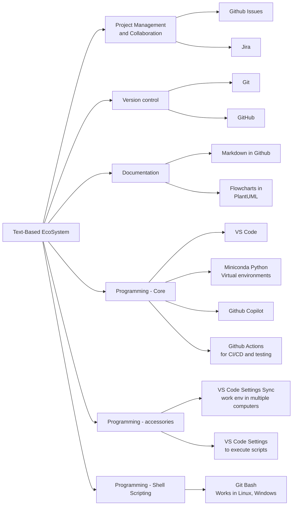

# Text Based Ecosystem

Objective is to create a cohesive environment for text-based workflows. The text-based workflow is expected to leverage various tools (AI, agents, practices etc) to enhance productivity and collaboration.

## Summary

An ecosystem of tools is given below:

Resources:

- Work in VS Code IDE (Environment).
  - See, <https://github.com/vamseeachanta/assetutilities/blob/main/docs/sub_ide/vscode.md>
- Version control in Git.
  - See, <https://github.com/vamseeachanta/energy/tree/apr_may/tools/git>
- Code with Miniconda python
- documentation with .md
- simple flowcharts in mermaid
  - see, <https://mermaid.js.org/syntax/flowchart.html>
- Other tools

### VS Code (VSC) IDE

**References:**

### Git

### Miniconda

### Markdown

For documentation, software manuals, readme, etc.
Features include but not limited to:

- headings
- lists
- tables (with alignment)
- highlight text/code

### Plantuml

For flowcharts, sequence diagrams, etc.

### VS Code Extensions

- vsc copilot (Paid version: USD 120)
- Settings scripts to perform following tasks:
  - save file automatically (timer of 3000ms)
  - automatically run scripts to
  - setup autoformatting for files
  - One off tasks hence time consuming but rewarding in long run even if used ocassionally (even at once a month)
- Edit files in column mode
- python libraries
- Test driven development, TDD
- Github actions

## Resources/References

Good podcasts to hear in general for python. They may seem boring first but cater to develop in a general and more business (less programming) oriented way. More useful in real life.
<https://realpython.com/podcasts/rpp/>
<https://podcasts.apple.com/us/podcast/develop-yourself/id1583498998>

<https://realpython.com/what-can-i-do-with-python/>

### Naming Conventions

<https://realpython.com/python-modules-packages/>
Naming conventions:
<https://realpython.com/python-pep8/>
<https://realpython.com/lessons/python-naming-conventions/#transcript>
