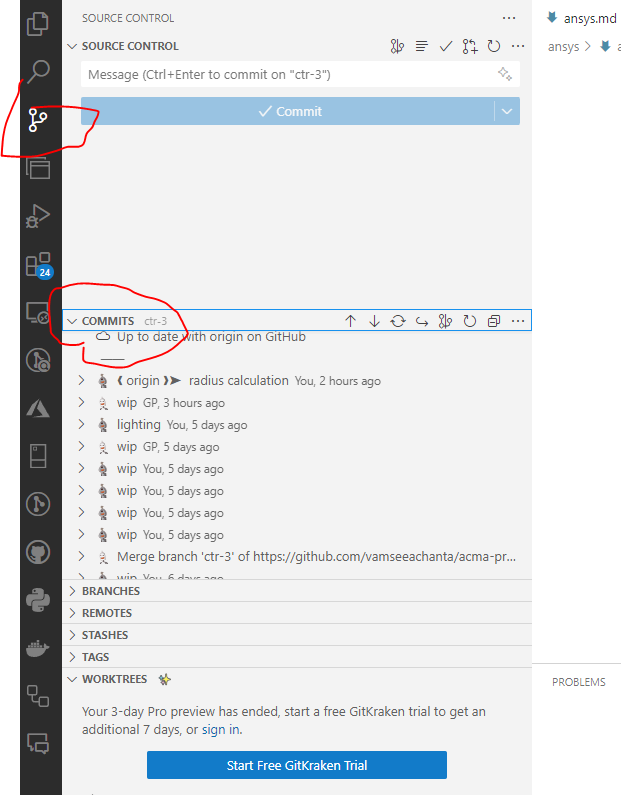
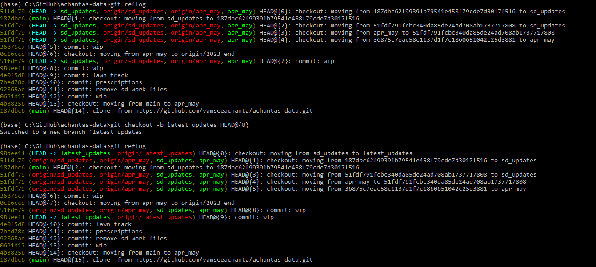
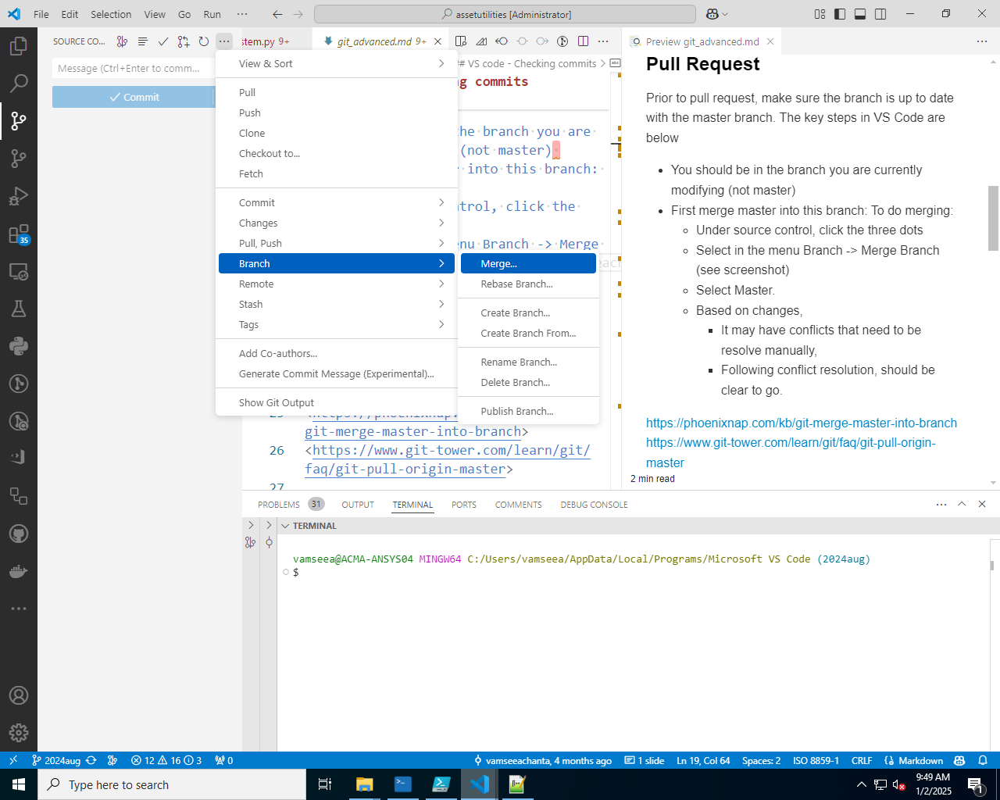

## Introduction

Git is a Verson control tool

## VS code - Checking commits



Other history using flog


### Pull Request

Prior to pull request, make sure the branch is up to date with the master branch. The key steps in VS Code are below

- You should be in the branch you are currently modifying (not master) 
- First merge master into this branch: To do merging:
  - Under source control, click the three dots 
  - Select in the menu Branch -> Merge Branch (see screenshot)
-  
  - Select Master. 
  - Based on changes, 
    - It may have conflicts that need to be resolve manually, 
    - Following conflict resolution, should be clear to go.

<https://phoenixnap.com/kb/git-merge-master-into-branch>
<https://www.git-tower.com/learn/git/faq/git-pull-origin-master>

## Rebase

- Manipulate commmits message
- delete commits
- reorder commits
- Use to clean up local history

### Usage 1 - Change message

Find the existing commits and associated messages
<code>
git log --oneline
</code>

<code>
git rebase -i HEAD~3
</code>

- Editor window pops up. All range of commits (except HEAD) is shown
- Only action keyword is given in this editor window
  - eg: change "pick" to "reword"
- Save and close
- Editor window opens again
- Check the changes

<code>

git log --oneline
</code>

### Usage 1 - Combine commits

Find the existing commits and associated messages
<code>
git log --oneline
</code>

<code>
git rebase -i HEAD~4
</code>

- Editor window pops up. All range of commits (except HEAD) is shown
- Only action keyword is given in this editor window
  - eg: change "squash" to "reword"
- give commit message
- Save and close
- Editor window opens again
- Check the changes

<code>

git log --oneline
</code>

### CLI: Git

<https://stackoverflow.com/questions/14893399/rebase-feature-branch-onto-another-feature-branch>

<https://www.youtube.com/watch?v=qsTthZi23VE>

### Interface: VS Code, GitLens

Steps:

<https://blog.delpuppo.net/why-i-love-gitlens-in-my-vscode-interactive-rebase>

<https://www.youtube.com/watch?v=3o_01F04bZ4>


### References
<https://stackoverflow.com/questions/4786972/get-a-list-of-all-git-commits-including-the-lost-ones>


### Git resolve complex conflicts b/w branches

When trying to merge, got complex merge conflicts:

- 100+ conflicted files
- Binary file conflicts
- File rename conflicts
- Delete/modify conflicts

**Smart Resolution :**

Instead of Fighting Conflicts and robust tests, original code mess issues due to rebasing ....
Used the "Reset Strategy" since 202506 branch had the correct latest changes:

```bash
# 2. Switch to master
git checkout master

# 3. Make master latest to 202506
git reset --hard 202506

# 4. Force push with safety
git push --force-with-lease origin master
```
Result:

- ✅ 551 files updated instantly
- ✅ Master now has all correct changes
- ✅ Zero conflicts to resolve manually
- ✅ Clean repository state

Note: This is a powerful approach , apply it only if you are sure that the target branch has the correct and latest changes.
else , it might lead to loss of some work.