# Repository Responsibility Matrix

> Analysis of public repositories from GitHub profiles: vamseeachanta and samdansk2
> Last Updated: 2025-07-24

## Executive Summary

This document outlines the primary and secondary responsibilities between two collaborating authors across their public GitHub repositories. The analysis reveals complementary expertise areas with clear domain ownership and collaborative infrastructure.

**Key Statistics:** 27 total repositories • 4 collaborative (15%) • 23 solo projects (85%) • 13 active (48%)

### Future Update Prompt Template

To update this analysis in the future, use the following prompt:

```
Analyze the public repositories from these GitHub profiles and update the responsibility matrix:
- https://github.com/vamseeachanta/
- https://github.com/samdansk2

For each repository, identify:
1. Repository name, description, language, and activity status
2. Number of contributors (solo vs collaborative)
3. Primary responsibility assignment based on repository owner
4. Cross-collaboration patterns between the authors
5. Domain categorization (engineering, financial, educational, etc.)

Update the existing responsibility.md document to:
- Add any new repositories
- Update activity status (active/archived)
- Maintain the visual Mermaid flowcharts showing collaboration patterns
- Include statistics on solo vs collaborative work
- Show clear primary and secondary responsibilities
```

## Visual Overview

### Responsibility Flow Structure


### Complete Repository Overview

```mermaid
graph TD
    %% Collaborative repositories (Multi-author)
    subgraph Collaborative ["`🤝 **Collaborative Repositories**`"]
        AU["`**assetutilities**
        3 contributors
        Business automation`"]
        DM["`**digitalmodel** 
        4 contributors
        Engineering modeling`"]
        AH["`**assethold**
        2 contributors  
        Stock analysis`"]
        WEB["`**aceengineer websites**
        Shared infrastructure`"]
    end
    
    %% vamseeachanta solo repositories
    subgraph VSolo ["`👤 **vamseeachanta Solo Projects** (15)`"]
        subgraph VEng ["`🔧 Engineering & Technical (8)`"]
            WED[worldenergydata]
            AI[ai-native-traditional-eng]
            PC[pipecapacity]
            EN[energy]
            SS[structuralstrength]
            PI[pyintegrity]
            PR[probabilisticrisk]
            PM[pymvil]
        end
        
        subgraph VDev ["`⚡ Development Tools (3)`"]
            PS[pyproject-starter]
            PPT[py-package-template]
            AEC[aceengineercode]
        end
        
        subgraph VBus ["`💼 Business & Personal (4)`"]
            LMF[leveraged-multi-family-analysis]
            HBL[hairbyliz]
            TR[teamresumes]
            HOB[hobbies]
            AGS[amgsharepointcontents]
        end
    end
    
    %% samdansk2 solo repositories  
    subgraph SSolo ["`👤 **samdansk2 Solo Projects** (6)`"]
        subgraph SEdu ["`📚 Educational (2)`"]
            PB[Python_Basics]
            DSA[DSA_in_Python]
        end
        
        subgraph STech ["`🧪 Technical (3)`"]
            AR[AquaResistivity]
            ML[ML_project]
            LT[librarytemplate]
        end
        
        subgraph SPersonal ["`👨‍💻 Personal (1)`"]
            PROF[samdansk2-profile]
        end
    end
    
    %% Collaboration flows
    AU -.->|Utility Support| AH
    DM -.->|Engineering Methods| AR
    PS -.->|Template Patterns| LT
    WEB <-.->|Shared Infrastructure| VSolo
    WEB <-.->|Shared Infrastructure| SSolo
    
    %% Styling
    classDef collabStyle fill:#e3f2fd,stroke:#1976d2,stroke-width:3px
    classDef vSoloStyle fill:#e8f5e8,stroke:#2e7d32,stroke-width:2px
    classDef sSoloStyle fill:#fff3e0,stroke:#f57c00,stroke-width:2px
    classDef activeStyle fill:#c8e6c9,stroke:#388e3c,stroke-width:2px
    classDef archivedStyle fill:#f5f5f5,stroke:#9e9e9e,stroke-width:1px
    
    class AU,DM,AH,WEB collabStyle
    class WED,AI,PC,EN activeStyle
    class SS,PI,PR,PM,PS,PPT,AEC,LMF,HBL,TR,HOB,AGS archivedStyle
    class AR,ML,LT,PB,DSA,PROF vSoloStyle
```



## Author Profiles

### [vamseeachanta](https://github.com/vamseeachanta/)
- **Primary Domain:** Engineering Utilities & Data Processing
- **Total Public Repositories:** 19
- **Main Languages:** Python (82%), HTML, JavaScript
- **Collaboration Style:** Infrastructure lead, project template creator
- **Active Period:** 2025 (7 active repositories)

### [samdansk2](https://github.com/samdansk2)
- **Primary Domain:** Financial Analysis & Scientific Computing
- **Total Public Repositories:** 8
- **Main Languages:** Python (85%), JavaScript
- **Collaboration Style:** Domain specialist, educational content creator
- **Active Period:** 2024-2025 (6 active repositories)

## Complete Repository Inventory

### vamseeachanta - All Repositories (19 total)

| Repository | Purpose | Language | Contributors | Status | Responsibility |
|------------|---------|----------|--------------|--------|----------------|
| **assetutilities** ⭐ | Business automation utility library | HTML/Python | 3 | 🟢 Active 2025 | **Collaborative** |
| **digitalmodel** ⭐ | Sustainable engineering asset modeling | Python | 4 | 🟢 Active 2025 | **Collaborative** |
| **worldenergydata** | Energy data collection and processing | Python | 1 | 🟢 Active 2025 | **Solo** |
| **ai-native-traditional-eng** | AI approaches for traditional engineering | Python | 1 | 🟢 Active 2025 | **Solo** |
| **pipecapacity** | Pipeline capacity calculations | Python | 1 | 🟢 Active 2025 | **Solo** |
| **energy** | Energy analysis notebooks | Jupyter | 1 | 🟢 Active 2025 | **Solo** |
| **aceengineer-website** | Professional website | HTML/JS | 1-2 | 🟢 Active 2025 | **Solo/Shared** |
| **structuralstrength** | Structural strength calculations | Python | 1 | 🟡 Archived 2023 | **Solo** |
| **teamresumes** | Resume preparation tool | - | 1 | 🟡 Archived | **Solo** |
| **pyproject-starter** | Python project template | Python | 1 | 🟡 Archived | **Solo** |
| **py-package-template** | Package template | Python | 1 | 🟡 Archived | **Solo** |
| **aceengineercode** | General coding repository | - | 1 | 🟡 Archived | **Solo** |
| **hairbyliz** | Business website project | - | 1 | 🟡 Archived | **Solo** |
| **pyintegrity** | Engineering integrity management | Python | 1 | 🟡 Archived | **Solo** |
| **leveraged-multi-family-analysis** | Real estate financial analysis | - | 1 | 🟡 Archived | **Solo** |
| **probabilisticrisk** | Risk analysis tools | Python | 1 | 🟡 Archived | **Solo** |
| **pymvil** | Engineering utilities | Python | 1 | 🟡 Archived | **Solo** |
| **amgsharepointcontents** | SharePoint integration | - | 1 | 🟡 Archived | **Solo** |
| **hobbies** | Personal projects | - | 1 | 🟡 Archived | **Solo** |

### samdansk2 - All Repositories (8 total)

| Repository | Purpose | Language | Contributors | Status | Responsibility |
|------------|---------|----------|--------------|--------|----------------|
| **ML_project** | Machine learning implementations | Python | 1 | 🟢 Active 2025 | **Solo** |
| **assethold** ⭐ | Stock market analysis & guidance | Python | 2 | 🟢 Active 2025 | **Collaborative** |
| **librarytemplate** | Python library template | Python | 1 | 🟢 Active 2025 | **Solo** |
| **AquaResistivity** ⭐ | Seawater resistivity calculator | Python | 1 | 🟢 Active 2025 | **Solo** |
| **aceengineer_website** | Website development | JavaScript | 1-2 | 🟢 Active 2025 | **Solo/Shared** |
| **Python_Basics** | Educational Python content | Python | 1 | 🟡 Learning 2024 | **Solo** |
| **DSA_in_Python** | Data structures and algorithms | Python | 1 | 🟡 Learning 2024 | **Solo** |
| **samdansk2** | Profile README | - | 1 | 🟢 Active 2025 | **Solo** |

## Collaboration Analysis

### Multi-Author Repositories (Collaborative)
- **assetutilities** (vamseeachanta lead, 3 contributors) - Core business utility library
- **digitalmodel** (vamseeachanta lead, 4 contributors) - Engineering modeling platform  
- **assethold** (samdansk2 lead, 2 contributors) - Financial analysis tool
- **aceengineer websites** (shared infrastructure) - Professional web presence

### Single-Author Repositories by Domain

#### vamseeachanta Solo Projects (15 repositories)
**Engineering & Technical (8 projects):**
- worldenergydata, ai-native-traditional-eng, pipecapacity, energy
- structuralstrength, pyintegrity, probabilisticrisk, pymvil

**Development Tools (3 projects):**
- pyproject-starter, py-package-template, aceengineercode

**Business & Financial (2 projects):**
- leveraged-multi-family-analysis, hairbyliz

**Professional & Personal (2 projects):**
- teamresumes, hobbies, amgsharepointcontents

#### samdansk2 Solo Projects (6 repositories)
**Educational & Learning (2 projects):**
- Python_Basics, DSA_in_Python

**Scientific Computing (1 project):**
- AquaResistivity

**Development Tools (1 project):**
- librarytemplate  

**Machine Learning (1 project):**
- ML_project

**Personal (1 project):**
- samdansk2 (profile)

## Secondary Responsibilities

### Cross-Collaboration Areas

| Domain | vamseeachanta Role | samdansk2 Role | Collaboration Type |
|--------|-------------------|----------------|-------------------|
| **Website Development** | Primary (aceengineer-website) | Secondary (aceengineer_website) | Shared Infrastructure |
| **Python Templates** | Primary (project templates) | Secondary (library templates) | Template Development |
| **Educational Content** | Secondary (documentation) | Primary (Python_Basics, DSA) | Knowledge Sharing |
| **Financial Engineering** | Secondary (utility support) | Primary (analysis tools) | Domain Expertise |

## Technical Domain Mapping

### Engineering & Utilities (vamseeachanta Lead)
- **Asset Management:** digitalmodel, assetutilities
- **Data Processing:** worldenergydata, various utilities
- **Web Development:** aceengineer-website, project sites
- **Project Automation:** pyproject-starter, py-package-template
- **AI Integration:** ai-native-traditional-eng

### Financial & Scientific Computing (samdansk2 Lead)
- **Financial Analysis:** assethold (stock market analysis)
- **Scientific Computing:** AquaResistivity (seawater calculations)
- **Machine Learning:** ML_project implementations
- **Educational Programming:** Python_Basics, DSA_in_Python
- **Algorithm Development:** Data structures and algorithms

## Collaboration Patterns

### Complementary Expertise Model
The collaboration follows a **complementary expertise pattern** where:

1. **Domain Specialization:** Each author maintains clear primary domains
2. **Infrastructure Sharing:** Both contribute to shared web presence and templates
3. **Cross-Support:** Secondary responsibilities support the other's primary work
4. **Knowledge Transfer:** Educational content and documentation sharing

### Responsibility Flow Summary

The collaboration follows a **complementary expertise pattern** where each author maintains clear primary domains while supporting shared infrastructure and cross-domain learning.

## Repository Statistics Summary

### Overall Distribution (27 Total Repositories)
- **Collaborative Projects:** 4 repositories (15%)
  - 3 led by vamseeachanta (assetutilities, digitalmodel, shared websites)
  - 1 led by samdansk2 (assethold)
- **Solo Projects:** 23 repositories (85%)
  - 15 by vamseeachanta (79% solo rate)
  - 6 by samdansk2 (75% solo rate)
  - 2 shared infrastructure projects

### Activity Status
- **Active 2025:** 13 repositories (48%)
  - 7 vamseeachanta projects
  - 6 samdansk2 projects  
- **Archived/Learning:** 14 repositories (52%)
  - 12 vamseeachanta archived projects
  - 2 samdansk2 learning projects

### Language Distribution
- **Python Dominant:** 21 repositories (78%)
- **Web Technologies:** 4 repositories (HTML/JS)
- **Other/Mixed:** 2 repositories

## Repository Classification

### Core Libraries (High Impact) 🟢
- **assetutilities** (vamseeachanta, 3 contributors) - Business automation library
- **assethold** (samdansk2, 2 contributors) - Stock market analysis platform
- **digitalmodel** (vamseeachanta, 4 contributors) - Engineering modeling system
- **worldenergydata** (vamseeachanta, solo) - Energy data processing

### Active Development Tools 🟢
- **ai-native-traditional-eng** (vamseeachanta, solo) - AI integration
- **ML_project** (samdansk2, solo) - Machine learning implementations
- **librarytemplate** (samdansk2, solo) - Development templates
- **AquaResistivity** (samdansk2, solo) - Scientific calculator

### Educational & Learning 📚
- **Python_Basics** (samdansk2, solo) - Python fundamentals
- **DSA_in_Python** (samdansk2, solo) - Data structures and algorithms

### Archived Utilities 🟡
- **Engineering Tools:** structuralstrength, pyintegrity, probabilisticrisk, pymvil
- **Development Templates:** pyproject-starter, py-package-template
- **Business Tools:** leveraged-multi-family-analysis, teamresumes
- **Personal Projects:** hobbies, hairbyliz, amgsharepointcontents

## Recommendations

### For Future Collaboration
1. **Maintain Domain Clarity:** Continue clear primary/secondary responsibility structure
2. **Enhance Cross-Pollination:** Consider joint projects combining engineering utilities with financial analysis
3. **Standardize Templates:** Align project templates and coding standards
4. **Documentation Sharing:** Leverage samdansk2's educational content creation for vamseeachanta's utility documentation

### Repository Health
- Monitor commit frequency on high-impact repositories
- Ensure adequate documentation for collaborative projects
- Consider consolidating similar template repositories
- Plan succession strategies for domain-specific knowledge

---

*This analysis is based on public repository information as of July 2025. Repository statistics and collaboration patterns may evolve over time.*