# Repository Responsibility Matrix

> Analysis of public repositories from GitHub profiles: vamseeachanta and samdansk2
> Last Updated: 2025-07-24

## Executive Summary

This document outlines the primary and secondary responsibilities between two collaborating authors across their public GitHub repositories. The analysis reveals complementary expertise areas with clear domain ownership and collaborative infrastructure.

## Author Profiles

### [vamseeachanta](https://github.com/vamseeachanta/)
- **Primary Domain:** Engineering Utilities & Data Processing
- **Total Public Repositories:** 20+
- **Main Languages:** Python, JavaScript, HTML, PowerShell
- **Collaboration Style:** Infrastructure lead, project template creator

### [samdansk2](https://github.com/samdansk2)
- **Primary Domain:** Financial Analysis & Scientific Computing
- **Total Public Repositories:** 8
- **Main Languages:** Python, JavaScript
- **Collaboration Style:** Domain specialist, educational content creator

## Primary Responsibilities

### vamseeachanta - Primary Ownership

| Repository | Purpose | Language | Commits | Responsibility Level |
|------------|---------|----------|---------|---------------------|
| **assetutilities** | Business task automation utility library | Python | 18 | Primary |
| **digitalmodel** | Engineering asset digital modeling | Python | 71 | Primary |
| **worldenergydata** | Energy data collection and processing | Python | 330 | Primary |
| **aceengineer-website** | Professional website development | HTML/JS | 28 | Primary |
| **pyproject-starter** | Python project template | Python | - | Primary |
| **ai-native-traditional-eng** | AI integration for engineering | Python | - | Primary |

### samdansk2 - Primary Ownership

| Repository | Purpose | Language | Commits | Responsibility Level |
|------------|---------|----------|---------|---------------------|
| **assethold** | Stock market analysis tool | Python | 195 | Primary |
| **AquaResistivity** | Seawater resistivity calculator | Python | 86 | Primary |
| **ML_project** | Machine learning implementations | Python | - | Primary |
| **DSA_in_Python** | Data structures and algorithms | Python | - | Primary |
| **Python_Basics** | Educational Python content | Python | - | Primary |

## Secondary Responsibilities

### Cross-Collaboration Areas

| Domain | vamseeachanta Role | samdansk2 Role | Collaboration Type |
|--------|-------------------|----------------|-------------------|
| **Website Development** | Primary (aceengineer-website) | Secondary (aceengineer_website) | Shared Infrastructure |
| **Python Templates** | Primary (project templates) | Secondary (library templates) | Template Development |
| **Educational Content** | Secondary (documentation) | Primary (Python_Basics, DSA) | Knowledge Sharing |
| **Financial Engineering** | Secondary (utility support) | Primary (analysis tools) | Domain Expertise |

## Technical Domain Mapping

### Engineering & Utilities (vamseeachanta Lead)
- **Asset Management:** digitalmodel, assetutilities
- **Data Processing:** worldenergydata, various utilities
- **Web Development:** aceengineer-website, project sites
- **Project Automation:** pyproject-starter, py-package-template
- **AI Integration:** ai-native-traditional-eng

### Financial & Scientific Computing (samdansk2 Lead)
- **Financial Analysis:** assethold (stock market analysis)
- **Scientific Computing:** AquaResistivity (seawater calculations)
- **Machine Learning:** ML_project implementations
- **Educational Programming:** Python_Basics, DSA_in_Python
- **Algorithm Development:** Data structures and algorithms

## Collaboration Patterns

### Complementary Expertise Model
The collaboration follows a **complementary expertise pattern** where:

1. **Domain Specialization:** Each author maintains clear primary domains
2. **Infrastructure Sharing:** Both contribute to shared web presence and templates
3. **Cross-Support:** Secondary responsibilities support the other's primary work
4. **Knowledge Transfer:** Educational content and documentation sharing

### Responsibility Flow

```mermaid
flowchart TD
    %% Author nodes
    V["`**vamseeachanta**
    Engineering Lead`"]
    S["`**samdansk2**
    Analysis Lead`"]
    
    %% Primary responsibility areas
    VE["`**Engineering Utilities**
    • assetutilities
    • digitalmodel
    • worldenergydata`"]
    
    VI["`**Infrastructure & Web**
    • aceengineer-website
    • pyproject-starter
    • ai-native-traditional-eng`"]
    
    SF["`**Financial Analysis**
    • assethold (195 commits)
    • Stock market tools`"]
    
    SC["`**Scientific Computing**
    • AquaResistivity
    • ML_project`"]
    
    SE["`**Educational Content**
    • Python_Basics
    • DSA_in_Python`"]
    
    %% Shared areas
    SHARED["`**Shared Resources**
    • Website collaboration
    • Python templates
    • Documentation`"]
    
    %% Connections - Primary responsibilities
    V --> VE
    V --> VI
    S --> SF
    S --> SC
    S --> SE
    
    %% Connections - Collaboration
    V -.->|Secondary Support| SHARED
    S -.->|Secondary Support| SHARED
    
    %% Cross-domain support
    VI -.->|Template Support| SE
    VE -.->|Utility Support| SF
    SC -.->|Scientific Methods| VE
    
    %% Styling
    classDef authorStyle fill:#e1f5fe,stroke:#01579b,stroke-width:3px
    classDef primaryStyle fill:#f3e5f5,stroke:#4a148c,stroke-width:2px
    classDef sharedStyle fill:#fff3e0,stroke:#e65100,stroke-width:2px
    
    class V,S authorStyle
    class VE,VI,SF,SC,SE primaryStyle
    class SHARED sharedStyle
```

## Repository Overlap Matrix

## Repository Classification

### Core Libraries (High Impact)
- **assetutilities** (vamseeachanta) - 🟢 Active development
- **assethold** (samdansk2) - 🟢 Active development
- **digitalmodel** (vamseeachanta) - 🟡 Maintenance mode
- **worldenergydata** (vamseeachanta) - 🟢 Active development

### Educational & Templates
- **Python_Basics** (samdansk2) - Educational content
- **DSA_in_Python** (samdansk2) - Algorithm education
- **pyproject-starter** (vamseeachanta) - Project templates

### Specialized Tools
- **AquaResistivity** (samdansk2) - Scientific calculator
- **ML_project** (samdansk2) - Machine learning
- **ai-native-traditional-eng** (vamseeachanta) - AI integration

## Recommendations

### For Future Collaboration
1. **Maintain Domain Clarity:** Continue clear primary/secondary responsibility structure
2. **Enhance Cross-Pollination:** Consider joint projects combining engineering utilities with financial analysis
3. **Standardize Templates:** Align project templates and coding standards
4. **Documentation Sharing:** Leverage samdansk2's educational content creation for vamseeachanta's utility documentation

### Repository Health
- Monitor commit frequency on high-impact repositories
- Ensure adequate documentation for collaborative projects
- Consider consolidating similar template repositories
- Plan succession strategies for domain-specific knowledge

---

*This analysis is based on public repository information as of July 2025. Repository statistics and collaboration patterns may evolve over time.*