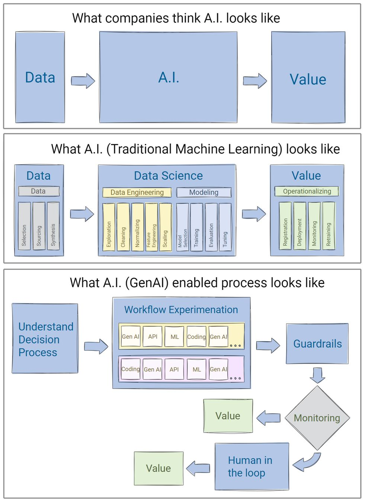

?? From Traditional ML to Generative AI: Navigating the Evolution of AI in Decision-Making ??

Over the past decade, Artificial Intelligence (AI) has undergone a transformative journey. While traditional machine learning (ML) methods like regression, SVMs, random forests, and XGBoost once dominated the field, they thrived primarily on structured data?think tabular datasets with well-defined numerical or categorical features. These models excelled in applications like classification, regression, recommender systems, and predictive analytics, leveraging structured pipelines that included feature engineering, model training, and deployment.

However, unstructured data (text, images, audio) posed a challenge. Traditional ML required extensive manual feature engineering and often fell short in automating creative, human-centric tasks. For instance, selecting an image for a blog article involves nuanced evaluations of aesthetics, relevance, and emotional appeal?areas where traditional ML struggled.

Enter Deep Learning and Generative AI (GenAI)?game-changers for unstructured data. These models eliminate the need for manual feature engineering, learning patterns directly from raw data. From text and image generation to summarization and contextual understanding, GenAI has opened up a world of possibilities for automating parts of human decision-making.

But here?s the key: Generative AI doesn?t replace traditional tools?it complements them. Implementing GenAI effectively requires breaking down decision-making into discrete components and assigning the right tools?ML, coding, APIs, or databases?to each step. Experimenting with these combinations and balancing trade-offs like accuracy, reliability, cost, and latency is essential for building robust end-to-end systems.

?? Challenges with GenAI:
Unlike traditional deterministic models, GenAI operates probabilistically, and can lead to "hallucinations." Further, there is lot more subjectivity in evaluating generated content such as text, image, audio, or video. Hence, GenAI enabled workflows require AI Evaluations (AI Evals) far beyond what traditional ML require. Specifically, it needs: 
- Robust guardrails for responsible AI integration
- Monitoring outputs for anomalies
- Human in the loop for remediation

As we continue to harness the power of GenAI, let?s remember that building real-world AI systems isn?t just about leveraging cutting-edge technology?it?s about thoughtfully designing AI enabled workflows that can augment human decision-making. ??

Please share your thoughts in comments ?? . 

Reference: [LinkedIn Post](https://www.linkedin.com/posts/rohitaggarwal_artificialintelligence-machinelearning-generativeai-activity-7287106607002394624-6dlJ)
