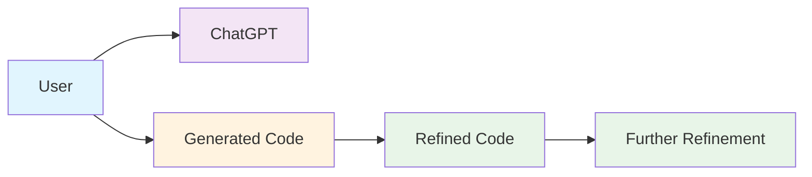
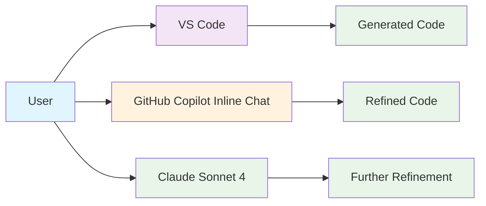
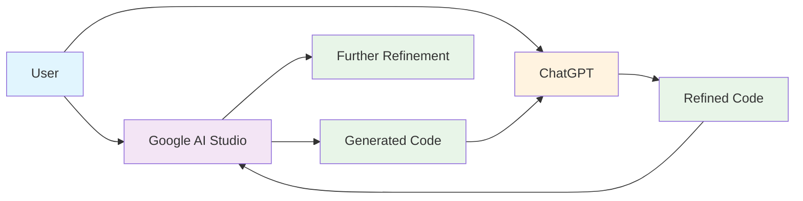
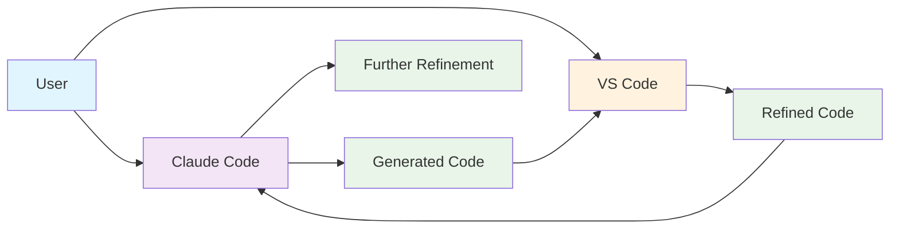
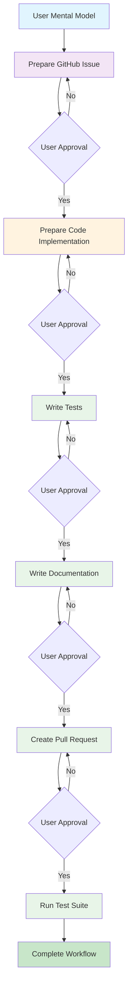

# Example Case Studies

An approximation of the current AI workflows is illustrated by the following case studies. These examples show how users interact with AI tools to generate, refine, and improve code or workflows across different domains.

### Summary

Identify a good practice. Need not be the best practice, but a good practice that is being used by the community.
- **Solution**: Use a combination of AI tools and IDEs to generate, refine, and improve code.
- **Tools**: ChatGPT, Claude, Gemini, VS Code, GitHub Copilot, etc.
- **Best Practice**: Encourage collaboration between AI tools and human developers to leverage the strengths of both.

Mermaid flowchart TBA

### Case study : Electrical SME Engineering

ChatGPT chat and get results

### Case study : Mechanical SME, Engineering

Mainly work in text based files such as markdown, yaml, python code, mermaid charts using below tools:
- VS code
- GitHub Copilot Inline chat
- Claude Sonnet 4

### Case study : Transportation SME Engineering

    I have been using the free Google AI Studio for the past few months....I really like it. I sometimes play the LLMs with each other. Give Google's Code to ChatGPT and ask it to refine further and vice-versa.

### Case study : AI First Workflows, Product Development, Every

    These days it's Claude code inside vs code for me. Looks like that's the way things are evolving, with Gemini cli released a couple of days ago

### Case study : AI First Workflows, Company (Vora)

User Prepares a mental model for AI to do the following with user approval at every step:
- Prepare a Github Issue
- Prepare Code to implement the issue
- Write tests
- Write documentation
- Create a PR
- Run a test suite

References

https://youtu.be/Lh_X32t9_po?si=CV3DXT9gaPTH8_xh

### Other References

TBA
