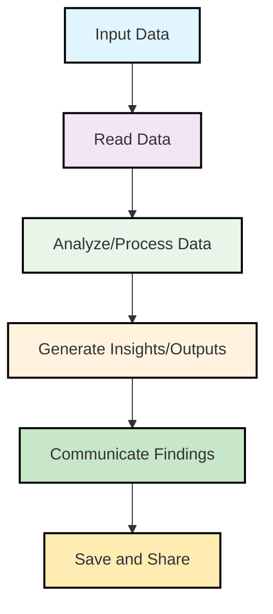
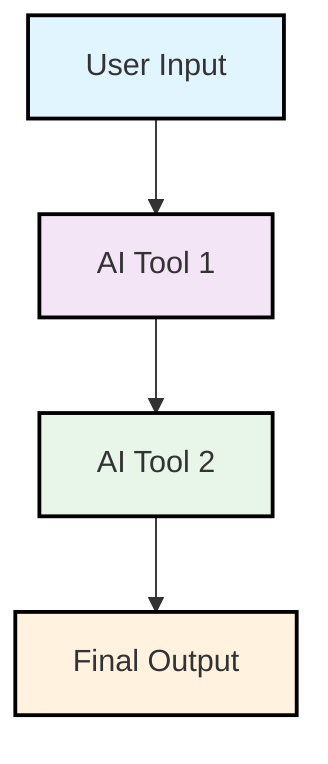

## Introduction

A generic workflow template with tools highlighted. The tools and AI services are are layered such that they are interchangeable at each levels

### Summary

### Detailed Steps

#### Basic Engineering

- input data
- Read the data
- Analyze/Process the data
- Generate insights/outputs
- Communicate findings
- Save and share

#### Refinement Workflow

- **Goal**: To refine prompts for better AI tool performance.
- **Tools**: ChatGPT, Claude, Gemini, VS Code, GitHub Copilot, etc.
- **Best Practice**: Use a combination of AI tools to generate, refine, and improve prompts iteratively.
- A basic prompt using specific instructions to build better prompt (iterate amongst AI tools)
  - 
- A more advanced prompt that incorporates user feedback and context to improve results (fine-tune AI tools)
- A comprehensive prompt that combines multiple sources of information and advanced techniques for optimal results (leverage AI tools)

