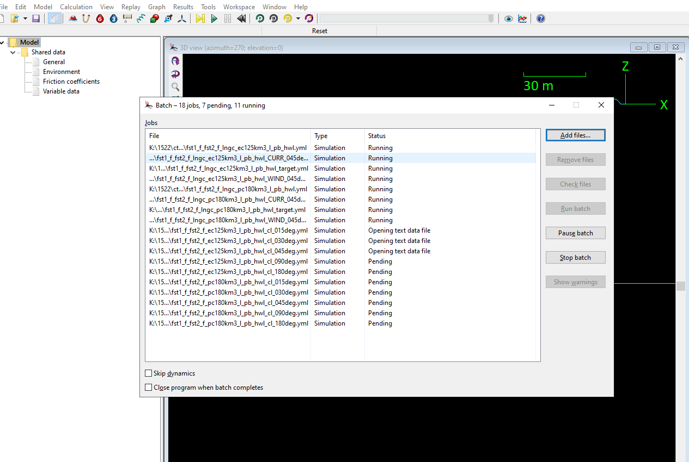

# OrcaFlex Computer Server

<!-- Title Slide -->
## Analysis and Costing


<!-- Today's Date -->
<!-- _class: date -->
<script>
  const today = new Date();
  const formattedDate = today.toISOString().split('T')[0];
  document.write(formattedDate);
</script>


---

<!-- Slide for Introduction -->
# Introduction
- Compute Server is required for OrcaFlex to increase productivity
- Given the license cost, having a dedicated server is cost-effective for running multiple simulations
- This presentation will cover the following:
  - OrcaFlex vs. Other Software
  - In-house vs. Cloud
  - IT requirements and Costing is also compared

---
<!-- _class: transition -->

# 

# OrcaFlex vs. Other Software

---

# OrcaFlex 

- Software typically require a dedicated license to run Multiprocessing and multicore runs. 
- However, Orcaflex allows to run each simulation using each core (logical processor)
- Ability to run any number of cores as much as the computer can accommodate. Typically 1 core is reserved  tasks other than OrcaFlex simulations



```markdown
- More cores = More runs; 
- Quicker turnaround of results. Effective use of license
```

---
# Cloud vs. In-house (Costing)

Key Factors in Pricing Comparison:

- Compute Costs: Differences in virtual machine (VM) pricing, instance types, and reserved instances.

- Storage Costs: Variations in block storage, object storage, and file storage pricing.

- Data Transfer Costs: Charges for data ingress and egress, which can vary significantly between providers.

- Support and Licensing: Differences in support plans and licensing models.

```markdown
- Requires good understanding and use of cloud hardware and awith appropriate gaurdrails. 
- Cloud computing will be <b>NEW</b> area for ACMA
```

---
# In-house (Rack vs. Desktop). IT support etc.

- Rack Server
  - Higher cost

I
```markdown
- Existing ACMA systems are rack based servers
```

---
# Comparison of costs

| Type | Specifications | Cores and Threads | CPU Speed | RAM Support | Hard Disk | Cost | URL |
| --- | --- | --- | --- | --- | --- | --- | --- |
| AMD Ryzen Threadripper Processors | | 16cores and 32 threads | Not specified | Up to 1 TB DDR5 memory | Not specified | 5389 | [AMD Ryzen](https://bizon-tech.com/amd-threadripper-workstation-pc-servers?utm_term=64-core%20computer&utm_campaign=workstations&utm_source=adwords&utm_medium=ppc&hsa_acc=2602547611&hsa_cam=1556162152&hsa_grp=82018998448&hsa_ad=619219694532&hsa_src=g&hsa_tgt=kwd-872495797641&hsa_kw=64-core%20computer&hsa_mt=b&hsa_net=adwords&hsa_ver=3&gad_source=1&gclid=CjwKCAiAw5W-hardware) |
| AMD Ryzen Threadripper Processors |  | Up to 64 cores and 128 threads | Not specified | 256 GB DDR5 memory | Not specified | 14,749 | [AMD Ryzen](https://bizon-tech.com/bizon-x4000.html#3215:47270;3217:47278;3218:29012;3219:46902;3220:59362;3222:29063;3223:29116;3224:29148;5024:53050) |
| Dell Precision 7960 Tower Workstation | Not specified | Not specified | Not specified | Not specified | Not specified | 5389 | [Dell](https://www.dell.com/en-us/shop/cty/pdp/spd/precision-t7960-workstation/xctopt7960us_vp_cc_fy25?tfcid=91049735&&gacd=9684992-1105-5761040-266906002-0&dgc=ST&SA360CID=71700000109798566&gclsrc=aw.ds&gad_source=1&gbraid=0AAAAADllXQeRwmGrtvlV1GI6DxO31PG9P&gclid=CjwKCAiAw5W-BhAhEiwApv4goJXmBIwrLokeVfP10u3FCs4nrHKbEk_aaURx1cegKI7rPPcRrQkl7RoC1OEQAvD_BwE) |
| BIZON AMD Threadripper Workstations |  | Up to 96 cores with AMD Threadripper 7000 series processors | Not specified | Up to 1 TB DDR5 memory | Not specified |
| Dell Precision 7960 Tower Workstation  | | Not specified | Not specified | Not specified | Not specified | Not specified | 5389 | [Dell](https://www.dell.com/en-us/shop/cty/pdp/spd/precision-t7960-workstation/xctopt7960us_vp_cc_fy25?tfcid=91049735&&gacd=9684992-1105-5761040-266906002-0&dgc=ST&SA360CID=71700000109798566&gclsrc=aw.ds&gad_source=1&gbraid=0AAAAADllXQeRwmGrtvlV1GI6DxO31PG9P&gclid=CjwKCAiAw5W-BhAhEiwApv4goJXmBIwrLokeVfP10u3FCs4nrHKbEk_aaURx1cegKI7rPPcRrQkl7RoC1OEQAvD_BwE) |
| BIZON AMD Threadripper Workstations  | | Up to 96 cores with AMD Threadripper 7000 series processors | Not specified | Up to 1 TB DDR5 memory | Not specified |

```markdown
- Add USD4000 to 5000 for rack type servers
```


---
# Conclusions and Recommendations


### Recommendations

- Understand Existing architecture
  - Rack and its capabilities
  - Flexibility in compute and hardware (Can we combine ANSYS03 and ANSYS04 to get 24 cores or more going?)


```markdown
- Get dedicated desktop or add to rack? 
- Right reasons for the long haul

```
---

# Way Forward

- Cloud is not an option due to First. Experience/skills of IT teams plays big role in success.
- Understand Existing architecture and see if we can easily expand it
- If shelling out 15K is an easy decision, Based on IT team's expertise and our existing hardware flexibility
  - get dedicated desktop or add to rack ?
