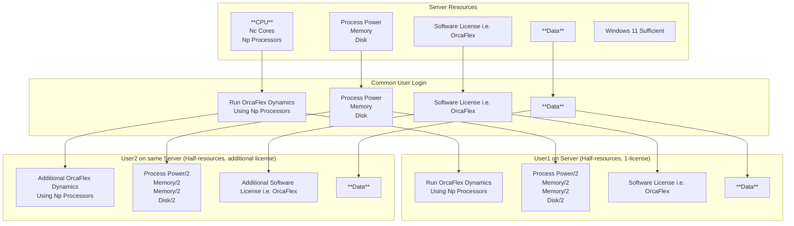

## Summary

- **Solution** : Shared username (eg: orcaflex, ansys etc.)/password pair to login and logout.
  - tightVPN (currently on OrcaFlex server)

## Details

### Common User Login

- Example: ANS 05
- Shared username/password
- **Full Transperency and Trust**
- Example software solutions:
  - tightVPN (free)
  - splashtop (USD 10/mo/user)
  - TeamViewer (USD 25/mo for 3 devices), etc.
- Cons: **No confidentiality**

### Multiple User Login (Shared Resources)

- Example: ANS 01 thru 04
- Utilizes windows server loging to allow logging of multiple users

- Important Considerations For multiple users:
    - It is important to close all licensed software 
    and log-out in the following example scenarios: 
    - When user licensed software runs are done (even after a day or Monday)
    - When user licensed software is going to be unused for more than 1 hour duration
    - Should not keep open to just block/hoard license unless there is an urgency.

## Common vs. Multiple

