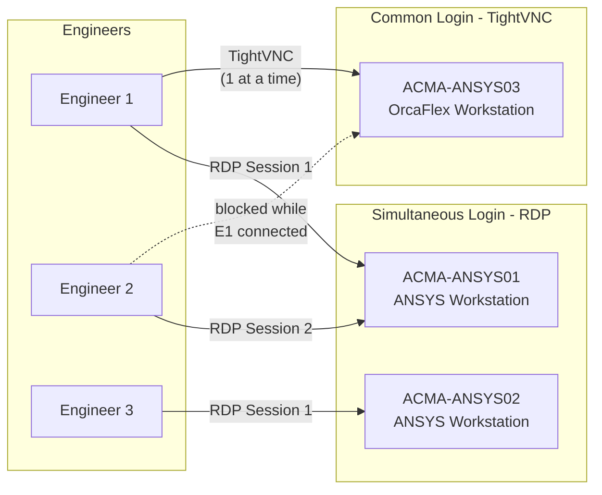

REMOTE ACCESS: SHARED vs SIMULTANEOUS LOGIN
=============================================
Last updated: 2026-02-11

Overview
--------

There are two ways to share a remote workstation among multiple
engineers: common login (shared desktop) or simultaneous login
(separate desktops). The right choice depends on how many software
licenses are available and whether users need separate desktops.

Comparison
----------

  +---------------------+---------------------+------------------------+
  | Aspect              | Common Login        | Simultaneous Login     |
  |                     | (TightVNC)          | (Windows Server RDP)   |
  +---------------------+---------------------+------------------------+
  | Users at once       | 1 (shared desktop)  | 2+ (separate desktops) |
  | OS required         | Windows 11 is fine  | Windows Server 2022    |
  | Resources per user  | Full machine        | Split (halved for 2)   |
  | Licenses needed     | 1                   | 1 per running instance |
  | Confidentiality     | None (shared view)  | Per-user desktop       |
  | Software examples   | TightVNC (free)     | RDP (built into Server)|
  | Cost                | Free                | Server license cost    |
  +---------------------+---------------------+------------------------+

  RECOMMENDATION:
  - Common login via TightVNC for single-license software (OrcaFlex)
  - Simultaneous login via RDP for multi-license software (ANSYS)

Architecture Diagram
--------------------

Common Login (TightVNC) — How It Works
---------------------------------------

- One shared account on the workstation (e.g., shared OrcaFlex user)
- All users connect to the SAME desktop session via TightVNC
- Only one person operates the machine at a time
- Full machine resources available to that one user
- Only one software license consumed at a time
- No privacy — everyone sees the same screen

  Use for: OrcaFlex (single-seat license on ACMA-ANSYS03)

Simultaneous Login (Windows Server RDP) — How It Works
-------------------------------------------------------

- Each user has their own Windows account
- Multiple users can log in at the same time via RDP
- Each user gets their own desktop session
- Machine resources (CPU, RAM, disk) are split between users
- Each running software instance consumes its own license
- Full privacy — each user sees only their own desktop

  Use for: ANSYS products on ACMA-ANSYS01 through ACMA-ANSYS04

Frequently Asked Questions
--------------------------

Q: Can multiple users run OrcaFlex simultaneously?
A: Only if you have additional OrcaFlex licenses. ACMA currently has
   one seat. Two users cannot run OrcaFlex at the same time with one
   license, regardless of the login method.

Q: Does simultaneous login slow down analysis runs?
A: Yes. With 2 users logged in, each gets roughly half the CPU cores
   and half the RAM. A run that takes 4 hours solo may take 7-8 hours
   with two users active. The exact slowdown depends on the analysis
   type and how resource-intensive both sessions are.

Q: If two users are logged in simultaneously, does that use 1 or 2
   software licenses?
A: It depends on how many instances of the software are running. Each
   running instance of OrcaFlex or ANSYS consumes one license,
   regardless of how the user logged in. Two users each running
   OrcaFlex = 2 licenses needed. One user running OrcaFlex and
   another user doing file management = 1 license.

Q: Can I access data on the server while another user is running an
   analysis?
A: Yes. You can access shared drives and file shares over the network
   without needing to log in to the server. Only use RDP/VNC when you
   need to run software that requires the server's hardware or license.

Q: What happens if I lock the screen via common login?
A: On TightVNC (common login), locking the screen means the next
   person who connects via VNC will see the lock screen. They need
   the shared credentials from the company password manager to unlock.

Q: Can I use RDP instead of TightVNC for OrcaFlex?
A: Technically yes, but not recommended. RDP creates a new session
   and may not see the existing TightVNC session. Stick with TightVNC
   for the OrcaFlex workstation to avoid confusion.

Current ACMA Setup
------------------

  +----------------+---------------+-----------------------------------+
  | Machine        | Access Method | Purpose                           |
  +----------------+---------------+-----------------------------------+
  | ACMA-ANSYS03   | TightVNC      | OrcaFlex (single-seat license)    |
  | ACMA-ANSYS01   | RDP           | ANSYS workstation                 |
  | ACMA-ANSYS02   | RDP           | ANSYS workstation                 |
  | ACMA-ANSYS04   | RDP           | ANSYS workstation                 |
  | ACMA-WS011     | RDP           | General workstation               |
  +----------------+---------------+-----------------------------------+

  NOTE: Credentials for all machines are in the company password
  manager. Contact IT for access. Do not store passwords in documents.

Related Documents
-----------------

- acma-projects/admin/orcaflex/use_instructions.md
  OrcaFlex license usage guide (connection, etiquette, troubleshooting)

- acma-projects/admin/acma_vpn.md
  Remote desktop machine list and VPN access

- acma-projects/admin/licensed_software_review.md
  Licensed software inventory, audit, and cost reduction recommendations
