# WLNG FST Engineering Completion 

<!-- Title Slide -->
## WLNG FST Extreme Weather Analysis

## Inputs and FST

## Vamsee Achanta

<!-- Today's Date -->
<!-- _class: date -->
<script>
  const today = new Date();
  const formattedDate = today.toISOString().split('T')[0];
  document.write(formattedDate);
</script>


---

<!-- Slide for Introduction -->
# Introduction
- FST analysis for WLNG

---
<!-- _class: transition -->

# 

## Design Data

## Analysis Methodology

---

# Design Data - Environment
<div style="display: flex; flex-wrap: wrap; justify-content: space-between;">
  
  
  
</div>

<div style="text-align: center;">
FST2 &emsp;&emsp;&emsp;&emsp;&emsp; FST1
</div>
<div style="text-align: center;">
  
</div>

```markdown
- Radial plots axis is based on environment direction
```

---
# FSTs Only, General Arrangement

<div style="text-align: center;">
FST2 &emsp;&emsp;&emsp;&emsp;&emsp;&emsp;&emsp;&emsp;&emsp;&emsp;&emsp;&emsp;&emsp;&emsp;&emsp;&emsp;&emsp;&emsp; FST1


</div>

```markdown
- strut, jacket and FST numbering shown
- FST local axes shown
```

---
# Methodology
- TBA

---
# Methodology - Analysis

- TBA

```markdown
- TBA
- TBA
```

---
# Methodology - Result Interpretation

- Timetrace plots are actual values (not statistical)
  - Strut positive tension is tension and negative tension is compression i.e. axes independent values
  - Jacket forces are in global X and Y direction
  - FST forces are in FST local axes
- Radial/rose  plots - ONLY positive values used
  - Objective: 
    - For understanding value change with direction. 
    - The increase/decrease help determine the max force directions.
  - Static values: absolute values
  - Dynamic values: absolute maximum i.e. max (abs(max), abs(min))

```markdown
- Applicable details will be added to each slide
```

---
<!-- _class: transition -->

# 

## 100 year Analysis Results

---
<!-- _class: transition -->

# 

### FST Motion Response

---
# FSTs 95% LNG, 100yr, LWL - FST Surge and Sway

- TBA

<div style="text-align: center;">
FST2 &emsp;&emsp;&emsp;&emsp;&emsp;&emsp;&emsp;&emsp;&emsp;&emsp;&emsp;&emsp;&emsp;&emsp;&emsp;&emsp;&emsp;&emsp; FST1
</div>
<div style="display: flex; justify-content: space-between;">

  
  
</div>

```markdown
- TBA
```

---
# FSTs 15% LNG, 100yr, HWL - FST Surge and Sway

- TBA

<div style="text-align: center;">
FST2 &emsp;&emsp;&emsp;&emsp;&emsp;&emsp;&emsp;&emsp;&emsp;&emsp;&emsp;&emsp;&emsp;&emsp;&emsp;&emsp;&emsp;&emsp; FST1
</div>
<div style="display: flex; justify-content: space-between;">
    
    
</div>

```markdown
- TBA
```

---
# FSTs 95% LNG, 100yr, LWL - FST Rotations

- TBA
<div style="text-align: center;">
FST2 &emsp;&emsp;&emsp;&emsp;&emsp;&emsp;&emsp;&emsp;&emsp;&emsp;&emsp;&emsp;&emsp;&emsp;&emsp;&emsp;&emsp;&emsp; FST1
</div>

<div style="display: flex; justify-content: space-between;">
    
    
</div>

```markdown
- TBA
```

---
# FSTs 15% LNG, 100yr, HWL - FST Rotations

- TBA

<div style="text-align: center;">
FST2 &emsp;&emsp;&emsp;&emsp;&emsp;&emsp;&emsp;&emsp;&emsp;&emsp;&emsp;&emsp;&emsp;&emsp;&emsp;&emsp;&emsp;&emsp; FST1
</div>
<div style="display: flex; justify-content: space-between;">
    
    
</div>

```markdown
- TBA
```

---
# FST Rotations, 100 yr, LWL vs. HWL

- TBA

<div style="text-align: center;">
LWL &emsp;&emsp;&emsp;&emsp;&emsp;&emsp;&emsp;&emsp;&emsp;&emsp;&emsp;&emsp;&emsp;&emsp;&emsp;&emsp;&emsp;&emsp; HWL
</div>
<div style="display: flex; justify-content: space-between;">
    
    
</div>

```markdown
- 15% LNG, HWL has low roll rotations compared to 95% LNG, LWL
```

---
<!-- _class: transition -->

# 

### FST Load Response, Static

---
# FSTs 95% LNG, 100yr, HWL, FST Forces, X Direction

- TBA

<div style="text-align: center;">
FST2 &emsp;&emsp;&emsp;&emsp;&emsp;&emsp;&emsp;&emsp;&emsp;&emsp;&emsp;&emsp;&emsp;&emsp;&emsp;&emsp;&emsp;&emsp; FST1
</div>
<div style="display: flex; justify-content: space-between;">
    
    
</div>

```markdown
- Wind loads dominate the FST forces
```

---
# FSTs 95% LNG, 100yr, HWL, FST Forces, Y Direction

- TBA

<div style="text-align: center;">
FST2 &emsp;&emsp;&emsp;&emsp;&emsp;&emsp;&emsp;&emsp;&emsp;&emsp;&emsp;&emsp;&emsp;&emsp;&emsp;&emsp;&emsp;&emsp; FST1
</div>
<div style="display: flex; justify-content: space-between;">
    
    
</div>

```markdown
- TBA
```

---
# FSTs 15% LNG, 100yr, LWL, FST Forces, X Direction

- TBA

<div style="text-align: center;">
FST2 &emsp;&emsp;&emsp;&emsp;&emsp;&emsp;&emsp;&emsp;&emsp;&emsp;&emsp;&emsp;&emsp;&emsp;&emsp;&emsp;&emsp;&emsp; FST1
</div>
<div style="display: flex; justify-content: space-between;">
    
    
</div>

```markdown
- TBA
```

---
# FSTs 15% LNG, 100yr, LWL, FST Forces, Y Direction

- TBA

<div style="text-align: center;">
FST2 &emsp;&emsp;&emsp;&emsp;&emsp;&emsp;&emsp;&emsp;&emsp;&emsp;&emsp;&emsp;&emsp;&emsp;&emsp;&emsp;&emsp;&emsp; FST1
</div>
<div style="display: flex; justify-content: space-between;">
    
    
</div>

```markdown
- TBA
```

---
<!-- _class: transition -->

# 

### FST Load Response, Dynamic

---
# FSTs 95% LNG, 100yr, HWL, FST Forces, X Direction

- TBA

<div style="text-align: center;">
FST2 &emsp;&emsp;&emsp;&emsp;&emsp;&emsp;&emsp;&emsp;&emsp;&emsp;&emsp;&emsp;&emsp;&emsp;&emsp;&emsp;&emsp;&emsp; FST1
</div>
<div style="display: flex; justify-content: space-between;">
    
    
</div>

```markdown
- TBA
```

---
# FSTs 95% LNG, 100yr, HWL, FST Forces, Y Direction

- TBA

<div style="text-align: center;">
FST2 &emsp;&emsp;&emsp;&emsp;&emsp;&emsp;&emsp;&emsp;&emsp;&emsp;&emsp;&emsp;&emsp;&emsp;&emsp;&emsp;&emsp;&emsp; FST1
</div>
<div style="display: flex; justify-content: space-between;">
    
    
</div>

```markdown
- TBA
```

---
# FSTs 15% LNG, 100yr, LWL, FST Forces, X Direction

- TBA

<div style="text-align: center;">
FST2 &emsp;&emsp;&emsp;&emsp;&emsp;&emsp;&emsp;&emsp;&emsp;&emsp;&emsp;&emsp;&emsp;&emsp;&emsp;&emsp;&emsp;&emsp; FST1
</div>
<div style="display: flex; justify-content: space-between;">
    
    
</div>

```markdown
- TBA
```

---
# FSTs 15% LNG, 100yr, LWL, FST Forces, Y Direction

- TBA

<div style="text-align: center;">
FST2 &emsp;&emsp;&emsp;&emsp;&emsp;&emsp;&emsp;&emsp;&emsp;&emsp;&emsp;&emsp;&emsp;&emsp;&emsp;&emsp;&emsp;&emsp; FST1
</div>
<div style="display: flex; justify-content: space-between;">
    
    
</div>

```markdown
- TBA
```

---
<!-- _class: transition -->

# 

### Jacket Loads, Static

---
# Max Jacket Loads, FSTs 95% LNG, 100yr, LWL, Fx

- Two (2) struts contribute to each jacket global force

<div style="text-align: center;">
FST2 &emsp;&emsp;&emsp;&emsp;&emsp;&emsp;&emsp;&emsp;&emsp;&emsp;&emsp;&emsp;&emsp;&emsp;&emsp;&emsp;&emsp;&emsp; FST1
</div>
<div style="display: flex; justify-content: space-between;">
    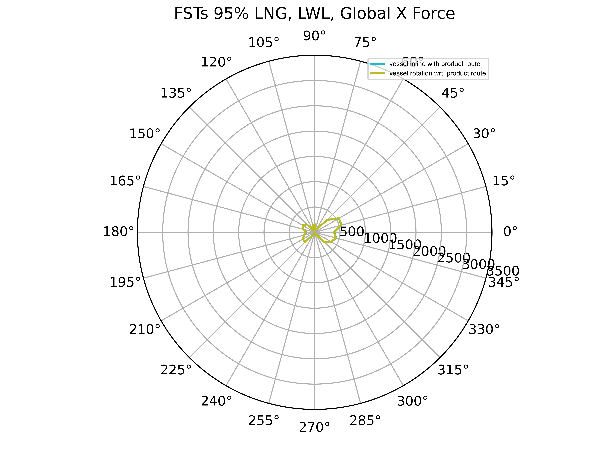
    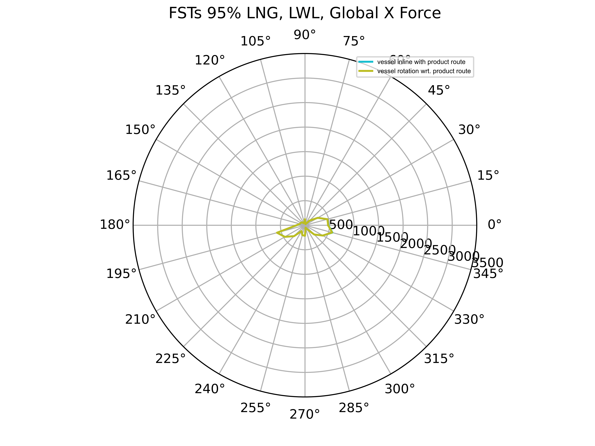
</div>

```markdown
- TBA
```

---
# Max Jacket Loads, FSTs 95% LNG, 100yr, LWL, Fy

- Two (2) struts contribute to each jacket global force

<div style="text-align: center;">
FST2 &emsp;&emsp;&emsp;&emsp;&emsp;&emsp;&emsp;&emsp;&emsp;&emsp;&emsp;&emsp;&emsp;&emsp;&emsp;&emsp;&emsp;&emsp; FST1
</div>
<div style="display: flex; justify-content: space-between;">
    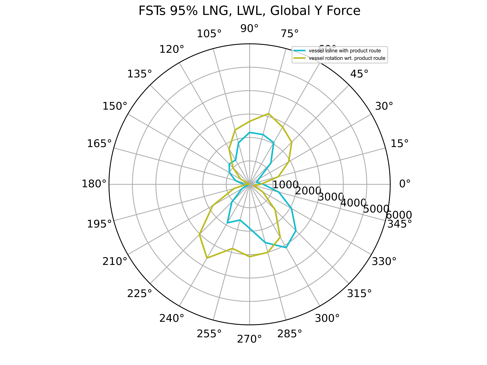
    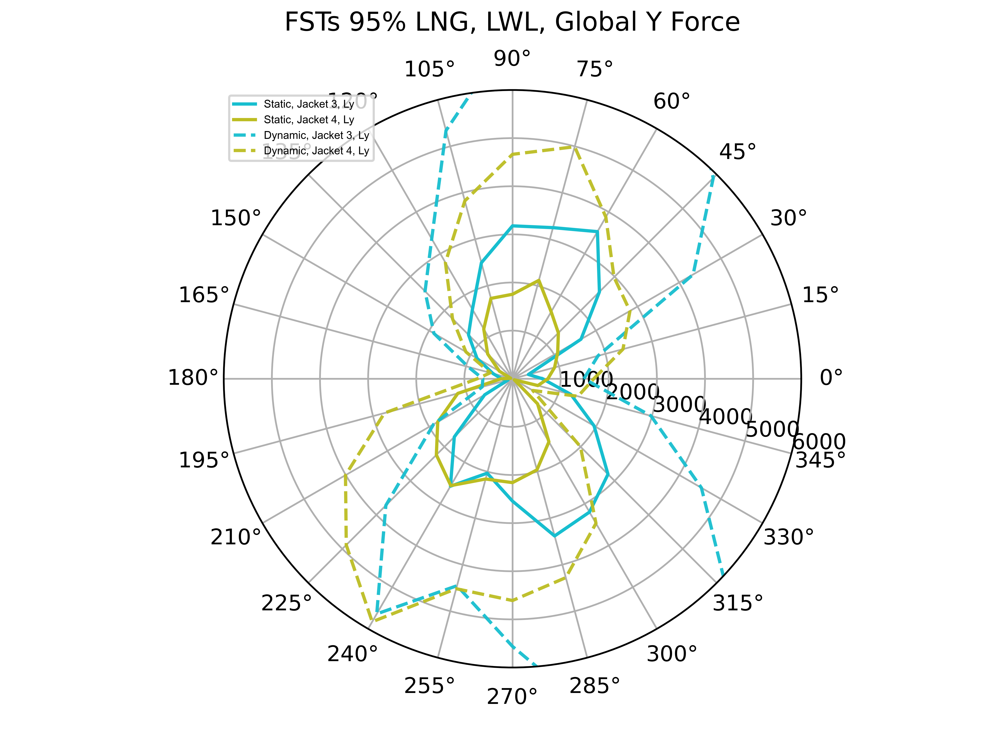
</div>

```markdown
- TBA
```

---
# Max Jacket Loads, FSTs 95% LNG, 100yr, HWL, Fx

- Two (2) struts contribute to each jacket global force

<div style="text-align: center;">
FST2 &emsp;&emsp;&emsp;&emsp;&emsp;&emsp;&emsp;&emsp;&emsp;&emsp;&emsp;&emsp;&emsp;&emsp;&emsp;&emsp;&emsp;&emsp; FST1
</div>
<div style="display: flex; justify-content: space-between;">
    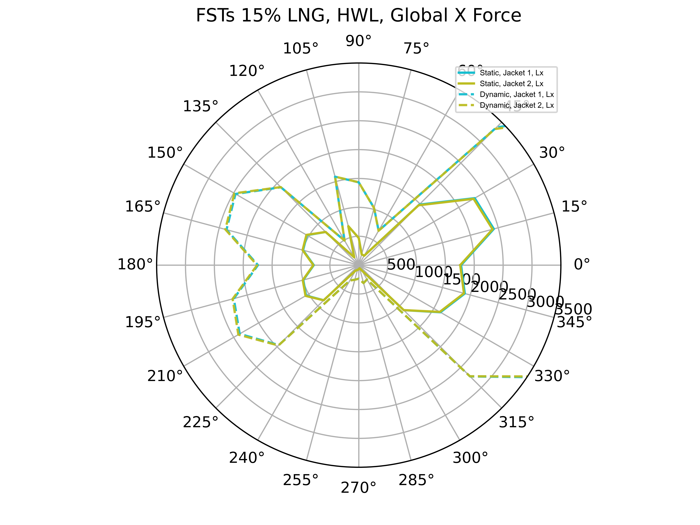
    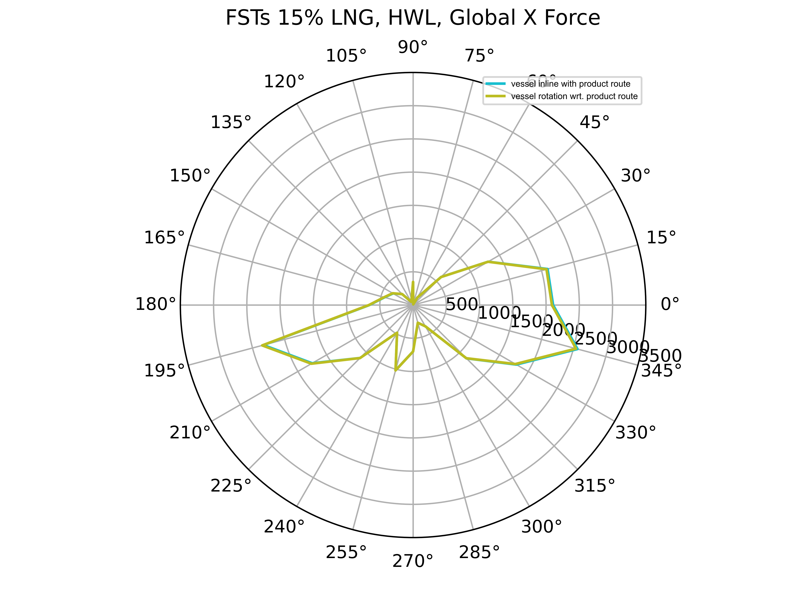
</div>

```markdown
- TBA
```


---
# Max Jacket Loads, FSTs 95% LNG, 100yr, HWL, Fy

- Two (2) struts contribute to each jacket global force

<div style="text-align: center;">
FST2 &emsp;&emsp;&emsp;&emsp;&emsp;&emsp;&emsp;&emsp;&emsp;&emsp;&emsp;&emsp;&emsp;&emsp;&emsp;&emsp;&emsp;&emsp; FST1
</div>
<div style="display: flex; justify-content: space-between;">
    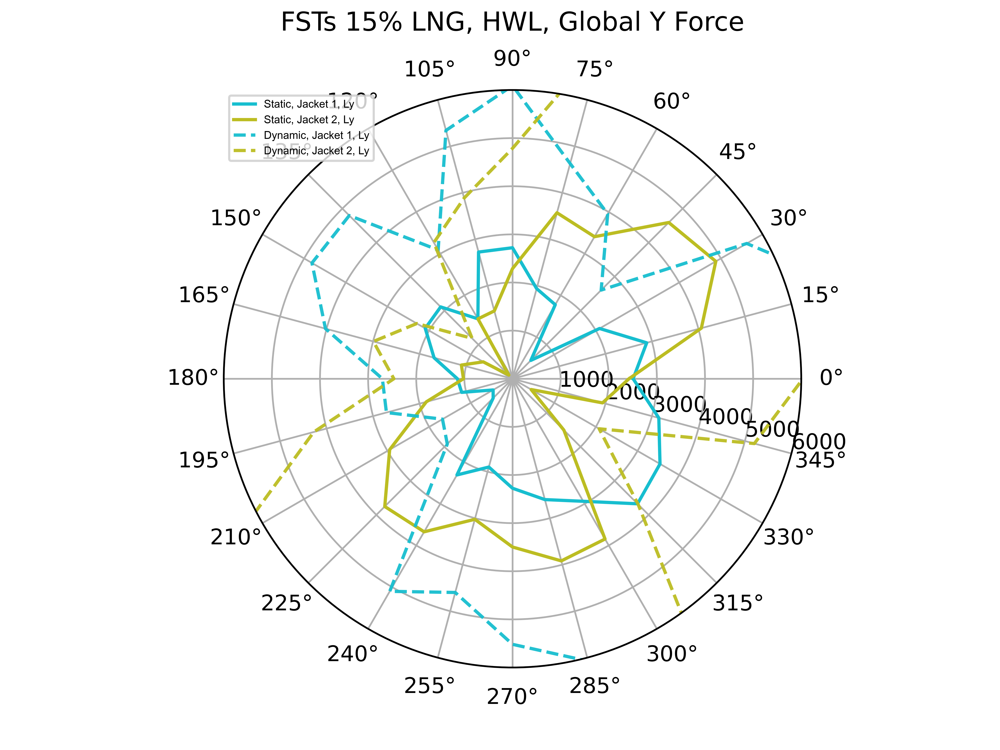
    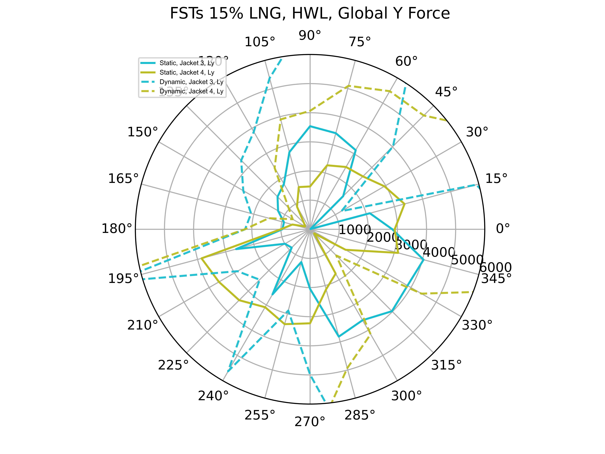
</div>

```markdown
- TBA
```


---
# Max Jacket Loads, FST1, Fy

- Two (2) struts contribute to each jacket global force

<div style="text-align: center;">
FSTs 95% LNG, 100yr, LWL &emsp;&emsp;&emsp;&emsp;&emsp;&emsp;&emsp; FSTs 15% LNG, 100yr, HWL
</div>
<div style="display: flex; justify-content: space-between;">
    
    
</div>

```markdown
- TBA
```

---
# Max Jacket Loads, FST2, Fy

- Two (2) struts contribute to each jacket global force

<div style="text-align: center;">
FSTs 95% LNG, 100yr, LWL &emsp;&emsp;&emsp;&emsp;&emsp;&emsp;&emsp; FSTs 15% LNG, 100yr, HWL
</div>
<div style="display: flex; justify-content: space-between;">
    
    
</div>

```markdown
- TBA
```


---
<!-- _class: transition -->

# 

### Jacket Loads, Dynamic

---
# Max Jacket Loads, FSTs 95% LNG, 100yr, LWL, Fx

- Two (2) struts contribute to each jacket global force

<div style="text-align: center;">
FST2 &emsp;&emsp;&emsp;&emsp;&emsp;&emsp;&emsp;&emsp;&emsp;&emsp;&emsp;&emsp;&emsp;&emsp;&emsp;&emsp;&emsp;&emsp; FST1
</div>
<div style="display: flex; justify-content: space-between;">
    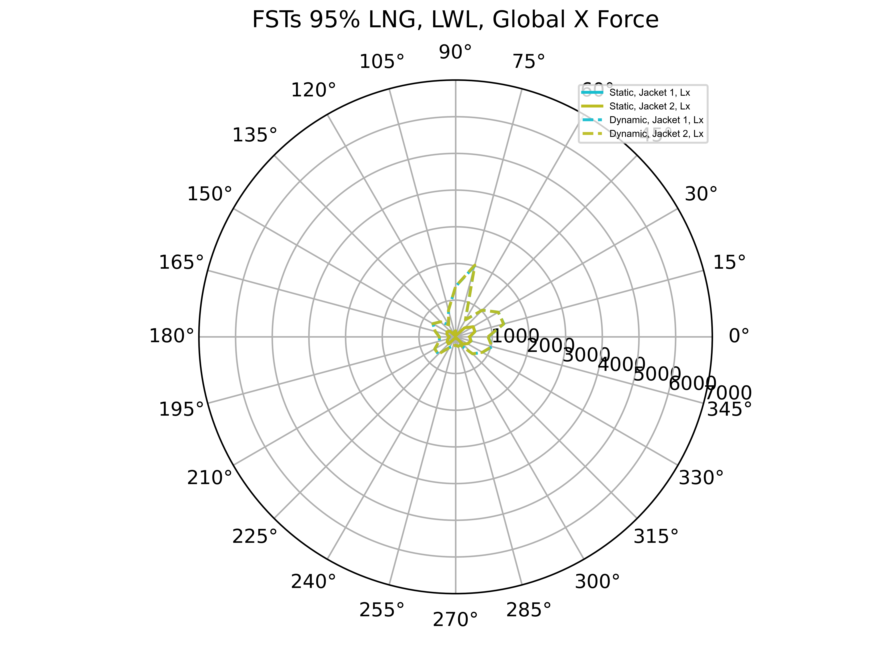
    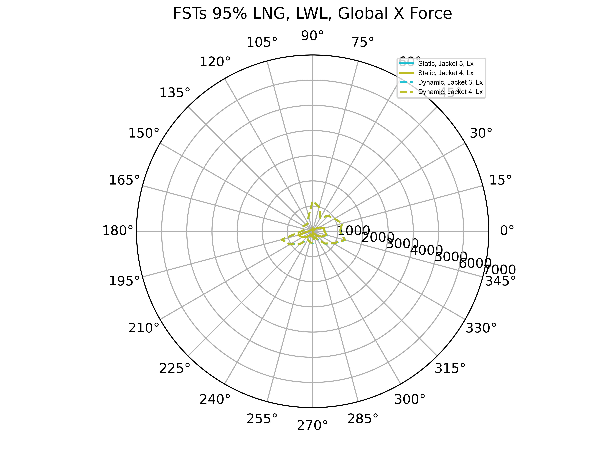
</div>

```markdown
- TBA
```

---
# Max Jacket Loads, FSTs 95% LNG, 100yr, LWL, Fy

- Two (2) struts contribute to each jacket global force

<div style="text-align: center;">
FST2 &emsp;&emsp;&emsp;&emsp;&emsp;&emsp;&emsp;&emsp;&emsp;&emsp;&emsp;&emsp;&emsp;&emsp;&emsp;&emsp;&emsp;&emsp; FST1
</div>
<div style="display: flex; justify-content: space-between;">
    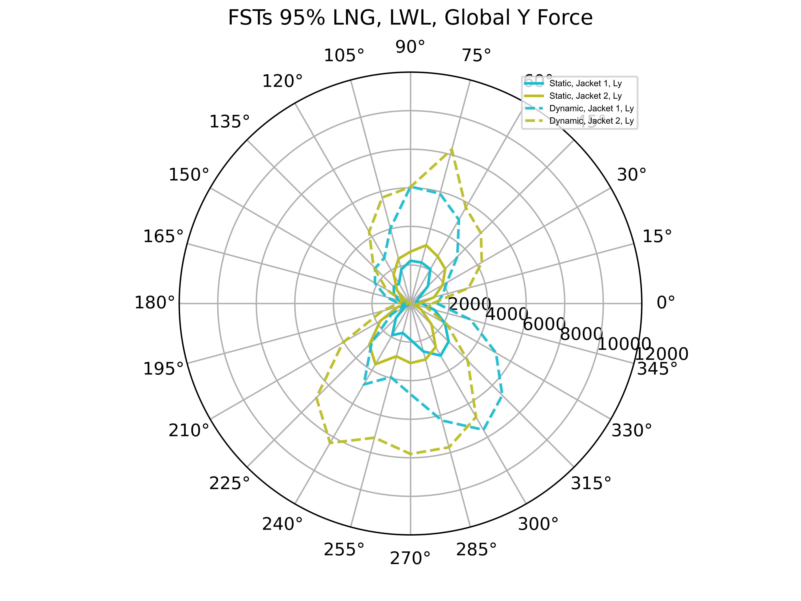
    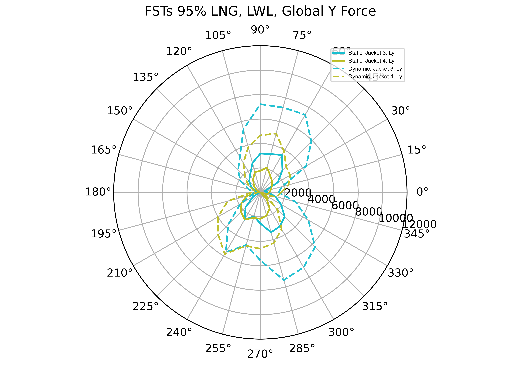
</div>

```markdown
- TBA
```

---
# Max Jacket Loads, FSTs 95% LNG, 100yr, HWL, Fx

- Two (2) struts contribute to each jacket global force

<div style="text-align: center;">
FST2 &emsp;&emsp;&emsp;&emsp;&emsp;&emsp;&emsp;&emsp;&emsp;&emsp;&emsp;&emsp;&emsp;&emsp;&emsp;&emsp;&emsp;&emsp; FST1
</div>
<div style="display: flex; justify-content: space-between;">
    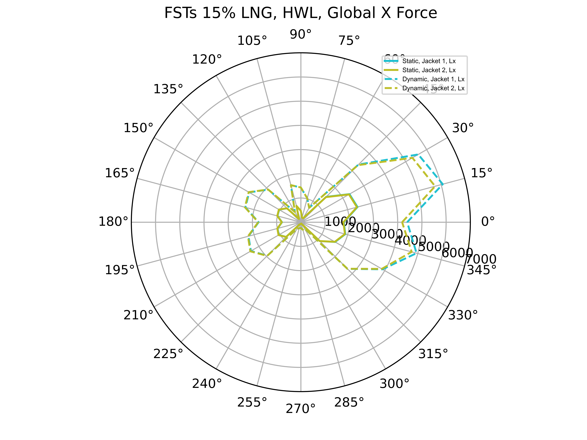
    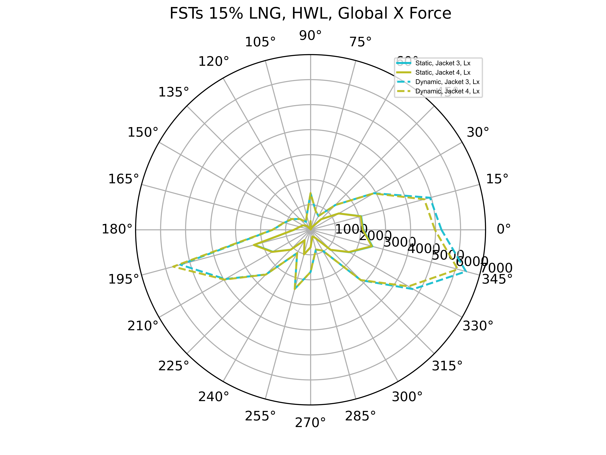
</div>

```markdown
- TBA
```


---
# Max Jacket Loads, FSTs 95% LNG, 100yr, HWL, Fy

- Two (2) struts contribute to each jacket global force

<div style="text-align: center;">
FSTs 95% LNG, 100yr, LWL &emsp;&emsp;&emsp;&emsp;&emsp;&emsp;&emsp;&emsp;&emsp;&emsp;&emsp; FSTs 15% LNG, 100yr, HWL
</div>
<div style="display: flex; justify-content: space-between;">
    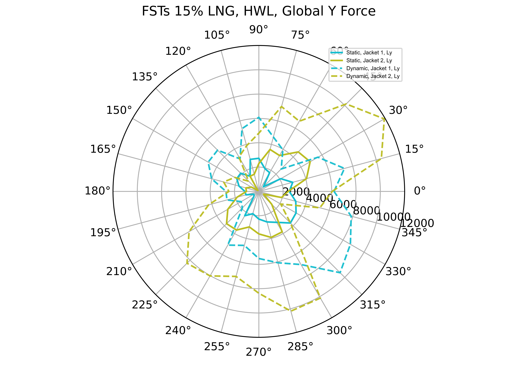
    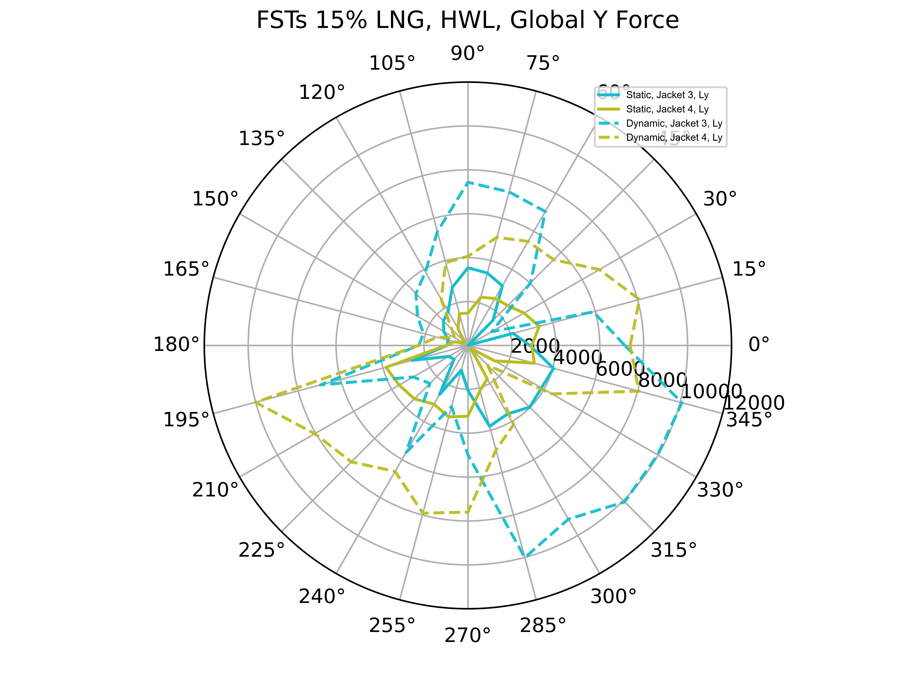
</div>

```markdown
- TBA
```

---
# Max Jacket Loads, FST1, Fy

- Two (2) struts contribute to each jacket global force

<div style="text-align: center;">
FSTs 95% LNG, 100yr, LWL &emsp;&emsp;&emsp;&emsp;&emsp;&emsp;&emsp; FSTs 15% LNG, 100yr, HWL
</div>
<div style="display: flex; justify-content: space-between;">
    
    
</div>

```markdown
- TBA
```

---
# Max Jacket Loads, FST2, Fy

- Two (2) struts contribute to each jacket global force

<div style="text-align: center;">
FSTs 95% LNG, 100yr, LWL &emsp;&emsp;&emsp;&emsp;&emsp;&emsp;&emsp; FSTs 15% LNG, 100yr, HWL
</div>
<div style="display: flex; justify-content: space-between;">
    
    
</div>

```markdown
- TBA
```


---
<!-- _class: transition -->

# 

### Strut Loads, Static

---
# Max Strut Loads, FSTs 95% LNG, 100yr, HWL, Tension, Static

- TBA

FST2 &emsp;&emsp;&emsp;&emsp;&emsp;&emsp;&emsp;&emsp;&emsp;&emsp;&emsp;&emsp;&emsp;&emsp;&emsp;&emsp;&emsp;&emsp; FST1

<div style="display: flex; justify-content: space-between;">
    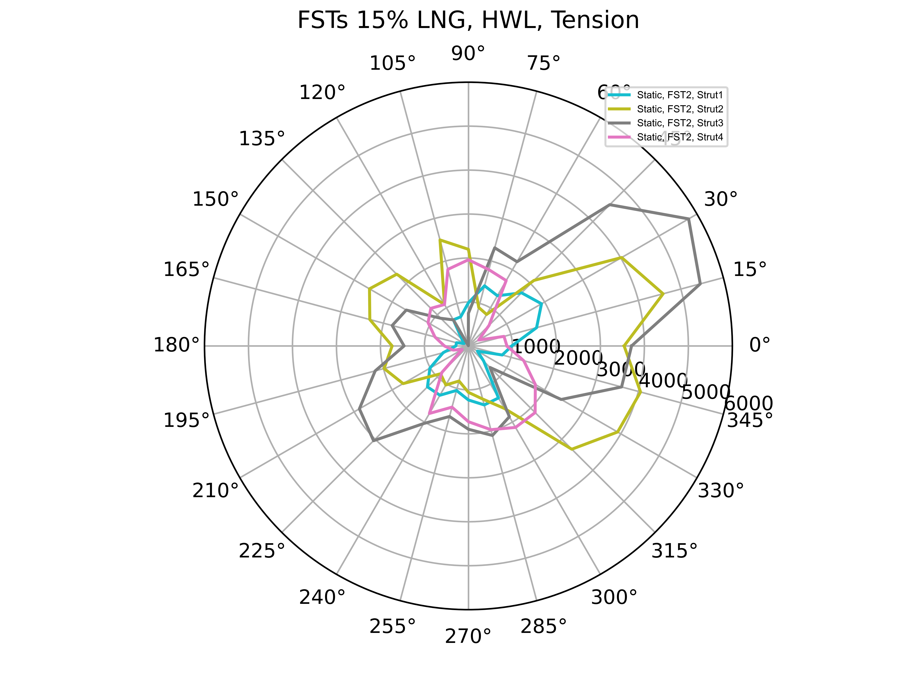
    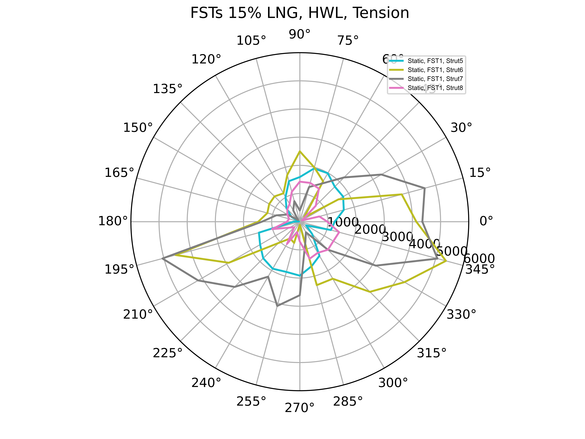
</div>

```markdown
- TBA
```

---
# Max Strut Loads, FSTs 95% LNG, 100yr, LWL, Tension, Static

- TBA

<div style="text-align: center;">
FST2 &emsp;&emsp;&emsp;&emsp;&emsp;&emsp;&emsp;&emsp;&emsp;&emsp;&emsp;&emsp;&emsp;&emsp;&emsp;&emsp;&emsp;&emsp; FST1
</div>
<div style="display: flex; justify-content: space-between;">
    
    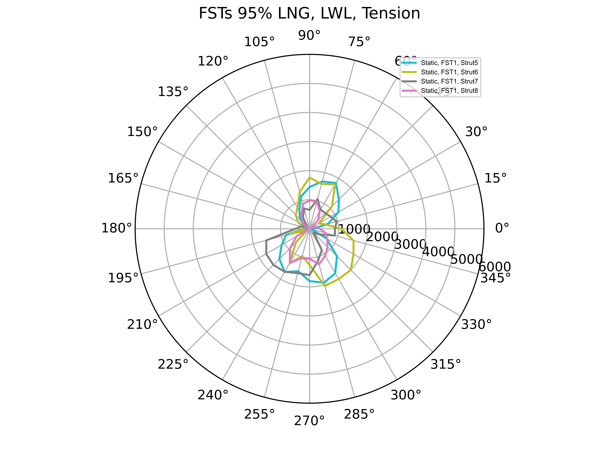
</div>

```markdown
- TBA
```

---
<!-- _class: transition -->

# 

### Strut Loads, Dynamic

---
# Max Strut Loads, FSTs 95% LNG, 100yr, HWL, Tension, Dynamic

- TBA

FST2 &emsp;&emsp;&emsp;&emsp;&emsp;&emsp;&emsp;&emsp;&emsp;&emsp;&emsp;&emsp;&emsp;&emsp;&emsp;&emsp;&emsp;&emsp; FST1

<div style="display: flex; justify-content: space-between;">
    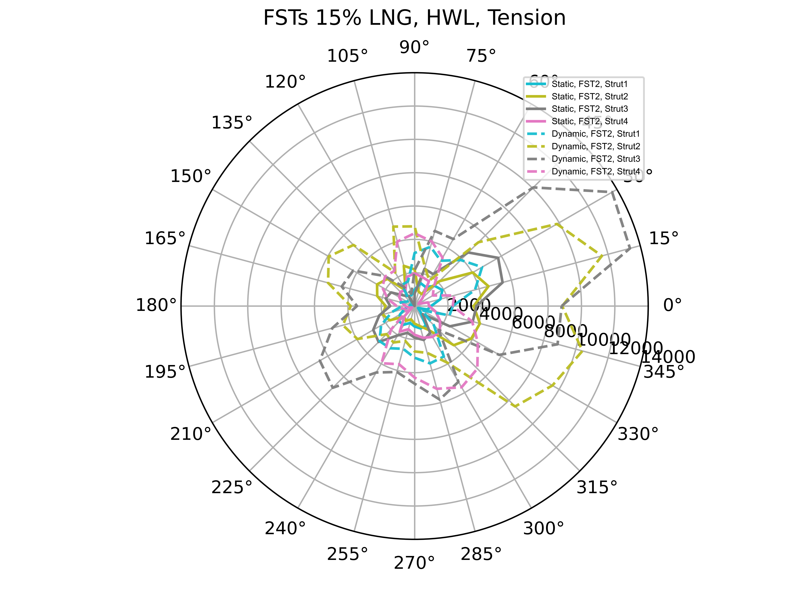
    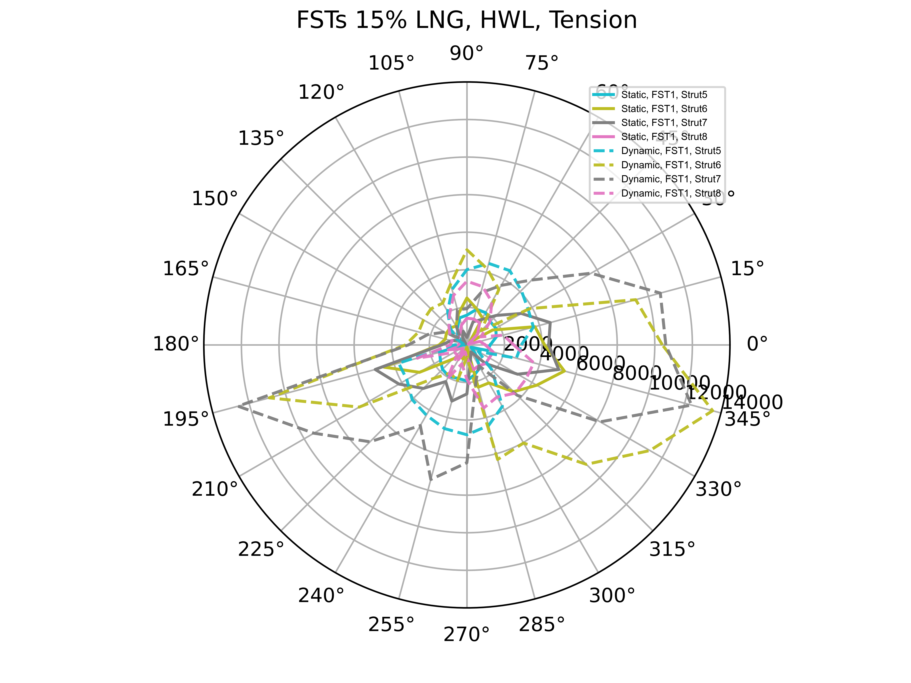
</div>

```markdown
- TBA
```

---
# Max Strut Loads, FSTs 95% LNG, 100yr, LWL, Tension, Dynamic

- TBA

<div style="text-align: center;">
FST2 &emsp;&emsp;&emsp;&emsp;&emsp;&emsp;&emsp;&emsp;&emsp;&emsp;&emsp;&emsp;&emsp;&emsp;&emsp;&emsp;&emsp;&emsp; FST1
</div>
<div style="display: flex; justify-content: space-between;">
    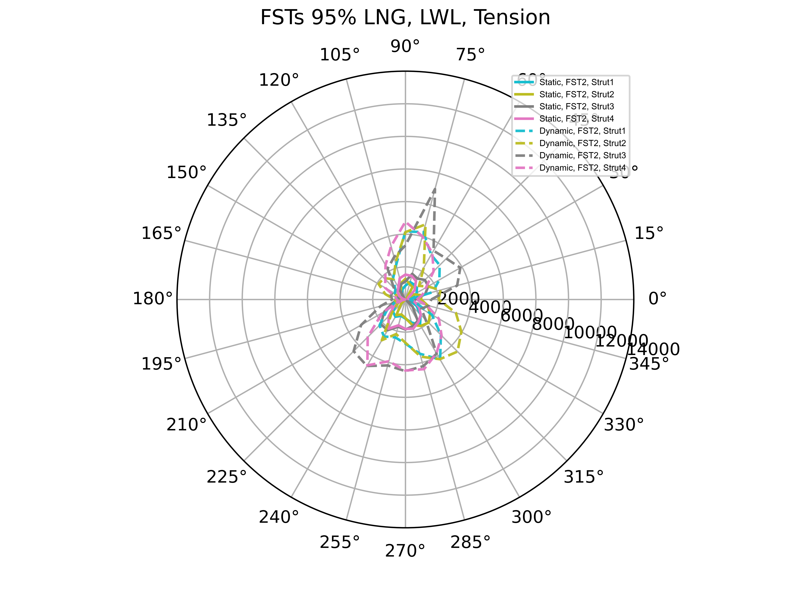
    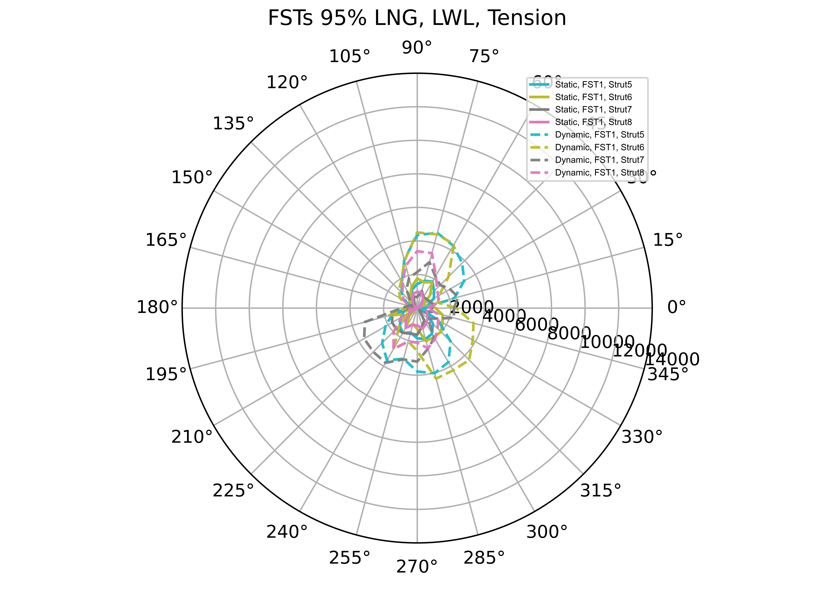
</div>

```markdown
- TBA
```

---
# Max Strut Loads, 100yr, HWL vs. LWL, Tension, Dynamic

- TBA

<div style="text-align: center;">
15% LNG HWL &emsp;&emsp;&emsp;&emsp;&emsp;&emsp;&emsp;&emsp;&emsp;&emsp;&emsp;&emsp;&emsp;&emsp;&emsp;&emsp;&emsp;&emsp; 95% LNG LWL
</div>
<div style="display: flex; justify-content: space-between;">
    
    
</div>

```markdown
- TBA
```


---

# FSTs 95% LNG, 100yr, LWL - Force Timetrace

<div style="text-align: center;">
Min -ve &emsp;&emsp;&emsp;&emsp;&emsp;&emsp;&emsp;&emsp;&emsp;&emsp;&emsp;&emsp;&emsp;&emsp;&emsp;&emsp;&emsp;&emsp; Max +ve
</div>
<div style="display: flex; justify-content: space-between;">
    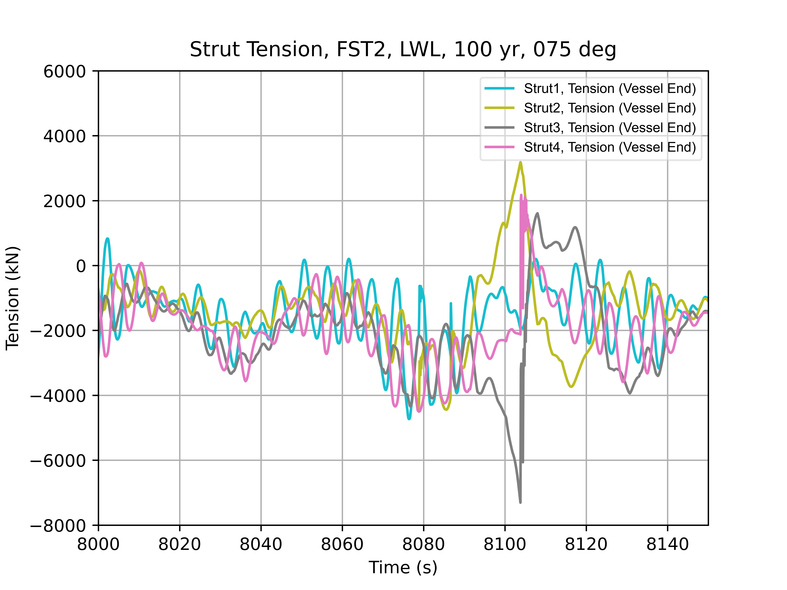
    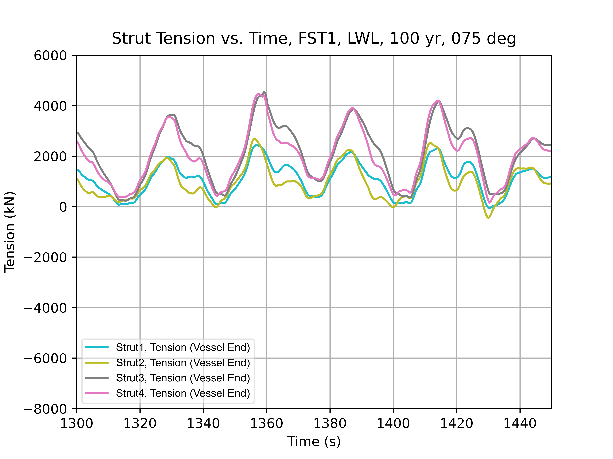
</div>

```markdown
- The struts are in sync
- Results in lower strut forces when compared to HWL results
```

---

# FSTs 95% LNG, 100yr, LWL - Force Timetrace, 240 deg

<div style="text-align: center;">
<iframe width="560" height="315" src="https://www.youtube.com/embed/QA3RmtbFTfE" title="YouTube video player" frameborder="0" allow="accelerometer; autoplay; clipboard-write; encrypted-media; gyroscope; picture-in-picture" allowfullscreen></iframe>
</div>

```markdown
- Time trace with extreme loading at 1359 s for FST2
```

---

# FSTs 15% LNG, 100yr, HWL - Force Timetrace

<div style="text-align: center;">
Min -ve &emsp;&emsp;&emsp;&emsp;&emsp;&emsp;&emsp;&emsp;&emsp;&emsp;&emsp;&emsp;&emsp;&emsp;&emsp;&emsp;&emsp;&emsp; Max +ve
</div>
<div style="display: flex; justify-content: space-between;">
    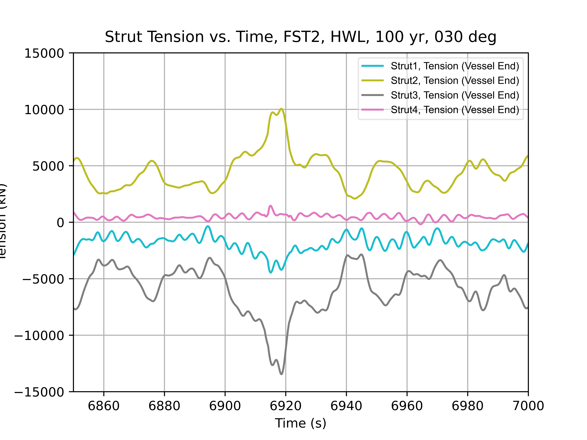
    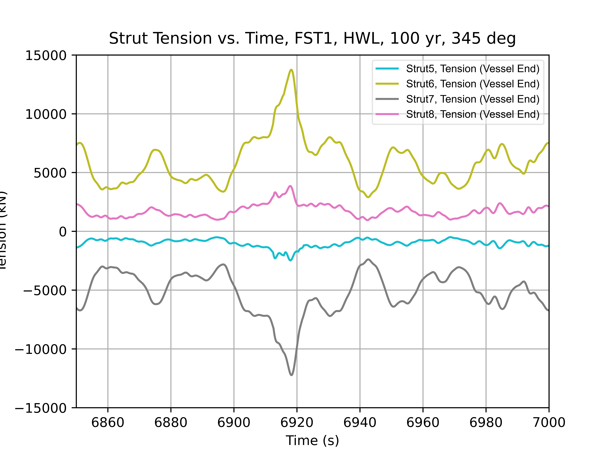
</div>

```markdown
- The 2 struts pairs are locked FST in tension-compression position
  - Results in high strut forces for FSTs 15% LNG, LWL condition
- This tension-compression lock position is similar to what was obtained in AQWA
```

---

# FSTs 15% LNG, 100yr, HWL - Force Timetrace, FST1, 345 deg

<div style="text-align: center;">
<iframe width="560" height="315" src="https://www.youtube.com/embed/breV6vJoA30" title="YouTube video player" frameborder="0" allow="accelerometer; autoplay; clipboard-write; encrypted-media; gyroscope; picture-in-picture" allowfullscreen></iframe>
</div>

```markdown
- Time trace with extreme loading at 6918 s for FST1
```


---
# FSTs, 100yr Discussion

- 100yr, HWL has tension-compression lock position
  - potentially due to force coefficients used
  - Perform sensitivity analysis with wind force yaw-coefficients = 0
  - Perform timestep senstivity with 0.05s and 0.025s. Current timestep is 0.1s.
- Determine whether tension-compression lock position is realistic due to prevailing external static loads (e.g. wind, current, wave etc.)

---

# Conclusions

### Way Forward

- FST tension-compression lock position
  - Theorically, this effect may be possible. 
  - Recommend permanemnt moring system designer, WSP to verify that this phenomenon does not occur from their design.
  - FST strut interface foundation is currently designed for all loads presented in this document.

---

# Way Forward

- 100 yr FSTs only QA/QC (Ongoing)

- 5 yr FSTs with LNGC
  - Will get this running after few more insights in 100 yr analysis


