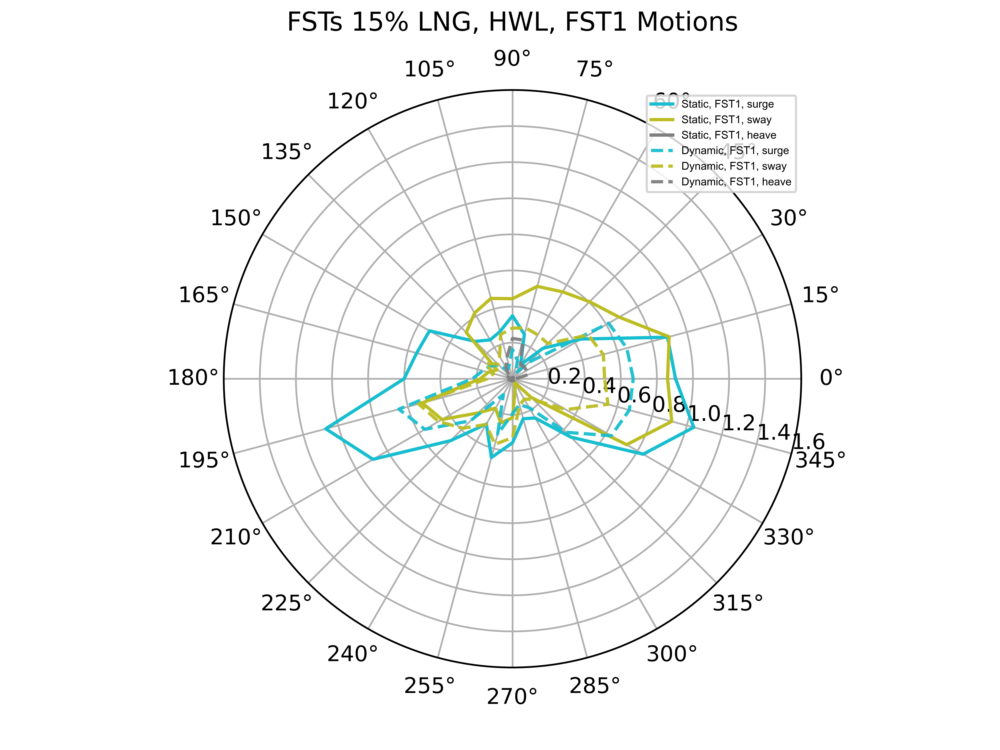
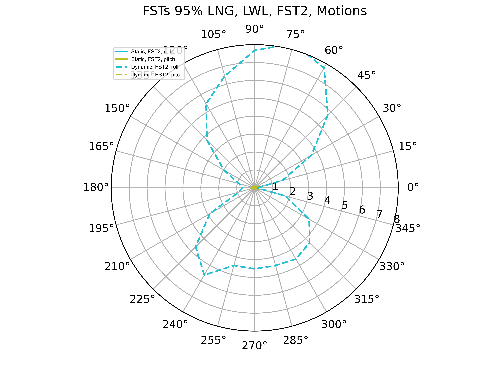
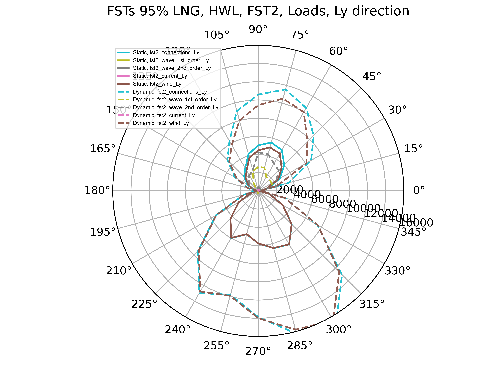

# WLNG FST Engineering Completion 

<!-- Title Slide -->
## WLNG FST Extreme Weather Analysis
## Vamsee Achanta

<!-- Today's Date -->
<!-- _class: date -->
<script>
  const today = new Date();
  const formattedDate = today.toISOString().split('T')[0];
  document.write(formattedDate);
</script>


---

<!-- Slide for Introduction -->
# Introduction
- FST analysis for WLNG

---
<!-- _class: transition -->

# 

## Design Data

## Analysis Methodology

---

# Design Data - Environment
<div style="display: flex; flex-wrap: wrap; justify-content: space-between;">
  
  
  
</div>

# FSTs Only, General Arrangement

<div style="text-align: center;">
FST2 &emsp;&emsp;&emsp;&emsp;&emsp;&emsp;&emsp;&emsp;&emsp;&emsp;&emsp;&emsp;&emsp;&emsp;&emsp;&emsp;&emsp;&emsp; FST1


</div>

```markdown
- strut, jacket and FST numbering shown
- FST local axes shown
```

---
# Methodology
- TBA

---
# Methodology - Analysis

- TBA

```markdown
- TBA
- TBA
```

---
# Methodology - Result Interpretation

- Timetrace plots ? actual values (no data manipulation)
  - Strut positive tension is tension and negative is compression i.e. axes independent values 
  - Jacket forces are in global X and Y direction
  - FST forces are in FST local axes
- Radial/rose  plots - ONLY positive values used
  - Objective: 
    - For understanding value change with direction. 
    - The increase/decrease help determine the max force directions.
  - Static values: absolute values
  - Dynamic values: absolute maximum i.e. max (abs(max), abs(min))

```markdown
- Applicable details will be added to each slide
```

---
<!-- _class: transition -->

# 

## 100 year Analysis Results

---
<!-- _class: transition -->

# 

### FST Motion Response

---
# FSTs 95% LNG, 100yr, LWL - FST Surge and Sway, Directional Response

- TBA

<div style="text-align: center;">
FST2 &emsp;&emsp;&emsp;&emsp;&emsp;&emsp;&emsp;&emsp;&emsp;&emsp;&emsp;&emsp;&emsp;&emsp;&emsp;&emsp;&emsp;&emsp; FST1
</div>
<div style="display: flex; justify-content: space-between;">

  
  
</div>

```markdown
- TBA
```

---
# FSTs 95% LNG, 100yr, HWL - FST Surge and Sway, Directional Response

- TBA

<div style="text-align: center;">
FST2 &emsp;&emsp;&emsp;&emsp;&emsp;&emsp;&emsp;&emsp;&emsp;&emsp;&emsp;&emsp;&emsp;&emsp;&emsp;&emsp;&emsp;&emsp; FST1
</div>
<div style="display: flex; justify-content: space-between;">
    
    
</div>

```markdown
- TBA
```

---
# FSTs 95% LNG, 100yr, LWL - FST Rotations, Directional Response

- TBA
<div style="text-align: center;">
FST2 &emsp;&emsp;&emsp;&emsp;&emsp;&emsp;&emsp;&emsp;&emsp;&emsp;&emsp;&emsp;&emsp;&emsp;&emsp;&emsp;&emsp;&emsp; FST1
</div>

<div style="display: flex; justify-content: space-between;">
    
    
</div>

```markdown
- TBA
```

---
# FSTs 95% LNG, 100yr, HWL - FST Rotations, Directional Response

- TBA

<div style="text-align: center;">
FST2 &emsp;&emsp;&emsp;&emsp;&emsp;&emsp;&emsp;&emsp;&emsp;&emsp;&emsp;&emsp;&emsp;&emsp;&emsp;&emsp;&emsp;&emsp; FST1
</div>
<div style="display: flex; justify-content: space-between;">
    
    
</div>

```markdown
- TBA
```

---
<!-- _class: transition -->

# 

### FST Load Response

---
# FSTs 95% LNG, 100yr, HWL - FST Loads, X Direction

- TBA

<div style="text-align: center;">
FST2 &emsp;&emsp;&emsp;&emsp;&emsp;&emsp;&emsp;&emsp;&emsp;&emsp;&emsp;&emsp;&emsp;&emsp;&emsp;&emsp;&emsp;&emsp; FST1
</div>
<div style="display: flex; justify-content: space-between;">
    
    
</div>

```markdown
- TBA
```

---
# FSTs 95% LNG, 100yr, HWL - FST Loads, Y Direction

- TBA

<div style="text-align: center;">
FST2 &emsp;&emsp;&emsp;&emsp;&emsp;&emsp;&emsp;&emsp;&emsp;&emsp;&emsp;&emsp;&emsp;&emsp;&emsp;&emsp;&emsp;&emsp; FST1
</div>
<div style="display: flex; justify-content: space-between;">
    
    
</div>

```markdown
- TBA
```

---
# FSTs 15% LNG, 100yr, LWL - FST Loads, X Direction

- TBA

<div style="text-align: center;">
FST2 &emsp;&emsp;&emsp;&emsp;&emsp;&emsp;&emsp;&emsp;&emsp;&emsp;&emsp;&emsp;&emsp;&emsp;&emsp;&emsp;&emsp;&emsp; FST1
</div>
<div style="display: flex; justify-content: space-between;">
    
    
</div>

```markdown
- TBA
```

---
# FSTs 15% LNG, 100yr, LWL - FST Loads, Y Direction

- TBA

<div style="text-align: center;">
FST2 &emsp;&emsp;&emsp;&emsp;&emsp;&emsp;&emsp;&emsp;&emsp;&emsp;&emsp;&emsp;&emsp;&emsp;&emsp;&emsp;&emsp;&emsp; FST1
</div>
<div style="display: flex; justify-content: space-between;">
    
    
</div>

```markdown
- TBA
```

---
<!-- _class: transition -->

# 

### Jacket Loads

---
# Max Jacket Loads, FSTs 95% LNG, 100yr, LWL

- LWL, Jacket Global forces in X and Y direction are shown
- Two (2) struts contribute to each jacket global force

<div style="display: flex; justify-content: space-between;">
    
    
</div>

```markdown
- Y loads are significantly higher than X loads
```

---

# Max Jacket Loads, FSTs 15% LNG, 100yr, HWL

- HWL, Jacket Global forces in X and Y direction are shown
- Max loads are absolute maximum i.e. max (abs(max), abs(min))

<div style="display: flex; justify-content: space-between;">
    
    
</div>

```markdown
- The HWL static & dynamic forces are significantly higher that those of LWL.
- The 15% LNG & LWL needs to be investigated further.
```

---
<!-- _class: transition -->

# 

### Strut Loads

---

# FSTs 95% LNG, 100yr, LWL - Force Timetrace

<div style="display: flex; justify-content: space-between;">
    
    
</div>

```markdown
- The struts are in sync
- Results in lower strut forces when compared to HWL results
```

---

# FSTs 15% LNG, 100yr, HWL - Force Timetrace

<div style="display: flex; justify-content: space-between;">
    
    
</div>

```markdown
- The 2 struts are locked FST in yaw position
  - Results in high forces
  - Low roll compared to LWL response
  - Comparable heave motions with LWL response
- This roll-locking result trend is similar to what was obtained in AQWA
```

---
# FSTs, 100yr Discussion

- 100yr, HWL has roll-locking effect 
  - potentially due to force coefficients used
- Perform sensitivity analysis on force coefficients with yaw-coeffs = 0
- Determine whether roll-locking effect is realistic due to prevailing external non-dynamic forces (e.g. wind, current, wave etc.)

---

# Conclusions

### Way Forward

- FST roll-locking effect
  - Theorically, this effect may be possible. 
  - Recommend permanemnt moring system designer, WSP to verify that this phenomenon does not occur from their design.
  - FST strut interface foundation is currently designed for all loads presented in this document.

---

# Way Forward
- 100 yr FSTs only
  - Perform sensitivity

- 5 yr FSTs with LNGC
  - Will get this running after few more insights in 100 yr analysis

