# WLNG FST Engineering Completion 

<!-- Title Slide -->
## WLNG FST Extreme Weather Analysis

## Inputs and FST

## Vamsee Achanta

<!-- Today's Date -->
<!-- _class: date -->
<script>
  const today = new Date();
  const formattedDate = today.toISOString().split('T')[0];
  document.write(formattedDate);
</script>


---

<!-- Slide for Introduction -->
# Introduction
- FST analysis for WLNG

---
<!-- _class: transition -->

# 

## Design Data

## Analysis Methodology

---

# Design Data - Environment
<div style="display: flex; flex-wrap: wrap; justify-content: space-between;">
  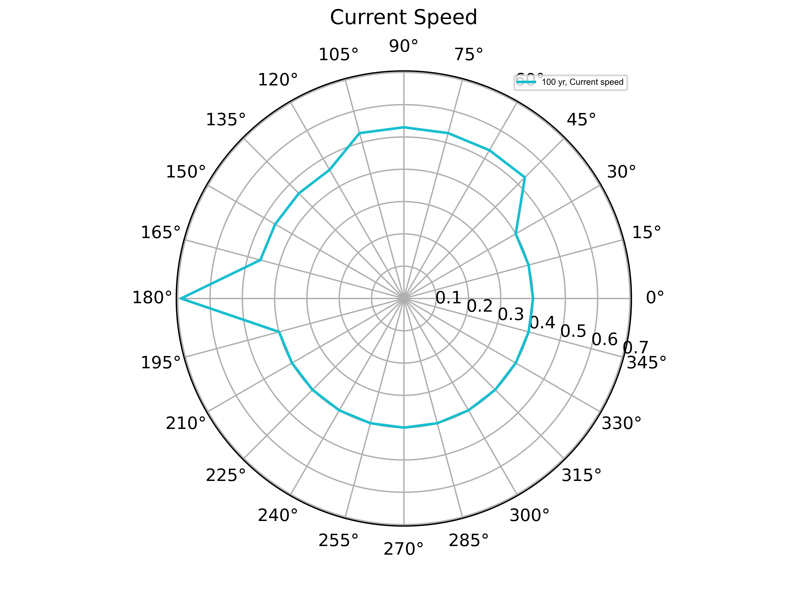
  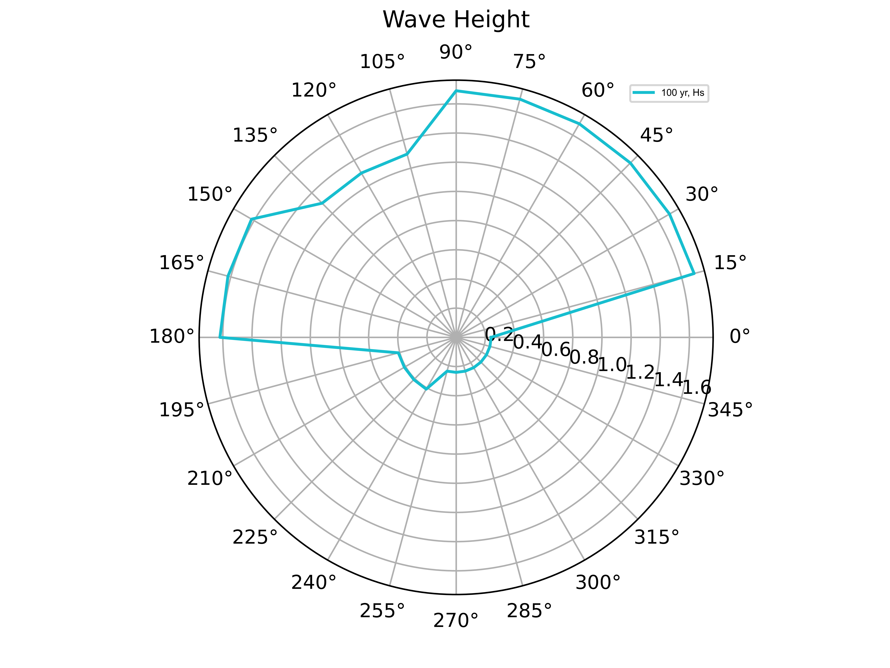
  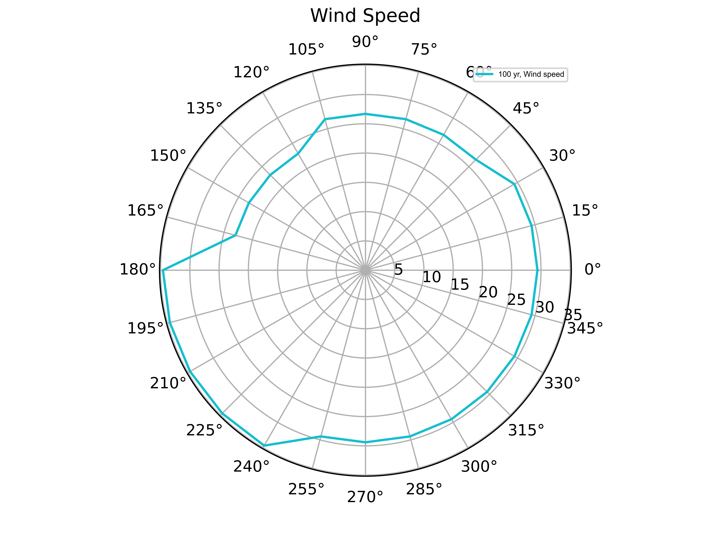
</div>

<div style="text-align: center;">
FST2 &emsp;&emsp;&emsp;&emsp;&emsp; FST1
</div>
<div style="text-align: center;">
  
</div>

```markdown
- Radial plots axis is based on environment direction
```

---
# FSTs Only, General Arrangement

<div style="text-align: center;">
FST2 &emsp;&emsp;&emsp;&emsp;&emsp;&emsp;&emsp;&emsp;&emsp;&emsp;&emsp;&emsp;&emsp;&emsp;&emsp;&emsp;&emsp;&emsp; FST1


</div>

```markdown
- strut, jacket and FST numbering shown
- FST local axes shown
```

---
# Methodology
- TBA

---
# Methodology - Analysis

- TBA

```markdown
- TBA
- TBA
```

---
# Methodology - Result Interpretation

- Timetrace plots are actual values (not statistical)
  - Strut positive tension is tension and negative tension is compression i.e. axes independent values
  - Jacket forces are in global X and Y direction
  - FST forces are in FST local axes
- Radial/rose  plots - ONLY positive values used
  - Objective: 
    - For understanding value change with direction. 
    - The increase/decrease help determine the max force directions.
  - Static values: absolute values
  - Dynamic values: absolute maximum i.e. max (abs(max), abs(min))

```markdown
- Applicable details will be added to each slide
```

---
<!-- _class: transition -->

# 

## 100 year Analysis Results

---
<!-- _class: transition -->

# 

### FST Motion Response

---
# FSTs 95% LNG, 100yr, LWL - FST Surge and Sway

- TBA

<div style="text-align: center;">
FST2 &emsp;&emsp;&emsp;&emsp;&emsp;&emsp;&emsp;&emsp;&emsp;&emsp;&emsp;&emsp;&emsp;&emsp;&emsp;&emsp;&emsp;&emsp; FST1
</div>
<div style="display: flex; justify-content: space-between;">

  
  
</div>

```markdown
- TBA
```

---
# FSTs 15% LNG, 100yr, HWL - FST Surge and Sway

- TBA

<div style="text-align: center;">
FST2 &emsp;&emsp;&emsp;&emsp;&emsp;&emsp;&emsp;&emsp;&emsp;&emsp;&emsp;&emsp;&emsp;&emsp;&emsp;&emsp;&emsp;&emsp; FST1
</div>
<div style="display: flex; justify-content: space-between;">
    
    
</div>

```markdown
- TBA
```

---
# FSTs 95% LNG, 100yr, LWL - FST Rotations

- TBA
<div style="text-align: center;">
FST2 &emsp;&emsp;&emsp;&emsp;&emsp;&emsp;&emsp;&emsp;&emsp;&emsp;&emsp;&emsp;&emsp;&emsp;&emsp;&emsp;&emsp;&emsp; FST1
</div>

<div style="display: flex; justify-content: space-between;">
    
    
</div>

```markdown
- TBA
```

---
# FSTs 15% LNG, 100yr, HWL - FST Rotations

- TBA

<div style="text-align: center;">
FST2 &emsp;&emsp;&emsp;&emsp;&emsp;&emsp;&emsp;&emsp;&emsp;&emsp;&emsp;&emsp;&emsp;&emsp;&emsp;&emsp;&emsp;&emsp; FST1
</div>
<div style="display: flex; justify-content: space-between;">
    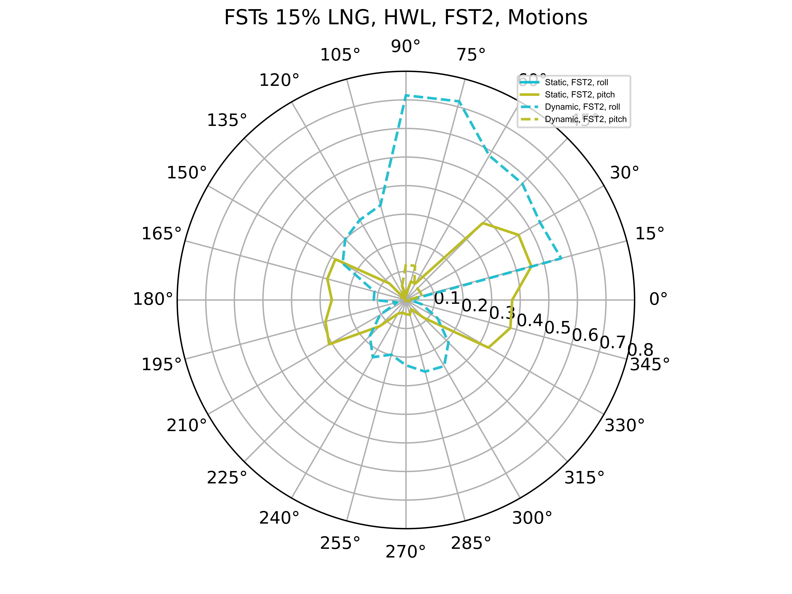
    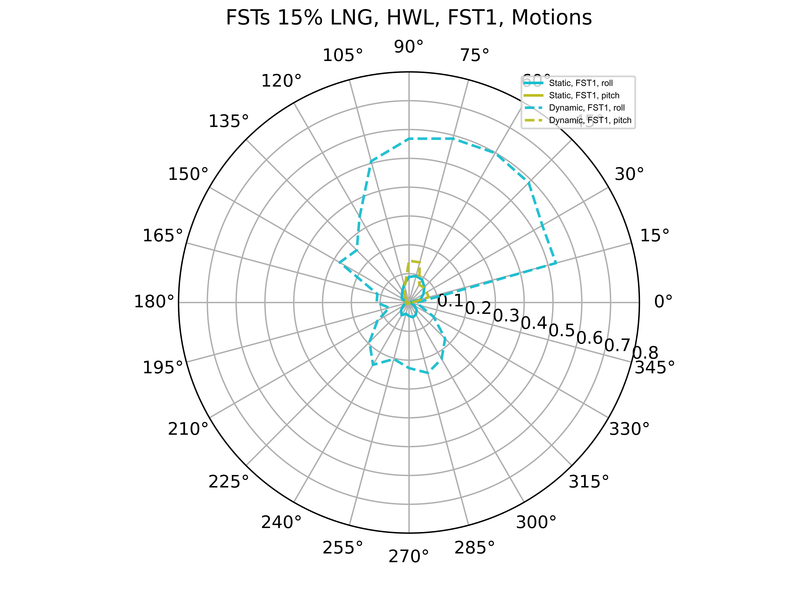
</div>

```markdown
- TBA
```

---
# FST Rotations, 100 yr, LWL vs. HWL

- TBA

<div style="text-align: center;">
LWL &emsp;&emsp;&emsp;&emsp;&emsp;&emsp;&emsp;&emsp;&emsp;&emsp;&emsp;&emsp;&emsp;&emsp;&emsp;&emsp;&emsp;&emsp; HWL
</div>
<div style="display: flex; justify-content: space-between;">
    
    
</div>

```markdown
- 15% LNG, HWL has low roll rotations compared to 95% LNG, LWL
```

---
<!-- _class: transition -->

# 

### FST Load Response, Static

---
# FSTs 95% LNG, 100yr, HWL, FST Forces, X Direction

- TBA

<div style="text-align: center;">
FST2 &emsp;&emsp;&emsp;&emsp;&emsp;&emsp;&emsp;&emsp;&emsp;&emsp;&emsp;&emsp;&emsp;&emsp;&emsp;&emsp;&emsp;&emsp; FST1
</div>
<div style="display: flex; justify-content: space-between;">
    
    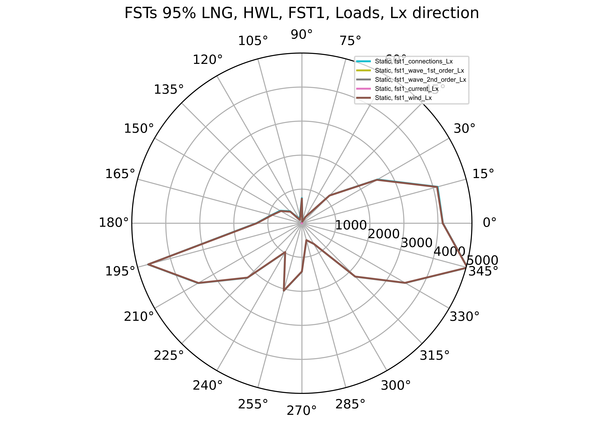
</div>

```markdown
- Wind loads dominate the FST forces
```

---
# FSTs 95% LNG, 100yr, HWL, FST Forces, Y Direction

- TBA

<div style="text-align: center;">
FST2 &emsp;&emsp;&emsp;&emsp;&emsp;&emsp;&emsp;&emsp;&emsp;&emsp;&emsp;&emsp;&emsp;&emsp;&emsp;&emsp;&emsp;&emsp; FST1
</div>
<div style="display: flex; justify-content: space-between;">
    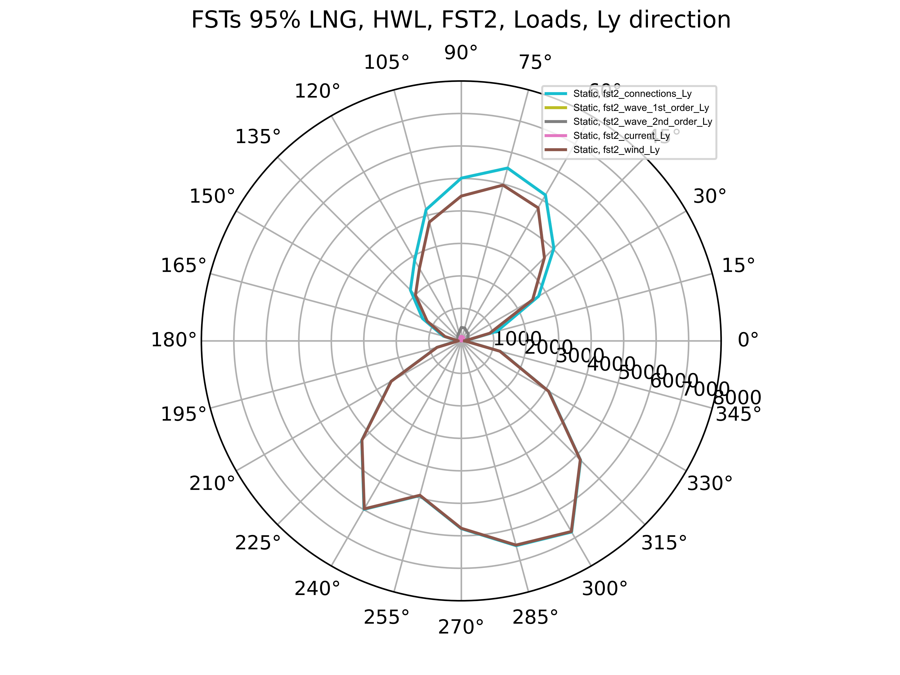
    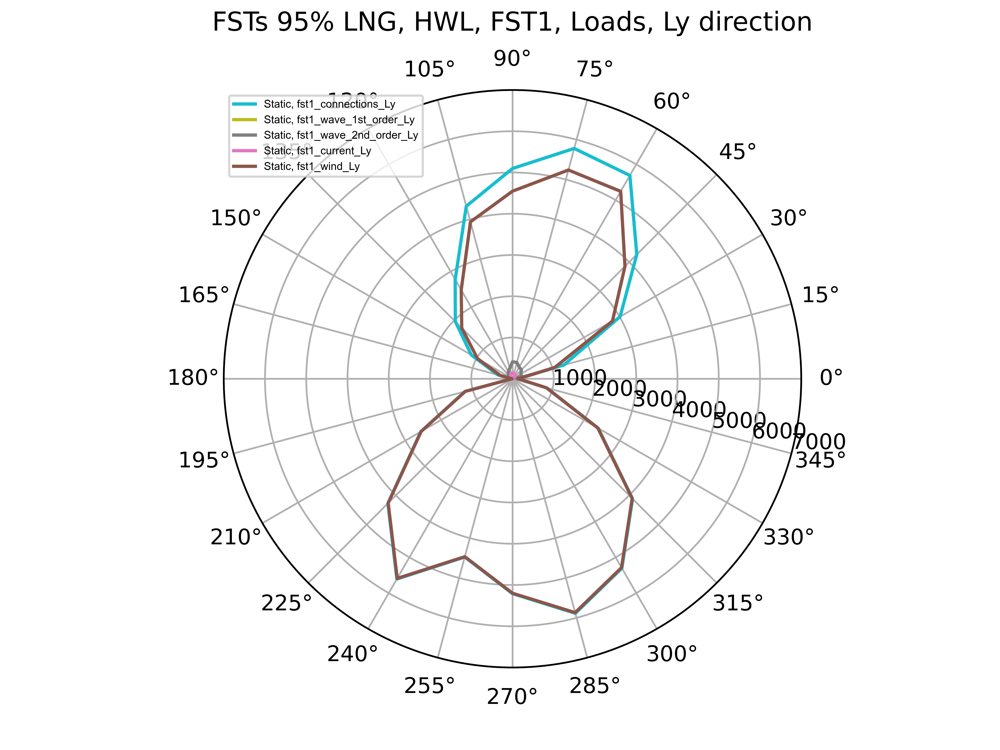
</div>

```markdown
- TBA
```

---
# FSTs 15% LNG, 100yr, LWL, FST Forces, X Direction

- TBA

<div style="text-align: center;">
FST2 &emsp;&emsp;&emsp;&emsp;&emsp;&emsp;&emsp;&emsp;&emsp;&emsp;&emsp;&emsp;&emsp;&emsp;&emsp;&emsp;&emsp;&emsp; FST1
</div>
<div style="display: flex; justify-content: space-between;">
    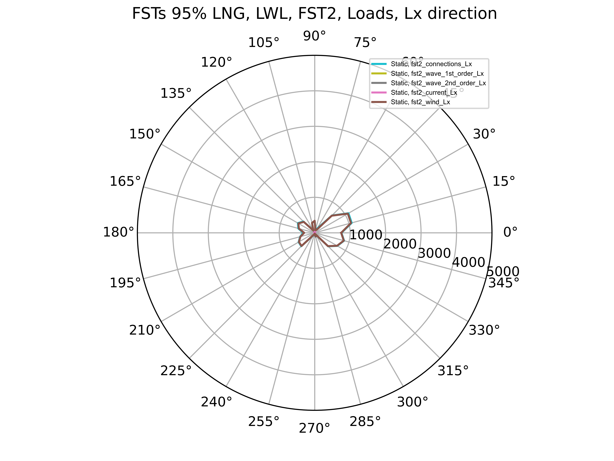
    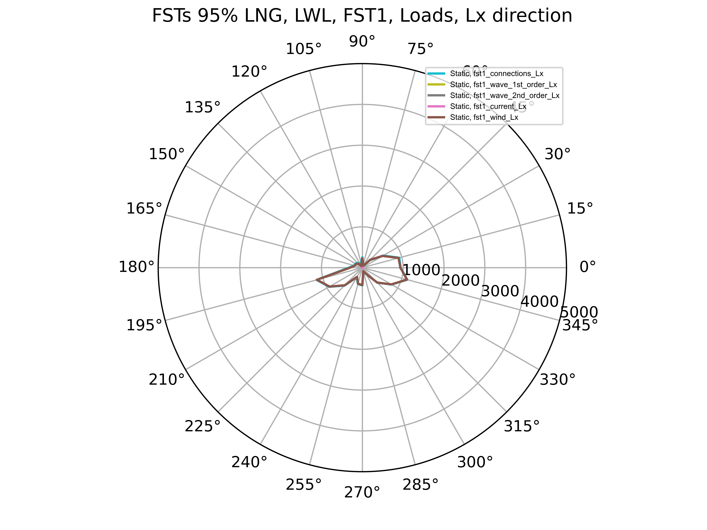
</div>

```markdown
- TBA
```

---
# FSTs 15% LNG, 100yr, LWL, FST Forces, Y Direction

- TBA

<div style="text-align: center;">
FST2 &emsp;&emsp;&emsp;&emsp;&emsp;&emsp;&emsp;&emsp;&emsp;&emsp;&emsp;&emsp;&emsp;&emsp;&emsp;&emsp;&emsp;&emsp; FST1
</div>
<div style="display: flex; justify-content: space-between;">
    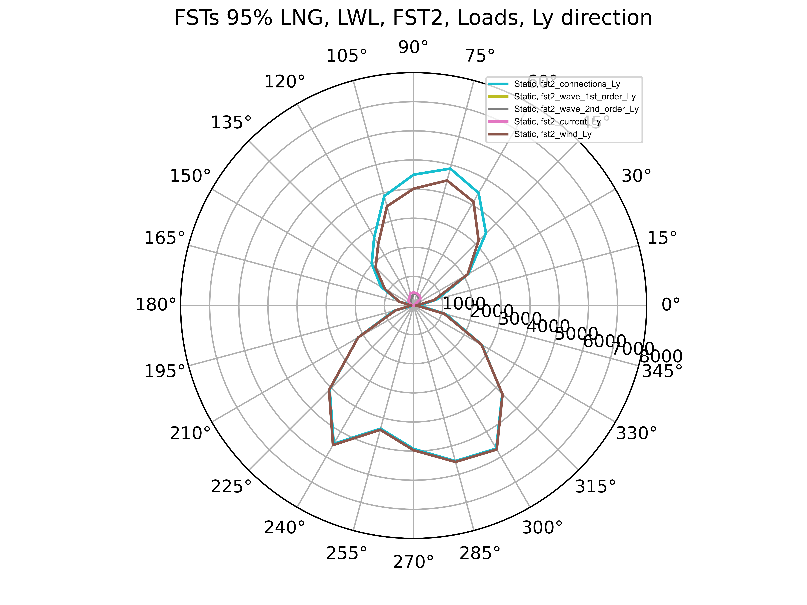
    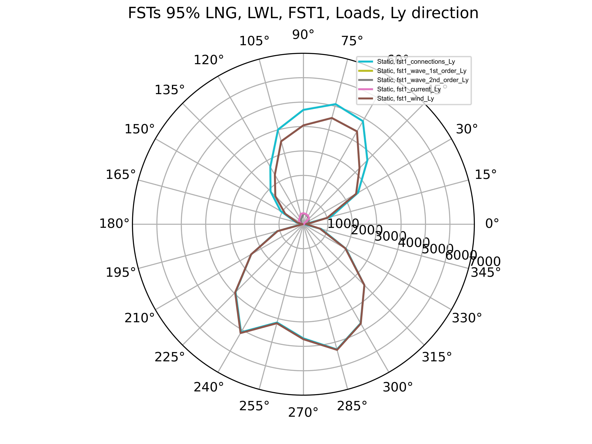
</div>

```markdown
- TBA
```

---
<!-- _class: transition -->

# 

### FST Load Response, Dynamic

---
# FSTs 95% LNG, 100yr, HWL, FST Forces, X Direction

- TBA

<div style="text-align: center;">
FST2 &emsp;&emsp;&emsp;&emsp;&emsp;&emsp;&emsp;&emsp;&emsp;&emsp;&emsp;&emsp;&emsp;&emsp;&emsp;&emsp;&emsp;&emsp; FST1
</div>
<div style="display: flex; justify-content: space-between;">
    
    
</div>

```markdown
- TBA
```

---
# FSTs 95% LNG, 100yr, HWL, FST Forces, Y Direction

- TBA

<div style="text-align: center;">
FST2 &emsp;&emsp;&emsp;&emsp;&emsp;&emsp;&emsp;&emsp;&emsp;&emsp;&emsp;&emsp;&emsp;&emsp;&emsp;&emsp;&emsp;&emsp; FST1
</div>
<div style="display: flex; justify-content: space-between;">
    
    
</div>

```markdown
- TBA
```

---
# FSTs 15% LNG, 100yr, LWL, FST Forces, X Direction

- TBA

<div style="text-align: center;">
FST2 &emsp;&emsp;&emsp;&emsp;&emsp;&emsp;&emsp;&emsp;&emsp;&emsp;&emsp;&emsp;&emsp;&emsp;&emsp;&emsp;&emsp;&emsp; FST1
</div>
<div style="display: flex; justify-content: space-between;">
    
    
</div>

```markdown
- TBA
```

---
# FSTs 15% LNG, 100yr, LWL, FST Forces, Y Direction

- TBA

<div style="text-align: center;">
FST2 &emsp;&emsp;&emsp;&emsp;&emsp;&emsp;&emsp;&emsp;&emsp;&emsp;&emsp;&emsp;&emsp;&emsp;&emsp;&emsp;&emsp;&emsp; FST1
</div>
<div style="display: flex; justify-content: space-between;">
    
    
</div>

```markdown
- TBA
```

