# WLNG FST Engineering Completion 

<!-- Title Slide -->
## WLNG FST Extreme Weather Analysis

## Struts, Conclusions and Way Forward

## Vamsee Achanta

<!-- Today's Date -->
<!-- _class: date -->
<script>
  const today = new Date();
  const formattedDate = today.toISOString().split('T')[0];
  document.write(formattedDate);
</script>


---
<!-- _class: transition -->

# 

### Strut Loads, Static

---
# Max Strut Loads, FSTs 95% LNG, 100yr, HWL, Tension, Static

- TBA

FST2 &emsp;&emsp;&emsp;&emsp;&emsp;&emsp;&emsp;&emsp;&emsp;&emsp;&emsp;&emsp;&emsp;&emsp;&emsp;&emsp;&emsp;&emsp; FST1

<div style="display: flex; justify-content: space-between;">
    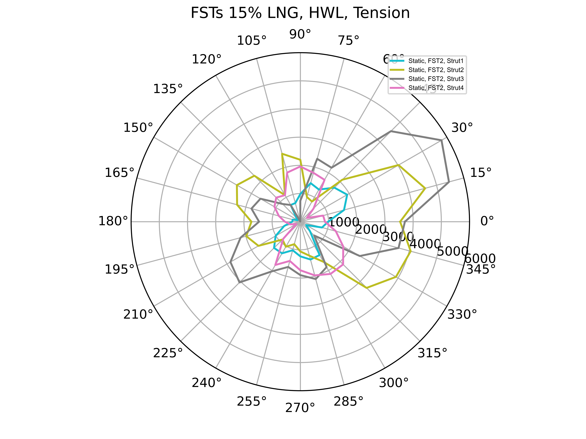
    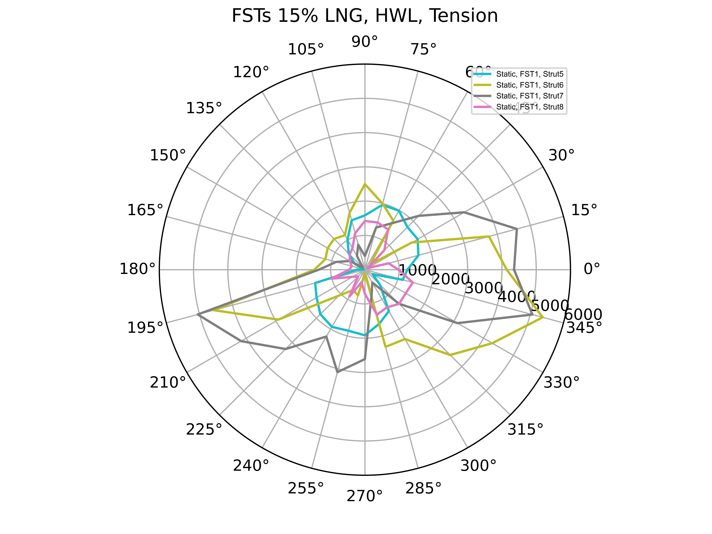
</div>

```markdown
- TBA
```

---
# Max Strut Loads, FSTs 95% LNG, 100yr, LWL, Tension, Static

- TBA

<div style="text-align: center;">
FST2 &emsp;&emsp;&emsp;&emsp;&emsp;&emsp;&emsp;&emsp;&emsp;&emsp;&emsp;&emsp;&emsp;&emsp;&emsp;&emsp;&emsp;&emsp; FST1
</div>
<div style="display: flex; justify-content: space-between;">
    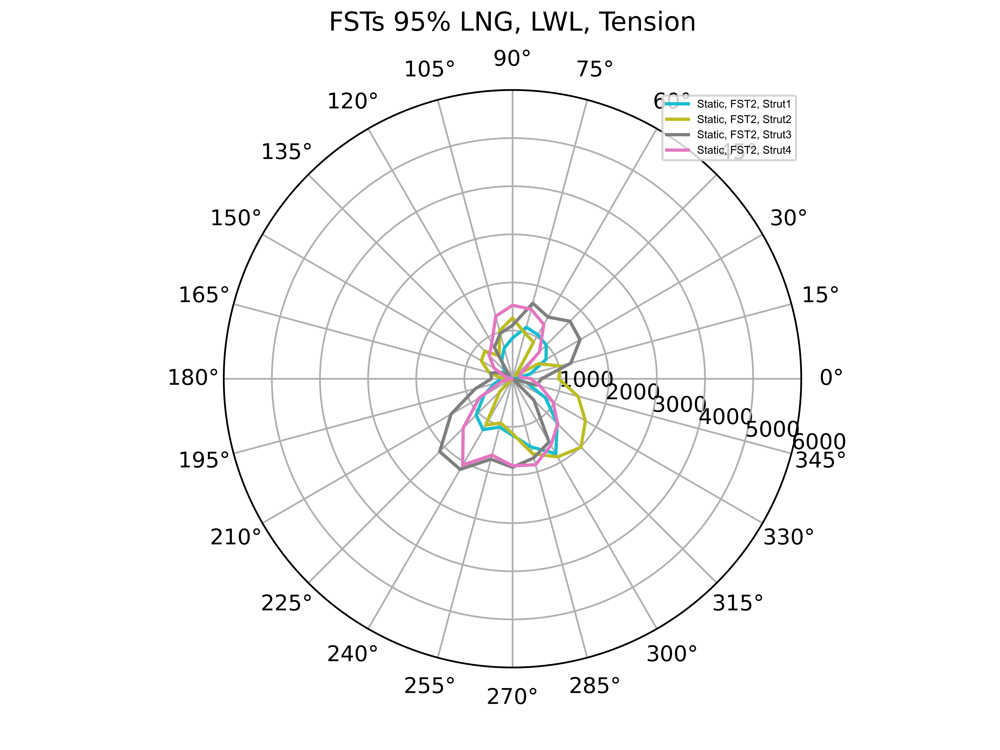
    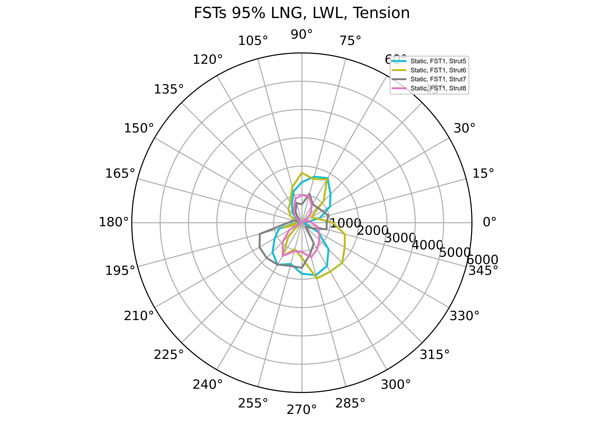
</div>

```markdown
- TBA
```

---
<!-- _class: transition -->

# 

### Strut Loads, Dynamic

---
# Max Strut Loads, FSTs 95% LNG, 100yr, HWL, Tension, Dynamic

- TBA

FST2 &emsp;&emsp;&emsp;&emsp;&emsp;&emsp;&emsp;&emsp;&emsp;&emsp;&emsp;&emsp;&emsp;&emsp;&emsp;&emsp;&emsp;&emsp; FST1

<div style="display: flex; justify-content: space-between;">
    
    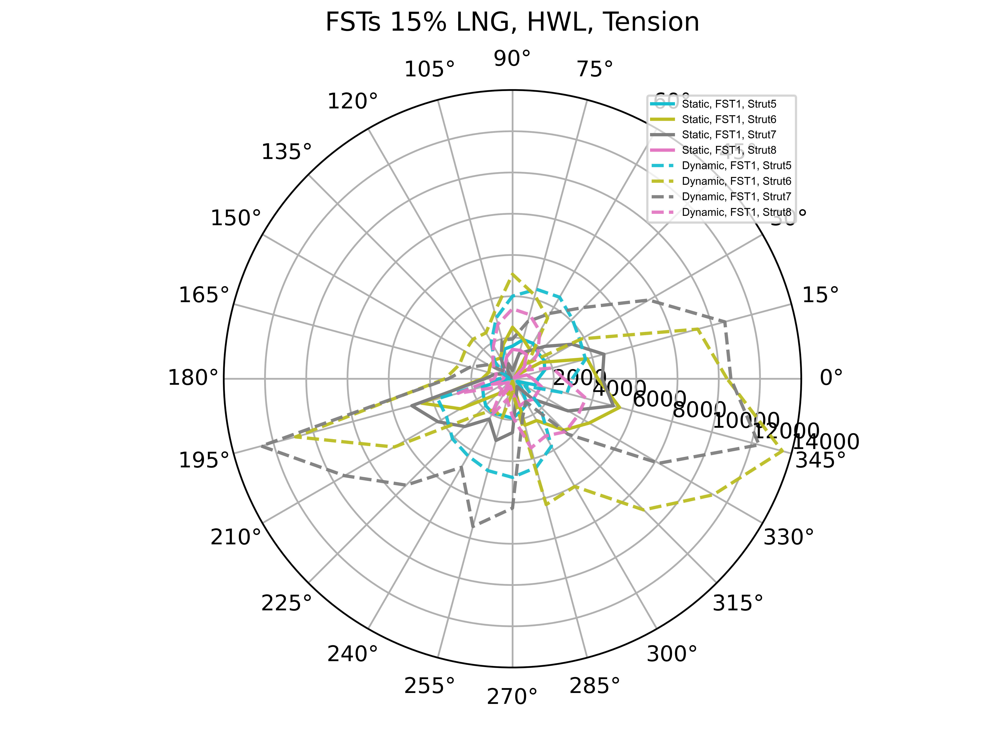
</div>

```markdown
- TBA
```

---
# Max Strut Loads, FSTs 95% LNG, 100yr, LWL, Tension, Dynamic

- TBA

<div style="text-align: center;">
FST2 &emsp;&emsp;&emsp;&emsp;&emsp;&emsp;&emsp;&emsp;&emsp;&emsp;&emsp;&emsp;&emsp;&emsp;&emsp;&emsp;&emsp;&emsp; FST1
</div>
<div style="display: flex; justify-content: space-between;">
    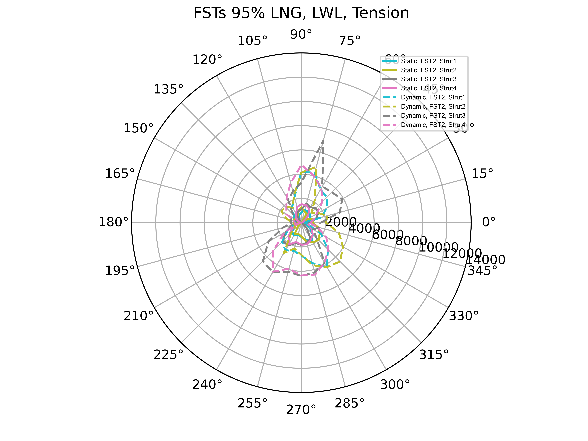
    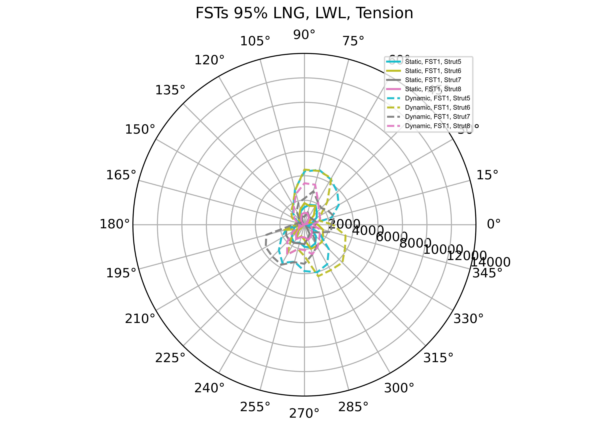
</div>

```markdown
- TBA
```

---

# FSTs 95% LNG, 100yr, LWL - Force Timetrace

<div style="text-align: center;">
Min -ve &emsp;&emsp;&emsp;&emsp;&emsp;&emsp;&emsp;&emsp;&emsp;&emsp;&emsp;&emsp;&emsp;&emsp;&emsp;&emsp;&emsp;&emsp; Max +ve
</div>
<div style="display: flex; justify-content: space-between;">
    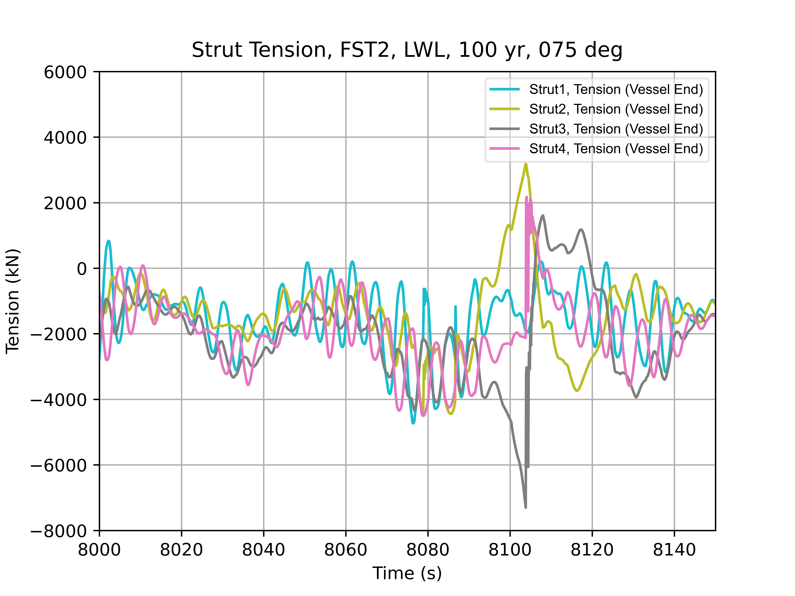
    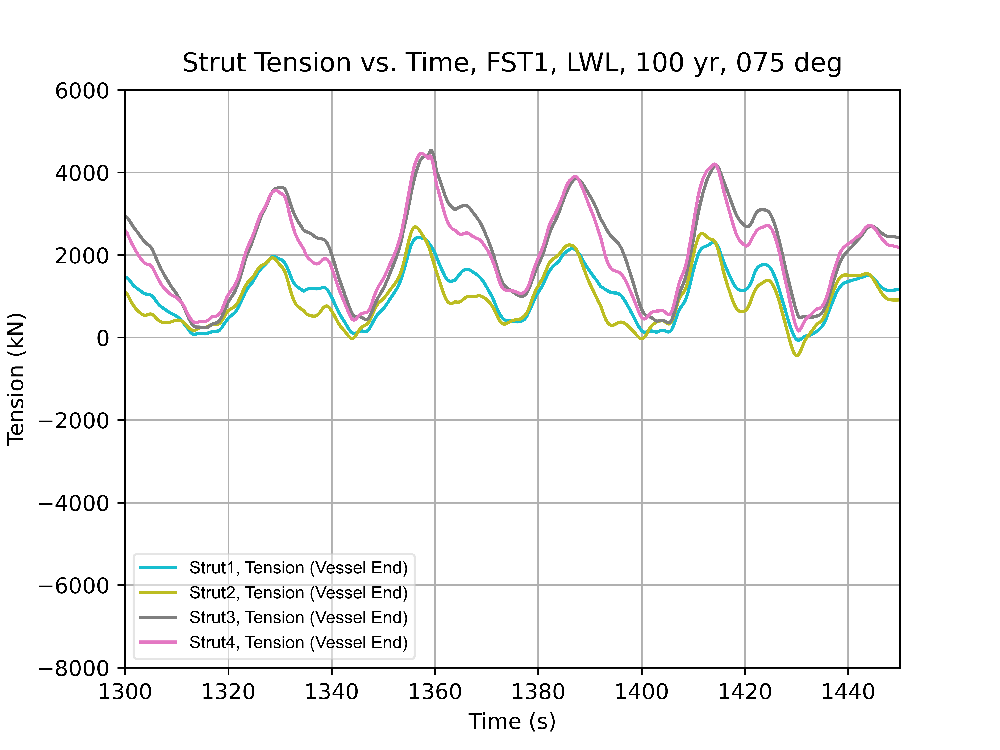
</div>

```markdown
- The struts are in sync
- Results in lower strut forces when compared to HWL results
```

---

# FSTs 15% LNG, 100yr, HWL - Force Timetrace

<div style="text-align: center;">
Min -ve &emsp;&emsp;&emsp;&emsp;&emsp;&emsp;&emsp;&emsp;&emsp;&emsp;&emsp;&emsp;&emsp;&emsp;&emsp;&emsp;&emsp;&emsp; Max +ve
</div>
<div style="display: flex; justify-content: space-between;">
    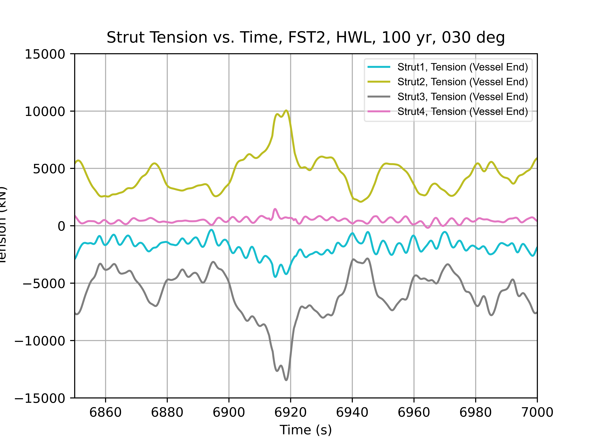
    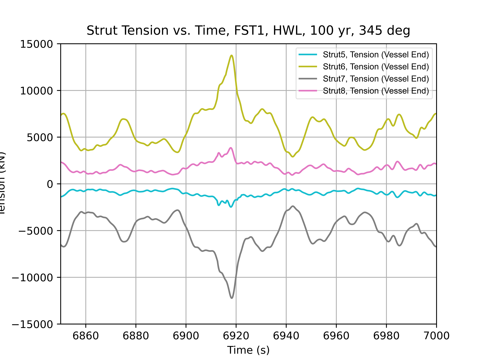
</div>

```markdown
- The 2 struts pairs are locked FST in tension-compression position
  - Results in high strut forces for FSTs 15% LNG, LWL condition
- This tension-compression lock position is similar to what was obtained in AQWA
```

---
# FSTs, 100yr Discussion

- 100yr, HWL has tension-compression lock position
  - potentially due to force coefficients used
  - Perform sensitivity analysis with wind force yaw-coefficients = 0
  - Perform timestep senstivity with 0.05s and 0.025s. Current timestep is 0.1s.
- Determine whether tension-compression lock position is realistic due to prevailing external static loads (e.g. wind, current, wave etc.)

---

# Conclusions

### Way Forward

- FST tension-compression lock position
  - Theorically, this effect may be possible. 
  - Recommend permanemnt moring system designer, WSP to verify that this phenomenon does not occur from their design.
  - FST strut interface foundation is currently designed for all loads presented in this document.

---

# Way Forward

- 100 yr FSTs only QA/QC (Ongoing)

- 5 yr FSTs with LNGC
  - Will get this running after few more insights in 100 yr analysis

