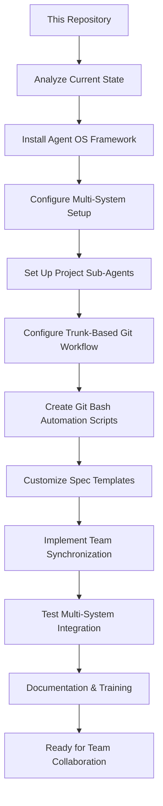

# Spec Requirements Document

> Spec: Agent OS Integration for This Repository
> Created: 2025-07-29
> Status: Planning

## Executive Summary

**Prompt for Future Reuse:**
```
Set up buildermethods Agent OS (https://github.com/buildermethods/agent-os) for this repository with comprehensive team collaboration features. Execute the following implementation with logical task dependency ordering:

TASK DEPENDENCY ORDERING STANDARD:
- All implementation tasks must follow logical dependency ordering where prior tasks are always applicable (if logical) to subsequent tasks
- Each task builds upon the achievements of previous tasks
- Task dependencies must be explicitly documented
- Foundation tasks (like system installation) come before dependent tasks (like analysis or configuration)
- This ordering minimizes errors, reduces rework, and ensures consistent implementation success across different team members and environments

IMPLEMENTATION STEPS:

1. INSTALL AGENT OS WITH MULTI-SYSTEM CONFIGURATION:
   Prerequisites: None - Foundation task
   - Install the framework at system level for Windows, Linux, macOS, or Unix
   - Configure system-level paths, environment variables, and shell integration
   - Set up cross-platform compatibility and OS-specific shell integration
   - Validate system installation with cross-platform compatibility tests

2. ANALYZE EXISTING CODEBASE:
   Depends on: Task 1 - System installation required to run @analyze-product
   - Run: @analyze-product "I want to install Agent OS in this existing codebase"
   - Document current structure, patterns, and development workflow
   - Identify integration points for the framework
   - Create comprehensive analysis report for repository integration

3. REPOSITORY INTEGRATION AND CONFIGURATION:
   Depends on: Task 2 - Analysis results guide repository configuration
   - Install and configure the framework in this repository based on analysis results
   - Create .agent-os directory structure with sub-agents folder
   - Configure repository-level settings for multi-system team synchronization
   - Always use /create-spec for specs and user stories

4. PROJECT SUB-AGENTS CONFIGURATION:
   Depends on: Task 3 - Repository structure and settings required for sub-agents
   - development-agent.md: Code generation and development workflows for this project
   - testing-agent.md: Automated test execution and validation using this project's testing approach
   - deployment-agent.md: Build and release automation matching this project's deployment process
   - Configure sub-agents for cross-system synchronization

5. TRUNK-BASED GIT DEVELOPMENT WORKFLOW:
   Depends on: Task 4 - Sub-agents provide the automation foundation for git workflows
   - Configure trunk-based git development workflow for each spec
   - Set up automated branching and merge workflows
   - Implement feature flags for continuous integration support

6. OS-SPECIFIC GIT BASH AUTOMATION SCRIPTS:
   Depends on: Task 5 - Git workflow structure required before creating automation scripts
   - create-spec-branch.sh: Automated spec branch management
   - sync-team-state.sh: Cross-system project synchronization
   - merge-spec-completion.sh: Automated spec completion workflows
   - Create OS-specific versions for Windows PowerShell, Linux/Unix bash, and macOS zsh/bash
   - development-tasks.sh: Common development task automation

7. ENHANCED SPEC TEMPLATES:
   Depends on: Task 6 - Automation scripts inform template workflow integration
   - Store all specs in .agent-os/specs/ folder with date-based naming
   - Include executive summary in every spec with original prompt and mermaid flowcharts
   - Modify spec templates to include reusable prompt capture
   - Ensure prompt completeness and self-containment for any project team

8. TEAM SYNCHRONIZATION FEATURES:
   Depends on: Task 7 - Templates and workflows must be established before team synchronization
   - Configure project-level and user-level settings
   - Implement cross-system state synchronization
   - Enable consistent behavior across different development environments
   - Support distributed team collaboration with trunk-based development

9. TESTING AND VALIDATION:
   Depends on: Task 8 - All components must be implemented before comprehensive testing
   - Write comprehensive tests for system-level installation across all supported operating systems
   - Test OS-specific installation scenarios (Windows, Linux, macOS, Unix)
   - Test complete multi-system workflow from spec creation to completion
   - Validate team synchronization and sub-agent functionality across different development environments

10. DOCUMENTATION AND TEAM TRAINING:
    Depends on: Task 9 - System must be tested and validated before documentation and training
    - Document system-level installation procedures for all supported operating systems
    - Update documentation with comprehensive workflow instructions for this repository
    - Create team training documentation for new trunk-based development workflow
    - Provide multi-system setup guide for distributed team members
    - Create reusable implementation guide that can be applied to other repositories

DELIVERABLES:
- Fully integrated Agent OS system with multi-platform support
- Custom spec templates with executive summaries and mermaid flowcharts
- Cross-platform git bash automation scripts
- Multi-system team synchronization capabilities
- Comprehensive documentation and training materials
- Established task dependency ordering framework for future implementations

This setup enables your development team to use Agent OS for structured, synchronized, and automated development workflows across multiple systems and team members with logical task dependencies that ensure implementation success.
```

**Process Flow:**


## Overview

Integrate Agent OS development framework into this repository to enable multi-system team collaboration with trunk-based development, automated git bash workflows, and synchronized sub-agents. This integration will provide structured spec creation, task management, and standardized documentation processes optimized for distributed team environments using this project's existing technology stack.

## User Stories

### Multi-System Development Team Collaboration

As a developer working on this project across multiple systems, I want to use Agent OS with trunk-based development and automated git bash scripts, so that I can collaborate seamlessly with team members while maintaining consistent workflows and synchronized states using our existing technology stack.

**Detailed Workflow:**
1. Developer creates new spec using `/create-spec` command
2. The system automatically creates trunk-based git branch for this spec
3. Sub-agents are configured in .agent-os folder for team synchronization
4. Git bash scripts automate development tasks and execution
5. All team members work on main branch with feature flags and continuous integration
6. Spec completion automatically merges changes and updates the state

### System-Level Agent OS Installation

As a team member setting up this project on my system, I want Agent OS to be properly installed at the system level for my operating system, so that I can use the framework consistently regardless of whether I'm on Windows, Linux, macOS, or Unix, with all commands and tools properly configured for my environment.

**Detailed Workflow:**
1. System detects current operating system (Windows, Linux, macOS, Unix)
2. Downloads and installs appropriate Agent OS system components for the OS
3. Configures system-level paths, environment variables, and shell integration
4. Sets up OS-specific git bash environment and permissions
5. Validates installation with cross-platform compatibility tests
6. Enables seamless `/create-spec` and other Agent OS commands across all supported platforms

### Team Synchronization and Management

As a manager of this project, I want Agent OS to provide multi-system synchronization with standardized spec creation, so that distributed team members can work consistently regardless of their development environment while maintaining full traceability of requirements and decisions.

**Detailed Workflow:**
1. Team member creates spec using standardized `/create-spec` process
2. Executive summary captures original prompt for future reference
3. Mermaid flowcharts visualize process flows and system interactions
4. Sub-agents ensure consistent behavior across all team systems
5. Trunk-based development enables continuous integration without branch conflicts
6. Git bash automation handles routine development and deployment tasks

## Spec Scope

1. **Task Dependency Ordering Requirement** - All implementation tasks must follow logical dependency ordering where prior tasks are always applicable (if logical) to subsequent tasks, ensuring each step builds upon previous achievements
2. **System-Level Agent OS Installation** - Install and configure the framework at system level for Windows, Linux, macOS, and Unix environments
3. **Repository Integration** - Install and configure the framework in this repository using @analyze-product approach (depends on system installation)
4. **Sub-Agents Configuration** - Set up repository sub-agents in .agent-os folder for team synchronization using this project's technology stack (depends on repository integration)
5. **Trunk-Based Git Development** - Configure trunk-based development workflow for each spec with automated branching (depends on sub-agents)
6. **Cross-Platform Git Bash Automation** - Create OS-specific git bash scripts for development, task execution, and automation (depends on git workflow)
7. **Multi-System Team Synchronization** - Implement system-level configurations for consistent team collaboration across different operating systems (depends on automation scripts)
8. **Enhanced Spec Templates** - Modify templates to include executive summary with prompt capture and mermaid diagrams (depends on synchronization setup)

## Out of Scope

- Modification of existing core functionality or business logic
- Changes to the current build system, package structure, or distribution methods
- Integration with external management tools beyond Agent OS
- Custom features beyond the specified customizations
- Technology-specific implementations (the solution should work with this project's current stack)

## Expected Deliverable

1. **Fully Integrated System** - Agent OS framework successfully installed and configured in this repository
2. **Custom Spec Templates** - Modified templates that automatically include executive summary sections with reusable prompts and mermaid flowcharts
3. **Updated Development Workflow** - Team can use `/create-spec` command to generate structured specifications that work with this project's technology stack
4. **Logical Task Dependency Framework** - Established pattern of task ordering where each step builds upon previous achievements for maximum efficiency and reduced errors
5. **Reusable Implementation Guide** - Complete documentation that enables this setup to be replicated in other repositories

## Future Spec Requirements

**Executive Summary Prompt Completeness Standard**: All specs created using Agent OS must include a complete, self-contained "Prompt for Future Reuse" in the executive summary that:
- Contains all necessary information for any project team to implement without external references
- Includes the Task Dependency Ordering Standard as defined below
- Documents all implementation steps with explicit dependencies
- Lists all expected deliverables and outcomes
- Uses generic language (pronouns, common nouns) for repository adaptability
- Provides sufficient context for successful implementation across different environments

**Task Dependency Ordering Standard**: All future specs created using Agent OS must follow the logical dependency ordering principle established in this specification, where:
- Prior tasks are always applicable (if logical) to subsequent tasks
- Each task builds upon the achievements of previous tasks
- Task dependencies are explicitly documented in both the prompt and task sections
- Foundation tasks (like system installation) come before dependent tasks (like analysis or configuration)
- This ordering minimizes errors, reduces rework, and ensures consistent implementation success across different team members and environments

## Spec Documentation

- Tasks: @.agent-os/specs/2025-07-29-agent-os-integration/tasks.md
- Technical Specification: @.agent-os/specs/2025-07-29-agent-os-integration/sub-specs/technical-spec.md
- Tests Specification: @.agent-os/specs/2025-07-29-agent-os-integration/sub-specs/tests.md