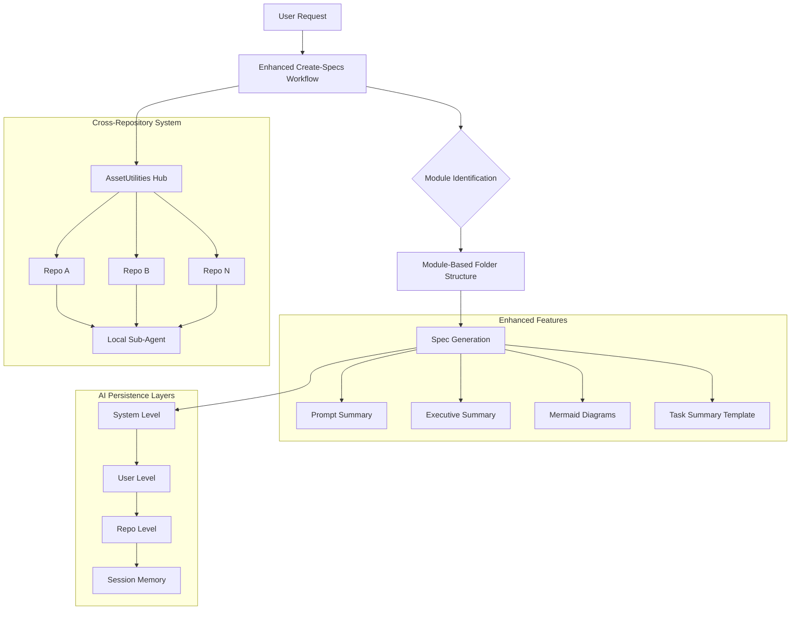
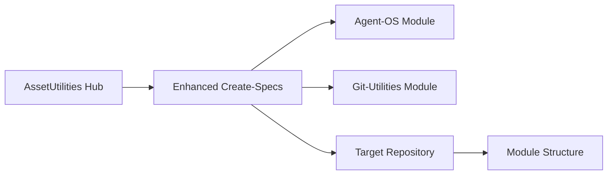

# Spec Requirements Document

> **Module:** agent-os
> **Spec:** enhanced-create-specs
> **Sub-Agent:** workflow-automation
> **Created:** 2025-08-01
> **Status:** Planning
> **AI Context:** Enhanced Agent OS spec creation workflow with module-based organization, executive summaries, mermaid charts, and cross-repository reusability

## Prompt Summary

**Original Request:** /create-specs, add a /create-specs sub-agent such that all (existing, this and future) specs contain prompt summary for future reuse, executive summary section, mermaid charts, add module name inside directory as applicable, add task_summary.md with implementation tracking, organize all repositories based on module guidance (specs/modules/<module_name>/<spec_name>), research best naming conventions for specs, add this to assetutilities repo for tracking and script reuse, make requirement applicable for all git repos and future repos with cross-repository referencing, add requirement such that AI agents do not forget over sessions/branches/systems/users at system/user/repo levels.

**Context Provided:** Agent OS framework enhancement with improved organization, documentation, and persistence.

**Clarifications Made:** 
- Determined date prefixes not needed for specs based on research
- Module-based organization prioritized over date-based naming
- Cross-repository referencing strategy planned
- Persistence strategy across multiple levels identified

**Reuse Notes:** This prompt can be iterated by updating the module categories, adding new sub-agent types, or enhancing the cross-repository referencing mechanism while maintaining the core module-based organization approach.

## Executive Summary

### Purpose
Enhance the Agent OS spec creation workflow to provide better organization, documentation quality, visual clarity, and cross-repository reusability for AI-assisted development workflows.

### Impact
- **Business Value:** Standardized development workflows across all repositories with improved traceability and reusability
- **User Benefit:** Consistent, well-documented specs with visual diagrams and clear implementation tracking
- **Technical Advancement:** Module-based organization with cross-repository sub-agent referencing and multi-level AI persistence

### Scope
- **Effort Estimate:** Large (L) - 2-3 weeks for full implementation
- **Timeline:** 2-3 week development cycle with iterative rollout
- **Dependencies:** Agent OS framework, assetutilities repository structure, cross-repo git workflow

### Key Outcomes
1. Enhanced /create-specs workflow with module-based organization
2. Cross-repository sub-agent referencing system
3. Multi-level AI agent persistence (system/user/repo)

## System Overview

### Flow Description
1. User initiates spec creation with enhanced workflow
2. System identifies appropriate module and creates structured folders
3. Enhanced documentation generated with visual diagrams and summaries
4. Cross-repository referencing enables reuse across projects
5. Multi-level persistence ensures AI agents maintain context

### Integration Points
- **Agent OS Framework:** Core spec creation and task execution workflows
- **AssetUtilities Repository:** Central hub for shared sub-agents and utilities
- **Git Workflows:** Cross-repository referencing and synchronization

## User Stories

### Primary Story: Enhanced Spec Creation

**As a** developer using Agent OS,  
**I want to** create specs with enhanced organization and documentation,  
**So that** I can maintain consistent, high-quality project documentation with clear visual representations and cross-project reusability.

**Acceptance Criteria:**
- [ ] Specs are organized in module-based folder structure (specs/modules/<module_name>/<spec_name>/)
- [ ] All specs include prompt summary, executive summary, and mermaid diagrams
- [ ] Task summary template is automatically created for implementation tracking
- [ ] Cross-repository sub-agent referencing works across all repositories
- [ ] AI agents maintain context across sessions and systems

**Workflow:**
1. Developer runs enhanced /create-specs command
2. System identifies module based on spec requirements
3. Module-based folder structure created automatically
4. Enhanced spec documentation generated with visual diagrams
5. Task summary template prepared for implementation phase
6. Cross-repository references established for reusability

## Spec Scope

1. **Enhanced Spec Creation Workflow** - Upgrade existing create-spec.md with module organization, executive summaries, mermaid diagrams, and prompt summaries
2. **Module-Based Repository Organization** - Implement specs/modules/<module_name>/<spec_name>/ structure with corresponding docs/, src/, and tests/ organization
3. **Task Summary System** - Create task_summary.md template and completion workflow for implementation tracking
4. **Cross-Repository Sub-Agent System** - Enable referencing of assetutilities sub-agents from other repositories
5. **Multi-Level AI Persistence** - Implement system, user, and repository level persistence for AI agent context

## Out of Scope

- Migration of existing specs to new structure (separate future enhancement)
- Real-time collaborative editing of specs
- Automated spec generation from code analysis
- Integration with external project management tools

## Module Dependencies

### Required Modules
- **agent-os:** Core Agent OS framework and workflow engine
- **git-utilities:** Cross-repository operations and synchronization
- **file-management:** Directory creation and file manipulation utilities

### Optional Integrations
- **visualization:** Enhanced mermaid diagram generation and validation

### External Dependencies
- **AssetUtilities Repository:** Central hub for shared sub-agents and cross-repo referencing
- **Git Workflows:** Multi-repository coordination and branch management

### Data Flow

## Expected Deliverable

1. **Enhanced create-specs workflow** - Fully functional enhanced spec creation with all requested features
2. **Cross-repository referencing system** - Working system for sharing sub-agents across repositories
3. **Multi-level AI persistence** - Implemented persistence at system, user, and repository levels