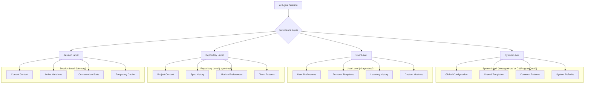

# AI Persistence Specification

> **Module:** agent-os
> **Sub-Agent:** workflow-automation
> **AI Context:** Multi-level AI agent persistence system for enhanced-create-specs

This specification defines the AI agent persistence system across system, user, and repository levels.

> Created: 2025-08-01
> Version: 1.0.0

## Overview

The AI persistence system ensures that AI agents maintain context, preferences, and learned patterns across different sessions, branches, systems, and users to provide consistent and improving assistance.

## Persistence Architecture



## System Level Persistence

### Location
- **Linux/macOS:** `/etc/agent-os/` or `~/.agent-os/system/`
- **Windows:** `C:\ProgramData\AgentOS\` or `%APPDATA%\AgentOS\system\`

### Configuration Structure
```yaml
# system_config.yml
version: "1.0.0"
global_defaults:
  default_module: "product"
  spec_naming_convention: "kebab-case"
  date_format: "YYYY-MM-DD"
  
common_modules:
  - authentication
  - authorization
  - user-management
  - data-management
  - api
  - ui-ux
  - reporting
  - notifications
  - payment
  - admin

template_library:
  spec_template: "enhanced-spec-template.md.j2"
  task_summary_template: "task-summary-template.md.j2"
  technical_spec_template: "technical-spec-template.md.j2"

cross_repo_settings:
  default_hub: "https://github.com/[user]/assetutilities.git"
  sync_frequency: "daily"
  cache_duration: "7d"
```

### Global Patterns Database
```json
{
  "common_patterns": {
    "authentication_specs": {
      "typical_modules": ["authentication", "user-management"],
      "common_dependencies": ["database", "security", "api"],
      "standard_components": ["login", "signup", "password-reset", "profile"]
    },
    "api_specs": {
      "typical_modules": ["api", "data-management"],
      "common_patterns": ["REST", "GraphQL", "webhook"],
      "standard_sections": ["endpoints", "authentication", "rate-limiting"]
    }
  }
}
```

## User Level Persistence

### Location
- **All Platforms:** `~/.agent-os/user/`

### User Preferences
```yaml
# user_preferences.yml
user_info:
  name: "User Name"
  email: "user@example.com"
  timezone: "UTC-05:00"

preferred_settings:
  default_modules:
    - authentication
    - user-management
    - api
  
  coding_style:
    indentation: "2 spaces"
    naming_convention: "camelCase"  # or snake_case
    comment_style: "minimal"
  
  documentation_preferences:
    diagram_type: "mermaid"
    detail_level: "medium"
    include_examples: true

custom_templates:
  spec_header: |
    # Custom Spec Header
    > Created by: {{user_name}}
    > Project: {{project_name}}
    > Date: {{creation_date}}
  
project_history:
  - project: "ecommerce-platform"
    modules_used: ["authentication", "payment", "user-management"]
    patterns_learned: ["microservices", "event-driven"]
  - project: "cms-system"
    modules_used: ["admin", "api", "ui-ux"]
    patterns_learned: ["admin-dashboard", "content-management"]
```

### Learning History
```json
{
  "learning_patterns": {
    "successful_specs": [
      {
        "spec_name": "user-authentication",
        "module": "authentication",
        "success_factors": ["clear requirements", "good mermaid diagrams", "comprehensive tests"],
        "reuse_count": 5
      }
    ],
    "common_mistakes": [
      {
        "mistake": "missing database schema",
        "context": "user-related specs",
        "correction": "always include database-schema.md for user data"
      }
    ],
    "preferred_patterns": {
      "authentication": "JWT with refresh tokens",
      "api_design": "REST with OpenAPI specs",
      "testing": "TDD with unit and integration tests"
    }
  }
}
```

## Repository Level Persistence

### Location
- **Repository Root:** `.agent-os/context/`

### Project Context
```yaml
# project_context.yml
project_info:
  name: "Project Name"
  type: "web-application"  # or "api", "library", "mobile-app"
  tech_stack:
    backend: "Ruby on Rails"
    frontend: "React"
    database: "PostgreSQL"
    
team_preferences:
  coding_standards: ".rubocop.yml"
  testing_framework: "RSpec"
  deployment_strategy: "Docker + Kubernetes"

module_usage:
  active_modules:
    - authentication
    - user-management
    - api
    - payment
  
  module_customizations:
    authentication:
      oauth_providers: ["google", "github"]
      session_duration: "24h"
    
    payment:
      providers: ["stripe", "paypal"]
      currencies: ["USD", "EUR"]

spec_history:
  completed_specs:
    - name: "user-authentication"
      module: "authentication"
      completion_date: "2025-07-15"
      success_rating: 5
    - name: "payment-processing"
      module: "payment"
      completion_date: "2025-07-20"
      success_rating: 4
  
  patterns_used:
    - "microservices-architecture"
    - "event-driven-design"
    - "domain-driven-design"
```

### Team Knowledge Base
```yaml
# team_knowledge.yml
team_decisions:
  architecture:
    - decision: "Use microservices for scalability"
      date: "2025-06-01"
      context: "Expecting high traffic"
    
  technology:
    - decision: "PostgreSQL for primary database"
      date: "2025-06-05"
      rationale: "Strong consistency requirements"

common_modules:
  - name: "company-auth"
    description: "Company-specific authentication patterns"
    location: "src/modules/company-auth/"
    maintainer: "security-team"

coding_patterns:
  error_handling: "Use Result<T, Error> pattern"
  logging: "Structured logging with JSON format"
  testing: "Test pyramid with emphasis on integration tests"
```

## Session Level Persistence

### In-Memory Context Management
```python
class SessionContext:
    def __init__(self):
        self.current_spec = None
        self.active_module = None
        self.conversation_history = []
        self.temporary_decisions = {}
        self.context_stack = []
    
    def save_context(self, key, value):
        """Save context for current session"""
        self.context_stack.append({
            'timestamp': datetime.now(),
            'key': key,
            'value': value,
            'spec': self.current_spec
        })
    
    def get_context(self, key):
        """Retrieve context from current session"""
        for item in reversed(self.context_stack):
            if item['key'] == key:
                return item['value']
        return None
```

### Context Serialization
```json
{
  "session_id": "uuid-session-id",
  "start_time": "2025-08-01T10:00:00Z",
  "current_spec": {
    "name": "enhanced-create-specs",
    "module": "agent-os",
    "status": "in_progress"
  },
  "decisions_made": [
    {
      "decision": "use module-based organization",
      "timestamp": "2025-08-01T10:05:00Z",
      "rationale": "better scalability and organization"
    }
  ],
  "context_variables": {
    "user_preferences": "loaded",
    "project_type": "agent-os-enhancement",
    "complexity_level": "high"
  }
}
```

## Persistence Implementation

### Data Storage
```python
class PersistenceManager:
    def __init__(self):
        self.system_config = self.load_system_config()
        self.user_config = self.load_user_config()
        self.repo_config = self.load_repo_config()
    
    def save_system_level(self, key, value):
        """Save to system-level persistence"""
        config_path = self.get_system_config_path()
        self.update_yaml_file(config_path, key, value)
    
    def save_user_level(self, key, value):
        """Save to user-level persistence"""
        config_path = self.get_user_config_path()
        self.update_yaml_file(config_path, key, value)
    
    def save_repo_level(self, key, value):
        """Save to repository-level persistence"""
        config_path = self.get_repo_config_path()
        self.update_yaml_file(config_path, key, value)
    
    def load_context_hierarchy(self):
        """Load configuration with proper hierarchy"""
        context = {}
        context.update(self.system_config)  # Base level
        context.update(self.user_config)    # Override with user prefs
        context.update(self.repo_config)    # Override with project prefs
        return context
```

### Context Loading Strategy
```python
def load_ai_context():
    """Load AI context with proper precedence"""
    context = {
        'system': load_system_context(),
        'user': load_user_context(),
        'repository': load_repository_context(),
        'session': initialize_session_context()
    }
    
    # Merge contexts with proper precedence
    merged_context = {}
    for level in ['system', 'user', 'repository', 'session']:
        merged_context.update(context[level])
    
    return merged_context
```

## Context Synchronization

### Cross-System Synchronization
```yaml
# sync_config.yml
sync_settings:
  enabled: true
  sync_targets:
    - type: "cloud_storage"
      provider: "github"
      repository: "user-ai-context"
      branch: "main"
    
    - type: "local_backup"
      path: "~/Dropbox/agent-os-context/"
      frequency: "daily"

sync_data:
  include:
    - user_preferences
    - learning_history
    - custom_templates
  exclude:
    - session_data
    - temporary_cache
    - sensitive_tokens
```

### Conflict Resolution
```python
def merge_contexts(local_context, remote_context):
    """Merge contexts with conflict resolution"""
    merged = {}
    
    for key in set(local_context.keys()) | set(remote_context.keys()):
        if key in local_context and key in remote_context:
            if local_context[key]['timestamp'] > remote_context[key]['timestamp']:
                merged[key] = local_context[key]
            else:
                merged[key] = remote_context[key]
        elif key in local_context:
            merged[key] = local_context[key]
        else:
            merged[key] = remote_context[key]
    
    return merged
```

## Security and Privacy

### Data Protection
- **Encryption:** Sensitive data encrypted at rest using AES-256
- **Access Control:** File permissions restricted to user/system only
- **Data Sanitization:** Remove sensitive information before persistence
- **Audit Logging:** Track access to persistent data

### Privacy Considerations
- **User Consent:** Clear opt-in for data collection and sync
- **Data Minimization:** Only store necessary information
- **Retention Policy:** Automatic cleanup of old session data
- **Export/Delete:** User control over their persistent data

### Configuration Example
```yaml
# privacy_config.yml
data_collection:
  enabled: true
  consent_date: "2025-08-01"
  
data_retention:
  session_data: "30d"
  learning_history: "1y"
  user_preferences: "permanent"

encryption:
  enabled: true
  algorithm: "AES-256-GCM"
  key_derivation: "PBKDF2"
  
sync_privacy:
  include_learning_data: true
  include_project_names: false
  include_code_snippets: false
```