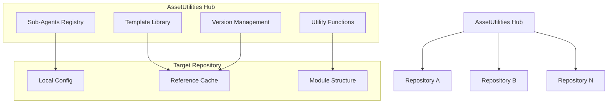

# Cross-Repository Integration Specification

> **Module:** agent-os
> **Sub-Agent:** workflow-automation
> **AI Context:** Cross-repository sub-agent referencing system for enhanced-create-specs

This specification defines the cross-repository referencing system for the enhanced create-specs workflow.

> Created: 2025-08-01
> Version: 1.0.0

## Overview

The cross-repository integration system enables sharing of sub-agents, templates, and utilities across multiple repositories while maintaining version control and dependency management.

## Architecture



## Reference Mechanisms

### 1. Git Submodule Approach
```bash
# Add assetutilities as submodule
git submodule add https://github.com/[user]/assetutilities.git .agent-os/shared

# Reference sub-agent
@.agent-os/shared/src/modules/workflow-automation/create-specs-enhanced/
```

### 2. Direct Git Reference Approach
```yaml
# .agent-os/cross-repo-refs.yml
shared_components:
  create_specs_enhanced:
    repository: "https://github.com/[user]/assetutilities.git"
    path: "src/modules/workflow-automation/create-specs-enhanced/"
    version: "main"
    cache_duration: "24h"
```

### 3. Package Manager Approach
```toml
# pyproject.toml
[tool.poetry.dependencies]
assetutilities = {git = "https://github.com/[user]/assetutilities.git", tag = "v1.0.0"}
```

## Implementation Strategy

### Phase 1: Hub Repository Setup
1. **AssetUtilities Structure Enhancement**
   ```
   assetutilities/
   ├── src/modules/workflow-automation/
   │   └── create-specs-enhanced/
   │       ├── __init__.py
   │       ├── enhanced_create_specs.py
   │       ├── module_manager.py
   │       ├── template_engine.py
   │       └── templates/
   ├── docs/cross-repo-integration/
   └── scripts/setup-cross-repo.sh
   ```

2. **Registry System**
   ```yaml
   # src/modules/registry.yml
   sub_agents:
     workflow-automation:
       create-specs-enhanced:
         version: "1.0.0"
         description: "Enhanced spec creation with module organization"
         entry_point: "enhanced_create_specs.main"
         dependencies: ["git-utilities", "file-management"]
   ```

### Phase 2: Target Repository Integration
1. **Configuration Setup**
   ```yaml
   # .agent-os/config.yml
   cross_repo:
     hub_repository: "https://github.com/[user]/assetutilities.git"
     sub_agents:
       - workflow-automation
     sync_interval: "daily"
     cache_location: ".agent-os/cache/"
   ```

2. **Reference Resolution**
   ```python
   # .agent-os/reference_resolver.py
   class CrossRepoResolver:
       def resolve_reference(self, reference_path):
           # Check local cache first
           # Fetch from hub if needed
           # Validate version compatibility
           # Return resolved path
   ```

### Phase 3: Synchronization System
1. **Automatic Sync**
   ```bash
   # .agent-os/scripts/sync-shared.sh
   #!/bin/bash
   git submodule update --remote --recursive
   python .agent-os/validate_references.py
   ```

2. **Version Management**
   ```yaml
   # .agent-os/versions.yml
   shared_components:
     assetutilities:
       current_version: "v1.0.0"
       last_sync: "2025-08-01T10:00:00Z"
       compatibility: ">=1.0.0,<2.0.0"
   ```

## Reference Patterns

### 1. Sub-Agent Reference
```markdown
<!-- In any repository's CLAUDE.md -->
## Cross-Repository Sub-Agents

- **Enhanced Spec Creation:** @github:assetutilities/src/modules/workflow-automation/create-specs-enhanced/
- **Git Utilities:** @github:assetutilities/src/modules/git-utilities/
```

### 2. Template Reference
```yaml
# In spec configuration
template_source: "@github:assetutilities/templates/spec-templates/enhanced-spec.md.j2"
```

### 3. Utility Function Reference
```python
# In implementation code
from agent_os.cross_repo import load_shared_module
create_specs = load_shared_module('assetutilities', 'workflow-automation.create-specs-enhanced')
```

## Persistence Implementation

### System Level (/etc/agent-os/ or ~/.agent-os/)
```yaml
# system_config.yml
default_hub_repository: "https://github.com/[user]/assetutilities.git"
global_sub_agents:
  - workflow-automation
  - git-utilities
  - file-management
cache_duration: "7d"
```

### User Level (~/.agent-os/user/)
```yaml
# user_preferences.yml
preferred_modules:
  - authentication
  - user-management
  - api
custom_templates: "~/.agent-os/user/templates/"
```

### Repository Level (.agent-os/)
```yaml
# repo_config.yml
module_preferences:
  default_module: "product"
  custom_modules:
    - "company-specific"
    - "domain-specific"
project_context:
  last_spec_module: "authentication"
  active_features: ["password-reset", "user-profile"]
```

## Validation and Testing

### Reference Validation
```python
def validate_cross_repo_reference(reference):
    """Validate that cross-repository reference is accessible and compatible"""
    # Check network connectivity
    # Validate repository access
    # Verify version compatibility
    # Test functionality
    pass
```

### Integration Tests
```yaml
# tests/cross-repo-integration.yml
test_scenarios:
  - name: "Basic reference resolution"
    reference: "@github:assetutilities/src/modules/workflow-automation/"
    expected_result: "successful_resolution"
  
  - name: "Version compatibility check"
    hub_version: "v1.0.0"
    local_requirements: ">=1.0.0,<2.0.0"
    expected_result: "compatible"
```

## Error Handling

### Common Scenarios
1. **Network Connectivity Issues**
   - Fallback to cached version
   - Graceful degradation to local functionality
   - User notification with retry options

2. **Version Incompatibility**
   - Warning message with compatibility requirements
   - Suggestion to update hub repository
   - Option to use compatible cached version

3. **Missing References**
   - Clear error message with resolution steps
   - Suggestion of alternative approaches
   - Automatic issue reporting (optional)

### Error Recovery
```python
class CrossRepoError(Exception):
    def __init__(self, reference, error_type, suggestions=None):
        self.reference = reference
        self.error_type = error_type
        self.suggestions = suggestions or []
        super().__init__(f"Cross-repo error for {reference}: {error_type}")
```

## Security Considerations

### Authentication
- Support for SSH keys and personal access tokens
- Secure credential storage using system keychain
- Option for read-only access to hub repositories

### Access Control
- Whitelist of allowed repositories
- Validation of repository ownership
- Sandbox execution of external code

### Data Privacy
- No transmission of sensitive project data
- Local caching with encryption options
- Audit logging of cross-repository access