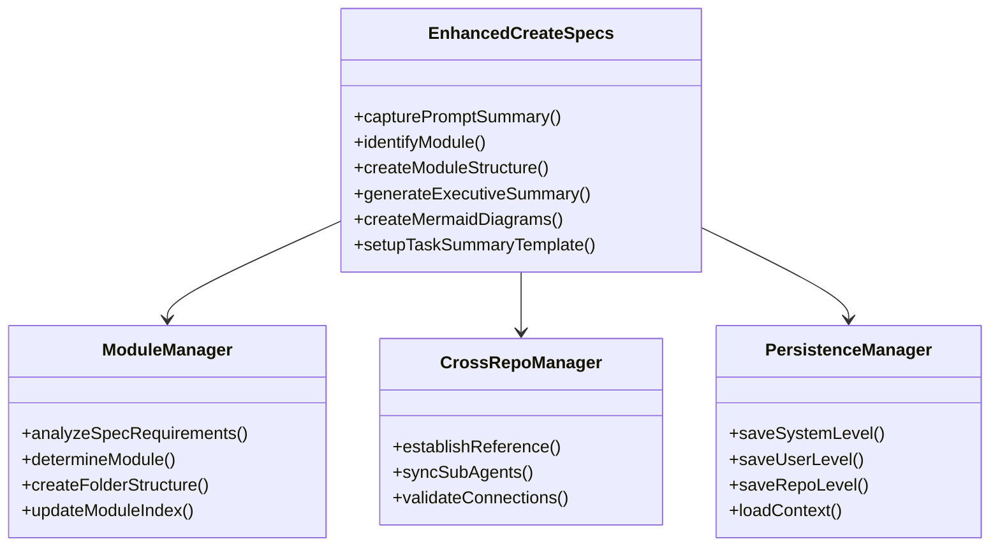
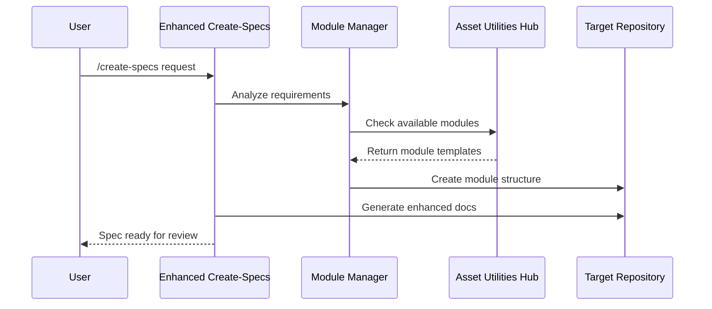

# Technical Specification

> **Module:** agent-os
> **Sub-Agent:** workflow-automation
> **AI Context:** Technical implementation details for enhanced-create-specs

This is the technical specification for the spec detailed in @specs/modules/agent-os/enhanced-create-specs/spec.md

> Created: 2025-08-01
> Version: 1.0.0

## Architecture Overview



## Technical Requirements

### Module-Based Organization
- **Folder Structure:** specs/modules/<module_name>/<spec_name>/ with corresponding docs/, src/, tests/ hierarchy
- **Module Identification:** Automated analysis of spec requirements to determine appropriate module
- **Module Index Management:** Automatic updating of module documentation and cross-references
- **Subcategory Support:** When >5 specs exist in a module, create logical subcategories

### Enhanced Documentation Generation
- **Prompt Summary Capture:** Store original user request verbatim for future iteration
- **Executive Summary Generation:** Business-focused summary with impact analysis
- **Mermaid Diagram Creation:** Multiple diagram types (graph, sequence, class, ER) based on spec type
- **Task Summary Template:** Pre-structured template for implementation tracking

### Cross-Repository Referencing
- **Sub-Agent Hub:** AssetUtilities repository as central reference point
- **Git Submodule Integration:** Use git submodules or subtree for shared components
- **Reference Resolution:** Dynamic loading of cross-repository sub-agents
- **Version Management:** Track compatible versions across repositories

### Multi-Level AI Persistence
- **System Level:** Global configuration files in ~/.agent-os/
- **User Level:** User-specific settings and preferences
- **Repository Level:** Project-specific context and history
- **Session Memory:** In-memory context for current session

## Implementation Approach

### Selected Approach: Modular Enhancement Architecture
- **Rationale:** Builds on existing Agent OS framework while adding modular capabilities
- **Trade-offs:** Requires coordination across multiple repositories but enables better organization

### Module Integration Pattern



## File Structure Implementation

### Repository Organization
```
repository/
├── specs/modules/<module_name>/<spec_name>/
│   ├── spec.md (enhanced with all features)
│   ├── task_summary.md (template)
│   └── sub-specs/
│       ├── technical-spec.md
│       ├── api-spec.md (conditional)
│       ├── database-schema.md (conditional)
│       └── tests.md
├── docs/modules/<module_name>/
│   ├── index.md
│   └── [long-term module documentation]
├── src/modules/<module_name>/
│   └── [long-term, reusable codebase scripts and utilities]
└── tests/modules/
    ├── <module_name>/
    │   └── [long-term, reusable test utilities and data]
    └── <module_name>/<spec_name>/
        ├── unit/          [ad-hoc, spec-specific tests]
        ├── integration/   [ad-hoc, spec-specific tests]
        └── e2e/          [ad-hoc, spec-specific tests]
```

### Directory Purpose Clarification

**Long-Term Module Assets (Independent of specific specs):**
- **`src/modules/<module_name>/`** - Reusable codebase scripts, utilities, and core functionality
- **`docs/modules/<module_name>/`** - Persistent module documentation and guides
- **`tests/modules/<module_name>/`** - Shared test utilities, fixtures, and long-term test data

**Spec-Specific Assets (Tied to individual specs):**
- **`specs/modules/<module_name>/<spec_name>/`** - Individual spec documentation and requirements
- **`tests/modules/<module_name>/<spec_name>/`** - Ad-hoc test scripts specific to the spec implementation

### Cross-Repository Reference Pattern
```yaml
# .agent-os/cross-repo-config.yml
repositories:
  assetutilities:
    url: "https://github.com/[user]/assetutilities.git"
    sub_agents:
      - workflow-automation
      - git-utilities
      - file-management
    version: "main"
```

## External Dependencies

### Required Libraries/Tools
- **Git:** For cross-repository operations and submodule management
- **Mermaid CLI:** For diagram generation and validation
- **YAML Parser:** For configuration file management
- **Jinja2 Templates:** For dynamic document generation
- **UV Tool:** Python package and project management, testing, debugging, and deployment

### Python Project Management with UV
- **UV Installation:** Fast Python package installer and resolver
- **Environment Management:** Virtual environment creation and management
- **Dependency Resolution:** Lock file generation and dependency management
- **Testing Integration:** Streamlined test execution with pytest
- **Development Tools:** Integrated debugging and development server capabilities
- **Deployment Support:** Production-ready package building and distribution

### Justification
- **Git Submodules:** Industry standard for cross-repository code sharing
- **Mermaid:** De facto standard for markdown-based diagrams
- **YAML:** Human-readable configuration format
- **Jinja2:** Flexible templating for document generation
- **UV Tool:** Modern Python tooling for faster, more reliable package management and development workflows

## Performance Considerations

### Optimization Strategies
- **Lazy Loading:** Load cross-repository references only when needed
- **Caching:** Cache module templates and configurations
- **Parallel Processing:** Generate multiple document sections concurrently
- **Incremental Updates:** Only update changed components

### Scalability Measures
- **Module Limits:** Implement subcategories when >5 specs per module
- **Reference Limits:** Limit cross-repository references to prevent circular dependencies
- **Memory Management:** Stream large documents instead of loading entirely in memory

## Security Considerations

### Cross-Repository Security
- **Authentication:** Use SSH keys or personal access tokens for git operations
- **Validation:** Validate all cross-repository references before loading
- **Sandboxing:** Isolate cross-repository operations in secure contexts
- **Audit Trail:** Log all cross-repository access and modifications

### File System Security
- **Path Validation:** Sanitize all file paths to prevent directory traversal
- **Permission Checks:** Verify write permissions before creating directories
- **Backup Strategy:** Create backups before modifying existing structures