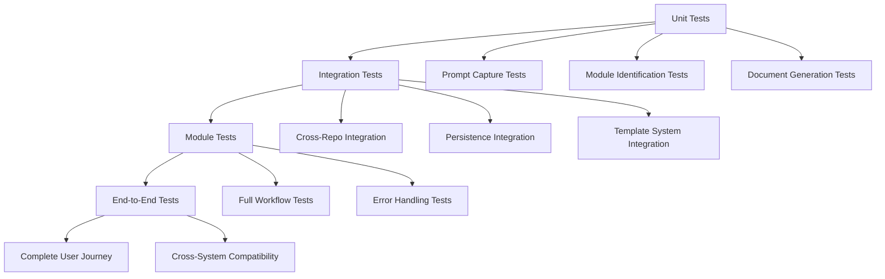

# Tests Specification

> **Module:** agent-os
> **Sub-Agent:** workflow-automation
> **AI Context:** Test coverage for enhanced-create-specs

This is the tests coverage details for the spec detailed in @specs/modules/agent-os/enhanced-create-specs/spec.md

> Created: 2025-08-01
> Version: 1.0.0

## Test Coverage Strategy



## Unit Tests

### Location
- **Base Path:** `tests/modules/agent-os/enhanced-create-specs/unit/`

### Test Categories

#### Prompt Capture and Processing
```python
# test_prompt_capture.py
class TestPromptCapture:
    def test_capture_original_request(self):
        """Test that original user request is captured verbatim"""
        
    def test_capture_context_provided(self):
        """Test that additional context is properly stored"""
        
    def test_capture_clarifications(self):
        """Test that clarifications made during process are recorded"""
        
    def test_reuse_notes_generation(self):
        """Test that reuse notes are generated correctly"""
```

#### Module Identification
```python
# test_module_identification.py
class TestModuleIdentification:
    def test_common_module_identification(self):
        """Test identification of common modules (auth, api, etc.)"""
        
    def test_custom_module_creation(self):
        """Test creation of new modules when needed"""
        
    def test_subcategory_handling(self):
        """Test subcategory creation when >5 specs in module"""
        
    def test_product_module_fallback(self):
        """Test fallback to 'product' module for unclear specs"""
```

#### Document Generation
```python
# test_document_generation.py
class TestDocumentGeneration:
    def test_executive_summary_generation(self):
        """Test creation of executive summary with business impact"""
        
    def test_mermaid_diagram_creation(self):
        """Test generation of appropriate mermaid diagrams"""
        
    def test_task_summary_template(self):
        """Test creation of task summary template"""
        
    def test_cross_references_update(self):
        """Test updating of cross-references in spec.md"""
```

#### Template Engine
```python
# test_template_engine.py
class TestTemplateEngine:
    def test_template_loading(self):
        """Test loading of templates from various sources"""
        
    def test_variable_substitution(self):
        """Test proper variable substitution in templates"""
        
    def test_conditional_sections(self):
        """Test conditional section generation (API, DB, etc.)"""
        
    def test_custom_template_support(self):
        """Test support for user-defined custom templates"""
```

## Integration Tests

### Location
- **Base Path:** `tests/modules/agent-os/enhanced-create-specs/integration/`

### Test Scenarios

#### Cross-Repository Integration
```python
# test_cross_repo_integration.py
class TestCrossRepoIntegration:
    def test_submodule_setup(self):
        """Test automatic setup of git submodules"""
        
    def test_reference_resolution(self):
        """Test resolution of cross-repository references"""
        
    def test_version_compatibility(self):
        """Test version compatibility checking"""
        
    def test_cache_management(self):
        """Test caching of cross-repository components"""
    
    def test_offline_fallback(self):
        """Test fallback behavior when hub repository unavailable"""
```

#### Persistence System Integration
```python
# test_persistence_integration.py
class TestPersistenceIntegration:
    def test_system_level_persistence(self):
        """Test saving/loading system-level configuration"""
        
    def test_user_level_persistence(self):
        """Test saving/loading user preferences"""
        
    def test_repo_level_persistence(self):
        """Test saving/loading repository context"""
        
    def test_context_hierarchy(self):
        """Test proper context loading hierarchy"""
    
    def test_context_synchronization(self):
        """Test synchronization across systems"""
```

#### File System Operations
```python
# test_file_system_integration.py
class TestFileSystemIntegration:
    def test_directory_creation(self):
        """Test creation of module-based directory structure"""
        
    def test_file_generation(self):
        """Test generation of all required files"""
        
    def test_permission_handling(self):
        """Test handling of file system permissions"""
        
    def test_existing_file_protection(self):
        """Test protection of existing files during updates"""
```

## Module Tests

### Location
- **Base Path:** `tests/modules/agent-os/enhanced-create-specs/module/`

### Workflow Tests
```python
# test_complete_workflow.py
class TestCompleteWorkflow:
    def test_basic_spec_creation(self):
        """Test complete workflow for basic spec creation"""
        
    def test_complex_spec_with_dependencies(self):
        """Test workflow for complex spec with multiple dependencies"""
        
    def test_spec_with_database_changes(self):
        """Test workflow including database schema generation"""
        
    def test_spec_with_api_changes(self):
        """Test workflow including API specification generation"""
```

### Error Handling Tests
```python
# test_error_handling.py
class TestErrorHandling:
    def test_invalid_module_name(self):
        """Test handling of invalid module names"""
        
    def test_network_failures(self):
        """Test handling of network failures during cross-repo operations"""
        
    def test_permission_errors(self):
        """Test handling of file system permission errors"""
        
    def test_template_not_found(self):
        """Test handling of missing template files"""
    
    def test_malformed_configuration(self):
        """Test handling of malformed configuration files"""
```

## End-to-End Tests

### Location
- **Base Path:** `tests/modules/agent-os/enhanced-create-specs/e2e/`

### User Journey Tests
```python
# test_user_journey.py
class TestUserJourney:
    def test_first_time_user_experience(self):
        """Test complete journey for first-time user"""
        # 1. No existing configuration
        # 2. Spec creation with setup
        # 3. Configuration generation
        # 4. Successful spec creation
        
    def test_experienced_user_workflow(self):
        """Test workflow for user with existing preferences"""
        # 1. Load existing preferences
        # 2. Apply user customizations
        # 3. Create spec with personalized templates
        # 4. Update learning history
        
    def test_team_collaboration_scenario(self):
        """Test scenario with multiple team members"""
        # 1. Shared repository configuration
        # 2. Team-specific module preferences
        # 3. Consistent spec generation across team
```

### Cross-System Compatibility
```python
# test_cross_system_compatibility.py
class TestCrossSystemCompatibility:
    def test_windows_compatibility(self):
        """Test full workflow on Windows systems"""
        
    def test_macos_compatibility(self):
        """Test full workflow on macOS systems"""
        
    def test_linux_compatibility(self):
        """Test full workflow on Linux systems"""
        
    def test_git_bash_compatibility(self):
        """Test compatibility with Git Bash on Windows"""
```

## Performance Tests

### Location
- **Base Path:** `tests/modules/agent-os/enhanced-create-specs/performance/`

### Performance Benchmarks
```python
# test_performance.py
class TestPerformance:
    def test_spec_generation_time(self):
        """Test that spec generation completes within acceptable time"""
        # Target: <5 seconds for typical spec
        
    def test_large_repository_handling(self):
        """Test performance with repositories containing many specs"""
        # Target: Handle 100+ existing specs efficiently
        
    def test_cross_repo_cache_performance(self):
        """Test performance of cross-repository caching"""
        # Target: Cache hit <100ms, cache miss <2s
        
    def test_template_processing_performance(self):
        """Test performance of template processing"""
        # Target: Template processing <1s
```

## Mock Requirements

### External Services
- **Git Operations:** Mock git commands for testing without actual repositories
- **Network Requests:** Mock HTTP requests for cross-repository operations
- **File System:** Mock file system operations for testing edge cases
- **Time/Date:** Mock date/time for consistent timestamp testing

### Mock Implementation Examples
```python
# conftest.py
import pytest
from unittest.mock import MagicMock, patch

@pytest.fixture
def mock_git_operations():
    with patch('subprocess.run') as mock_run:
        mock_run.return_value.returncode = 0
        mock_run.return_value.stdout = b'success'
        yield mock_run

@pytest.fixture
def mock_file_system():
    with patch('pathlib.Path.mkdir') as mock_mkdir, \
         patch('pathlib.Path.write_text') as mock_write:
        yield {'mkdir': mock_mkdir, 'write_text': mock_write}

@pytest.fixture
def mock_network_requests():
    with patch('requests.get') as mock_get:
        mock_get.return_value.status_code = 200
        mock_get.return_value.json.return_value = {'status': 'success'}
        yield mock_get
```

## Test Data Management

### Test Fixtures
```yaml
# test_fixtures/basic_spec_request.yml
spec_request:
  type: "user_authentication"
  module_hint: "authentication"
  requirements:
    - "secure login system"
    - "password reset functionality"
    - "user profile management"
  
expected_output:
  module: "authentication"
  files_created:
    - "spec.md"
    - "task_summary.md"
    - "sub-specs/technical-spec.md"
    - "sub-specs/database-schema.md"
    - "sub-specs/api-spec.md"
    - "sub-specs/tests.md"
```

### Test Database Setup
```python
# test_database.py
class TestDatabase:
    @classmethod
    def setup_class(cls):
        """Setup test database with sample data"""
        cls.sample_modules = load_sample_modules()
        cls.sample_specs = load_sample_specs()
        cls.sample_templates = load_sample_templates()
    
    @classmethod
    def teardown_class(cls):
        """Clean up test database"""
        cleanup_test_data()
```

## Continuous Integration

### Test Pipeline Configuration
```yaml
# .github/workflows/test-enhanced-create-specs.yml
name: Test Enhanced Create-Specs

on: [push, pull_request]

jobs:
  test:
    runs-on: ${{ matrix.os }}
    strategy:
      matrix:
        os: [ubuntu-latest, windows-latest, macos-latest]
        python-version: [3.9, 3.10, 3.11]
    
    steps:
    - uses: actions/checkout@v3
    - name: Set up Python
      uses: actions/setup-python@v3
      with:
        python-version: ${{ matrix.python-version }}
    
    - name: Install dependencies
      run: |
        pip install -r requirements-test.txt
    
    - name: Run unit tests
      run: |
        pytest tests/modules/agent-os/enhanced-create-specs/unit/
    
    - name: Run integration tests
      run: |
        pytest tests/modules/agent-os/enhanced-create-specs/integration/
    
    - name: Run e2e tests
      run: |
        pytest tests/modules/agent-os/enhanced-create-specs/e2e/
```

## Test Coverage Requirements

### Coverage Targets
- **Unit Tests:** 95% code coverage
- **Integration Tests:** 90% feature coverage
- **End-to-End Tests:** 100% user workflow coverage

### Coverage Reporting
```bash
# Generate coverage report
pytest --cov=enhanced_create_specs --cov-report=html --cov-report=term-missing

# Coverage thresholds
pytest --cov=enhanced_create_specs --cov-fail-under=95
```