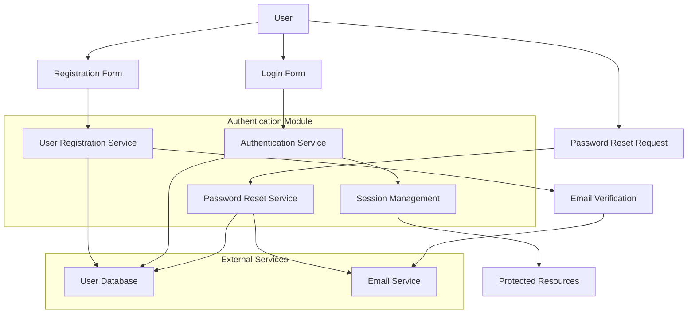
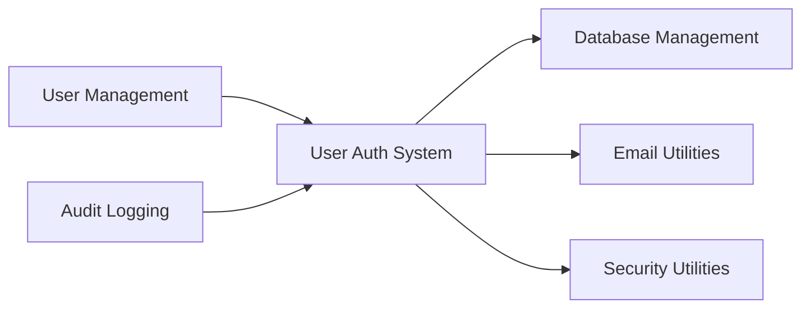

# Spec Requirements Document

> **Module:** authentication
> **Spec:** user-auth-system
> **Sub-Agent:** security-authentication
> **Created:** 2025-08-01
> **Status:** Planning
> **AI Context:** User authentication system with secure login, signup, password reset, and profile management

## Prompt Summary

**Original Request:** Create a user authentication system with secure login, signup, password reset functionality, and user profile management.

**Context Provided:** Testing the enhanced create-specs workflow system

**Clarifications Made:** This is a test of the enhanced workflow system to validate all features work correctly

**Reuse Notes:** This prompt can be iterated by updating authentication methods, adding OAuth providers, or extending user management features while maintaining the core authentication module approach.

## Executive Summary

### Purpose
Implement a comprehensive user authentication system that provides secure user registration, login, password management, and basic profile functionality for web applications.

### Impact
- **Business Value:** Enables user account management and secure access control for applications
- **User Benefit:** Streamlined registration and login experience with self-service password recovery
- **Technical Advancement:** Establishes foundational security patterns and user management infrastructure

### Scope
- **Effort Estimate:** Large (L) - 2-3 weeks for complete implementation
- **Timeline:** 2-3 week development cycle with security review
- **Dependencies:** Database system, email service, encryption libraries

### Key Outcomes
1. Secure user registration and authentication system
2. Self-service password reset functionality  
3. Basic user profile management capabilities

## System Overview

### Flow Description
1. User registers through registration form with email verification
2. Authentication service validates credentials and manages sessions
3. Password reset service handles self-service password recovery via email
4. Session management maintains secure user sessions
5. Profile management allows users to update their information

### Integration Points
- **Database System:** User data storage and retrieval
- **Email Service:** Account verification and password reset notifications
- **Session Management:** Secure session handling and token management

## User Stories

### Primary Story: User Registration and Login

**As a** new user,  
**I want to** create an account and securely log in,  
**So that** I can access personalized features and maintain my data securely.

**Acceptance Criteria:**
- [ ] Users can register with email and password
- [ ] Email verification is required for account activation
- [ ] Users can log in with verified credentials
- [ ] Failed login attempts are logged and rate-limited
- [ ] Sessions are securely managed with appropriate timeouts

**Workflow:**
1. User submits registration form with email and password
2. System validates input and creates inactive account
3. Verification email sent to user's email address
4. User clicks verification link to activate account
5. User can now log in with credentials
6. System creates secure session upon successful login

### Secondary Story: Password Reset

**As a** registered user,  
**I want to** reset my password if I forget it,  
**So that** I can regain access to my account without contacting support.

**Acceptance Criteria:**
- [ ] Users can request password reset via email
- [ ] Reset links expire after reasonable time period
- [ ] Password reset process is secure and validated
- [ ] Users receive confirmation of successful password change

## Spec Scope

1. **User Registration System** - Email-based registration with verification and validation
2. **Authentication Service** - Secure login with credential validation and session management
3. **Password Reset Functionality** - Self-service password recovery via email verification
4. **User Profile Management** - Basic profile viewing and editing capabilities
5. **Security Features** - Rate limiting, secure password hashing, session management

## Out of Scope

- OAuth/Social login integration (future enhancement)
- Multi-factor authentication (future enhancement)
- Advanced user roles and permissions (separate authorization module)
- Password complexity policies beyond basic requirements

## Module Dependencies

### Required Modules
- **database-management:** User data persistence and queries
- **email-utilities:** Account verification and password reset notifications
- **security-utilities:** Password hashing and session token management

### Optional Integrations
- **user-management:** Extended profile and user preference features
- **audit-logging:** Security event logging and monitoring

### External Dependencies
- **Database System:** PostgreSQL or similar for user data storage
- **Email Service:** SMTP service for transactional emails
- **Encryption Library:** bcrypt or similar for password hashing

### Data Flow

## Expected Deliverable

1. **Complete authentication system** - Working registration, login, and password reset functionality
2. **User profile management** - Basic profile viewing and editing capabilities
3. **Security implementation** - Secure password handling and session management