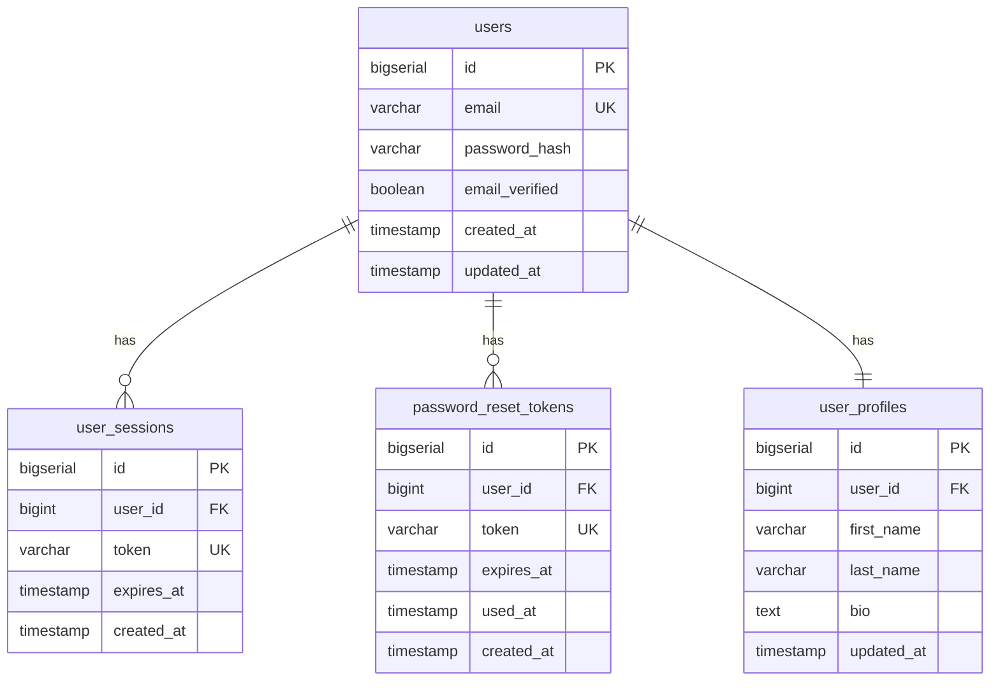

# Database Schema

> **Module:** authentication
> **Sub-Agent:** security-authentication
> **AI Context:** Database schema for user-auth-system

This is the database schema implementation for the spec detailed in @specs/modules/authentication/user-auth-system/spec.md

> Created: 2025-08-01
> Version: 1.0.0

## Schema Overview



## Table Specifications

### users Table
```sql
CREATE TABLE users (
    id BIGSERIAL PRIMARY KEY,
    email VARCHAR(255) NOT NULL UNIQUE,
    password_hash VARCHAR(255) NOT NULL,
    email_verified BOOLEAN DEFAULT FALSE,
    created_at TIMESTAMP DEFAULT CURRENT_TIMESTAMP,
    updated_at TIMESTAMP DEFAULT CURRENT_TIMESTAMP
);

-- Indexes
CREATE INDEX idx_users_email ON users(email);
CREATE INDEX idx_users_verified ON users(email_verified);
```

### user_sessions Table
```sql
CREATE TABLE user_sessions (
    id BIGSERIAL PRIMARY KEY,
    user_id BIGINT NOT NULL REFERENCES users(id) ON DELETE CASCADE,
    token VARCHAR(500) NOT NULL UNIQUE,
    expires_at TIMESTAMP NOT NULL,
    created_at TIMESTAMP DEFAULT CURRENT_TIMESTAMP
);

-- Indexes
CREATE INDEX idx_sessions_user_id ON user_sessions(user_id);
CREATE INDEX idx_sessions_token ON user_sessions(token);
CREATE INDEX idx_sessions_expires ON user_sessions(expires_at);
```

### password_reset_tokens Table
```sql
CREATE TABLE password_reset_tokens (
    id BIGSERIAL PRIMARY KEY,
    user_id BIGINT NOT NULL REFERENCES users(id) ON DELETE CASCADE,
    token VARCHAR(255) NOT NULL UNIQUE,
    expires_at TIMESTAMP NOT NULL,
    used_at TIMESTAMP NULL,
    created_at TIMESTAMP DEFAULT CURRENT_TIMESTAMP
);

-- Indexes
CREATE INDEX idx_reset_tokens_user_id ON password_reset_tokens(user_id);
CREATE INDEX idx_reset_tokens_token ON password_reset_tokens(token);
CREATE INDEX idx_reset_tokens_expires ON password_reset_tokens(expires_at);
```

### user_profiles Table
```sql
CREATE TABLE user_profiles (
    id BIGSERIAL PRIMARY KEY,
    user_id BIGINT NOT NULL REFERENCES users(id) ON DELETE CASCADE,
    first_name VARCHAR(100),
    last_name VARCHAR(100),
    bio TEXT,
    updated_at TIMESTAMP DEFAULT CURRENT_TIMESTAMP
);

-- Indexes
CREATE INDEX idx_profiles_user_id ON user_profiles(user_id);
```

## Migration Scripts

### Initial Migration (001_create_authentication_tables.sql)
```sql
-- Create users table
CREATE TABLE users (
    id BIGSERIAL PRIMARY KEY,
    email VARCHAR(255) NOT NULL UNIQUE,
    password_hash VARCHAR(255) NOT NULL,
    email_verified BOOLEAN DEFAULT FALSE,
    created_at TIMESTAMP DEFAULT CURRENT_TIMESTAMP,
    updated_at TIMESTAMP DEFAULT CURRENT_TIMESTAMP
);

-- Create user_sessions table
CREATE TABLE user_sessions (
    id BIGSERIAL PRIMARY KEY,
    user_id BIGINT NOT NULL REFERENCES users(id) ON DELETE CASCADE,
    token VARCHAR(500) NOT NULL UNIQUE,
    expires_at TIMESTAMP NOT NULL,
    created_at TIMESTAMP DEFAULT CURRENT_TIMESTAMP
);

-- Create password_reset_tokens table
CREATE TABLE password_reset_tokens (
    id BIGSERIAL PRIMARY KEY,
    user_id BIGINT NOT NULL REFERENCES users(id) ON DELETE CASCADE,
    token VARCHAR(255) NOT NULL UNIQUE,
    expires_at TIMESTAMP NOT NULL,
    used_at TIMESTAMP NULL,
    created_at TIMESTAMP DEFAULT CURRENT_TIMESTAMP
);

-- Create user_profiles table
CREATE TABLE user_profiles (
    id BIGSERIAL PRIMARY KEY,
    user_id BIGINT NOT NULL REFERENCES users(id) ON DELETE CASCADE,
    first_name VARCHAR(100),
    last_name VARCHAR(100),
    bio TEXT,
    updated_at TIMESTAMP DEFAULT CURRENT_TIMESTAMP
);

-- Create indexes
CREATE INDEX idx_users_email ON users(email);
CREATE INDEX idx_users_verified ON users(email_verified);
CREATE INDEX idx_sessions_user_id ON user_sessions(user_id);
CREATE INDEX idx_sessions_token ON user_sessions(token);
CREATE INDEX idx_sessions_expires ON user_sessions(expires_at);
CREATE INDEX idx_reset_tokens_user_id ON password_reset_tokens(user_id);
CREATE INDEX idx_reset_tokens_token ON password_reset_tokens(token);
CREATE INDEX idx_reset_tokens_expires ON password_reset_tokens(expires_at);
CREATE INDEX idx_profiles_user_id ON user_profiles(user_id);
```

## Data Integrity Rules

### Constraints
- **Email Uniqueness:** Enforced at database level with unique constraint
- **Foreign Key Integrity:** All child tables properly reference users table
- **Token Uniqueness:** Session tokens and reset tokens must be unique
- **Expiration Validation:** Application-level validation for token expiration

### Triggers (Optional)
```sql
-- Update updated_at timestamp on users table changes
CREATE OR REPLACE FUNCTION update_updated_at_column()
RETURNS TRIGGER AS $$
BEGIN
    NEW.updated_at = CURRENT_TIMESTAMP;
    RETURN NEW;
END;
$$ language 'plpgsql';

CREATE TRIGGER update_users_updated_at 
    BEFORE UPDATE ON users 
    FOR EACH ROW EXECUTE FUNCTION update_updated_at_column();

CREATE TRIGGER update_profiles_updated_at 
    BEFORE UPDATE ON user_profiles 
    FOR EACH ROW EXECUTE FUNCTION update_updated_at_column();
```

## Performance Considerations

### Index Strategy
- **Primary Keys:** Automatic B-tree indexes for fast lookups
- **Email Index:** Critical for login performance
- **Token Indexes:** Essential for session and reset token validation
- **Foreign Key Indexes:** Optimize join operations

### Cleanup Procedures
```sql
-- Cleanup expired sessions (run periodically)
DELETE FROM user_sessions WHERE expires_at < CURRENT_TIMESTAMP;

-- Cleanup expired/used reset tokens (run periodically)
DELETE FROM password_reset_tokens 
WHERE expires_at < CURRENT_TIMESTAMP OR used_at IS NOT NULL;
```

### Rationale
- **BIGSERIAL for IDs:** Supports high-volume applications with large user bases
- **VARCHAR Limits:** Reasonable limits prevent abuse while allowing flexibility
- **Timestamp Usage:** Consistent timezone handling with UTC storage
- **Cascade Deletes:** Maintains referential integrity when users are deleted
- **Index Selection:** Optimizes common query patterns for authentication workflows