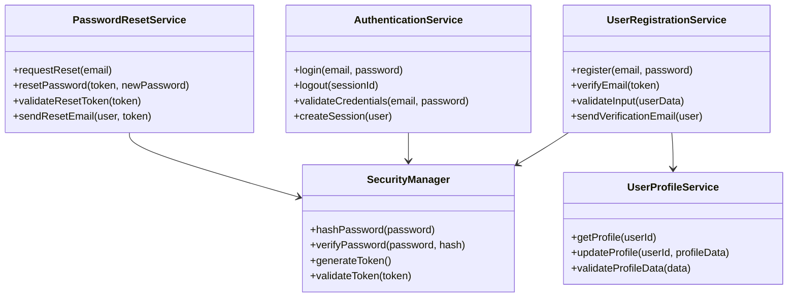
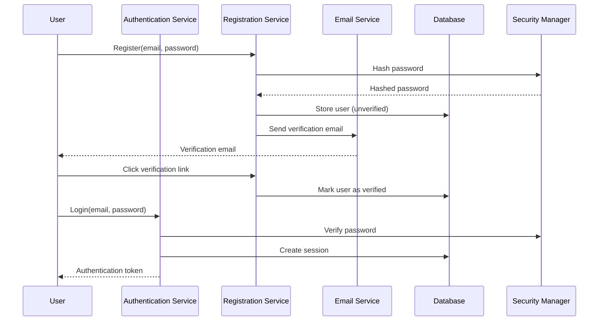

# Technical Specification

> **Module:** authentication
> **Sub-Agent:** security-authentication
> **AI Context:** Technical implementation details for user-auth-system

This is the technical specification for the spec detailed in @specs/modules/authentication/user-auth-system/spec.md

> Created: 2025-08-01
> Version: 1.0.0

## Architecture Overview

## Technical Requirements

### Authentication Components
- **Registration Service:** Email-based user registration with verification workflow
- **Authentication Service:** Credential validation and secure session management
- **Password Reset Service:** Token-based password recovery system
- **Profile Service:** Basic user profile management and updates
- **Security Manager:** Centralized security utilities (hashing, tokens, validation)

### Security Specifications
- **Password Hashing:** bcrypt with minimum 12 rounds
- **Session Management:** JWT tokens with 24-hour expiration
- **Rate Limiting:** 5 failed login attempts per 15-minute window per IP
- **Email Verification:** 24-hour token expiration for account activation
- **Password Reset:** 1-hour token expiration for password reset

### Database Requirements
- **User Table:** id, email, password_hash, email_verified, created_at, updated_at
- **Session Table:** id, user_id, token, expires_at, created_at
- **Reset Token Table:** id, user_id, token, expires_at, used_at

## Implementation Approach

### Selected Approach: Service-Oriented Architecture
- **Rationale:** Modular services enable independent testing and easier maintenance
- **Trade-offs:** Slightly more complex than monolithic approach but provides better separation of concerns

### Module Integration Pattern

## External Dependencies

### Required Libraries
- **bcrypt:** Password hashing and verification
- **jsonwebtoken:** JWT token generation and validation
- **nodemailer:** Email sending capabilities (or equivalent)
- **express-rate-limit:** Rate limiting middleware

### Justification
- **bcrypt:** Industry standard for secure password hashing with configurable work factor
- **jsonwebtoken:** Widely adopted JWT implementation with good security practices
- **nodemailer:** Reliable email sending with support for various SMTP providers
- **express-rate-limit:** Proven rate limiting solution with flexible configuration

## Performance Considerations

### Optimization Strategies
- **Password Hashing:** Async hashing to prevent blocking
- **Database Queries:** Indexed email column for fast user lookups
- **Session Storage:** In-memory or Redis cache for active sessions
- **Rate Limiting:** IP-based with sliding window algorithm

### Scalability Measures
- **Stateless Sessions:** JWT tokens enable horizontal scaling
- **Database Connection Pooling:** Efficient database resource utilization
- **Email Queue:** Async email processing to prevent request blocking
- **Caching Strategy:** User profile data caching for frequent access

## Security Considerations

### Authentication Security
- **Password Requirements:** Minimum 8 characters with complexity validation
- **Session Security:** Secure HTTP-only cookies with CSRF protection
- **Token Validation:** Signature verification and expiration checking
- **Input Sanitization:** SQL injection and XSS prevention

### Data Protection
- **Sensitive Data:** Never log passwords or tokens in plain text
- **Database Security:** Encrypted password storage and secure connections
- **Email Security:** Secure token generation and transmission
- **Audit Logging:** Security events logging without sensitive data