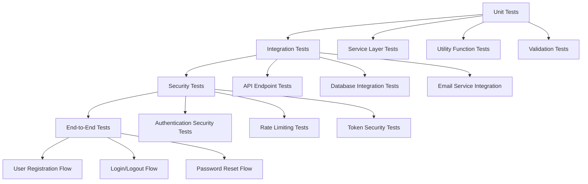

# Tests Specification

> **Module:** authentication
> **Sub-Agent:** security-authentication
> **AI Context:** Test coverage for user-auth-system

This is the tests coverage details for the spec detailed in @specs/modules/authentication/user-auth-system/spec.md

> Created: 2025-08-01
> Version: 1.0.0

## Test Coverage Strategy



## Unit Tests

### Location
- **Base Path:** `tests/modules/authentication/user-auth-system/unit/`

### Service Layer Tests

#### UserRegistrationService Tests
```javascript
// tests/modules/authentication/user-auth-system/unit/UserRegistrationService.test.js
describe('UserRegistrationService', () => {
  describe('register', () => {
    it('should register a new user with valid data');
    it('should reject registration with invalid email');
    it('should reject registration with weak password');
    it('should reject registration with existing email');
    it('should send verification email after registration');
    it('should store user with unverified status');
  });
  
  describe('verifyEmail', () => {
    it('should verify email with valid token');
    it('should reject verification with invalid token');
    it('should reject verification with expired token');
    it('should reject verification with already used token');
  });
});
```

#### AuthenticationService Tests
```javascript
// tests/modules/authentication/user-auth-system/unit/AuthenticationService.test.js
describe('AuthenticationService', () => {
  describe('login', () => {
    it('should authenticate user with valid credentials');
    it('should reject login with invalid email');
    it('should reject login with invalid password');
    it('should reject login for unverified account');
    it('should create session token on successful login');
    it('should apply rate limiting after failed attempts');
  });
  
  describe('logout', () => {
    it('should invalidate session token');
    it('should reject logout with invalid token');
  });
});
```

#### PasswordResetService Tests
```javascript
// tests/modules/authentication/user-auth-system/unit/PasswordResetService.test.js
describe('PasswordResetService', () => {
  describe('requestReset', () => {
    it('should generate reset token for valid email');
    it('should send reset email with token');
    it('should handle non-existent email gracefully');
    it('should apply rate limiting for reset requests');
  });
  
  describe('resetPassword', () => {
    it('should reset password with valid token');
    it('should reject reset with invalid token');
    it('should reject reset with expired token');
    it('should mark token as used after reset');
  });
});
```

### Security Utility Tests

#### SecurityManager Tests
```javascript
// tests/modules/authentication/user-auth-system/unit/SecurityManager.test.js
describe('SecurityManager', () => {
  describe('hashPassword', () => {
    it('should hash password with bcrypt');
    it('should generate different hashes for same password');
    it('should use minimum 12 rounds');
  });
  
  describe('verifyPassword', () => {
    it('should verify correct password');
    it('should reject incorrect password');
  });
  
  describe('generateToken', () => {
    it('should generate unique tokens');
    it('should generate tokens of sufficient length');
  });
  
  describe('validateToken', () => {
    it('should validate valid JWT tokens');
    it('should reject expired tokens');
    it('should reject malformed tokens');
  });
});
```

## Integration Tests

### Location
- **Base Path:** `tests/modules/authentication/user-auth-system/integration/`

### API Endpoint Integration Tests

#### Authentication API Tests
```javascript
// tests/modules/authentication/user-auth-system/integration/auth-api.test.js
describe('Authentication API', () => {
  describe('POST /api/auth/register', () => {
    it('should register new user and send verification email');
    it('should return 409 for duplicate email');
    it('should validate email format');
    it('should validate password requirements');
  });
  
  describe('POST /api/auth/login', () => {
    it('should authenticate verified user');
    it('should return JWT token on success');
    it('should reject unverified user');
    it('should apply rate limiting');
  });
  
  describe('GET /api/auth/verify/:token', () => {
    it('should verify valid token');
    it('should reject invalid token');
    it('should reject expired token');
  });
});
```

#### Profile API Tests
```javascript
// tests/modules/authentication/user-auth-system/integration/profile-api.test.js
describe('Profile API', () => {
  describe('GET /api/auth/profile', () => {
    it('should return user profile with valid token');
    it('should reject request without token');
    it('should reject request with invalid token');
  });
  
  describe('PUT /api/auth/profile', () => {
    it('should update profile with valid data');
    it('should validate profile data');
    it('should require authentication');
  });
});
```

### Database Integration Tests

#### User Repository Tests
```javascript
// tests/modules/authentication/user-auth-system/integration/user-repository.test.js
describe('User Repository', () => {
  beforeEach(() => {
    // Setup test database
  });
  
  describe('createUser', () => {
    it('should create user in database');
    it('should enforce email uniqueness');
    it('should set default verification status');
  });
  
  describe('findByEmail', () => {
    it('should find user by email');
    it('should return null for non-existent user');
  });
  
  describe('updateVerificationStatus', () => {
    it('should update email verification status');
  });
});
```

### Email Service Integration Tests

#### Email Integration Tests
```javascript
// tests/modules/authentication/user-auth-system/integration/email-service.test.js
describe('Email Service Integration', () => {
  describe('sendVerificationEmail', () => {
    it('should send verification email with token');
    it('should use correct email template');
    it('should handle email service failures');
  });
  
  describe('sendPasswordResetEmail', () => {
    it('should send reset email with token');
    it('should include reset link in email');
  });
});
```

## Security Tests

### Location
- **Base Path:** `tests/modules/authentication/user-auth-system/security/`

### Authentication Security Tests

#### Password Security Tests
```javascript
// tests/modules/authentication/user-auth-system/security/password-security.test.js
describe('Password Security', () => {
  it('should enforce minimum password length');
  it('should require password complexity');
  it('should prevent common passwords');
  it('should hash passwords with sufficient rounds');
  it('should not store passwords in plain text');
});
```

#### Token Security Tests
```javascript
// tests/modules/authentication/user-auth-system/security/token-security.test.js
describe('Token Security', () => {
  it('should generate cryptographically secure tokens');
  it('should set appropriate token expiration');
  it('should invalidate tokens on logout');
  it('should prevent token reuse');
  it('should validate token signatures');
});
```

### Rate Limiting Tests

#### Rate Limiting Security Tests
```javascript
// tests/modules/authentication/user-auth-system/security/rate-limiting.test.js
describe('Rate Limiting', () => {
  describe('Login Rate Limiting', () => {
    it('should allow normal login attempts');
    it('should block after 5 failed attempts');
    it('should reset counter after time window');
    it('should apply limits per IP address');
  });
  
  describe('Registration Rate Limiting', () => {
    it('should limit registration attempts per IP');
    it('should prevent spam registrations');
  });
  
  describe('Password Reset Rate Limiting', () => {
    it('should limit reset requests per email');
    it('should prevent reset request flooding');
  });
});
```

## End-to-End Tests

### Location
- **Base Path:** `tests/modules/authentication/user-auth-system/e2e/`

### Complete User Workflows

#### User Registration E2E Test
```javascript
// tests/modules/authentication/user-auth-system/e2e/registration-flow.test.js
describe('User Registration Flow', () => {
  it('should complete full registration workflow', async () => {
    // 1. Register new user
    const registerResponse = await request(app)
      .post('/api/auth/register')
      .send({
        email: 'test@example.com',
        password: 'SecurePass123',
        firstName: 'Test',
        lastName: 'User'
      });
    
    expect(registerResponse.status).toBe(201);
    
    // 2. Check verification email was sent
    const emails = await getTestEmails();
    expect(emails).toHaveLength(1);
    
    // 3. Extract verification token
    const verificationToken = extractTokenFromEmail(emails[0]);
    
    // 4. Verify email
    const verifyResponse = await request(app)
      .get(`/api/auth/verify/${verificationToken}`);
    
    expect(verifyResponse.status).toBe(200);
    
    // 5. Login with verified account
    const loginResponse = await request(app)
      .post('/api/auth/login')
      .send({
        email: 'test@example.com',
        password: 'SecurePass123'
      });
    
    expect(loginResponse.status).toBe(200);
    expect(loginResponse.body.token).toBeDefined();
  });
});
```

#### Password Reset E2E Test
```javascript
// tests/modules/authentication/user-auth-system/e2e/password-reset-flow.test.js
describe('Password Reset Flow', () => {
  it('should complete full password reset workflow', async () => {
    // 1. Request password reset
    const resetRequest = await request(app)
      .post('/api/auth/forgot-password')
      .send({ email: 'existing@example.com' });
    
    expect(resetRequest.status).toBe(200);
    
    // 2. Check reset email was sent
    const emails = await getTestEmails();
    const resetToken = extractTokenFromEmail(emails[0]);
    
    // 3. Reset password with token
    const resetResponse = await request(app)
      .post('/api/auth/reset-password')
      .send({
        token: resetToken,
        newPassword: 'NewSecurePass123'
      });
    
    expect(resetResponse.status).toBe(200);
    
    // 4. Login with new password
    const loginResponse = await request(app)
      .post('/api/auth/login')
      .send({
        email: 'existing@example.com',
        password: 'NewSecurePass123'
      });
    
    expect(loginResponse.status).toBe(200);
  });
});
```

## Mock Requirements

### External Service Mocks
- **Email Service:** Mock SMTP service for testing email delivery
- **Database:** In-memory database or test database for isolation
- **Time Functions:** Mock date/time for token expiration testing
- **Random Generators:** Predictable random values for token testing

### Mock Implementation Examples
```javascript
// Setup test mocks
jest.mock('../../../src/modules/authentication/EmailService', () => ({
  sendVerificationEmail: jest.fn(),
  sendPasswordResetEmail: jest.fn()
}));

jest.mock('bcrypt', () => ({
  hash: jest.fn((password, rounds) => Promise.resolve(`hashed_${password}`)),
  compare: jest.fn((password, hash) => Promise.resolve(password === hash.replace('hashed_', '')))
}));
```

## Test Data Management

### Test Fixtures
```javascript
// tests/modules/authentication/user-auth-system/fixtures/users.js
const testUsers = {
  unverifiedUser: {
    email: 'unverified@example.com',
    password: 'TestPass123',
    emailVerified: false
  },
  verifiedUser: {
    email: 'verified@example.com',
    password: 'TestPass123',
    emailVerified: true
  }
};

const testTokens = {
  validJWT: 'valid.jwt.token',
  expiredJWT: 'expired.jwt.token',
  invalidJWT: 'invalid.jwt.token'
};
```

### Database Seeding
```javascript
// tests/modules/authentication/user-auth-system/setup/seed-database.js
async function seedTestDatabase() {
  await db.users.create(testUsers.verifiedUser);
  await db.users.create(testUsers.unverifiedUser);
}

async function cleanupTestDatabase() {
  await db.users.deleteMany({});
  await db.user_sessions.deleteMany({});
  await db.password_reset_tokens.deleteMany({});
}
```

## Performance Tests

### Load Testing
```javascript
// tests/modules/authentication/user-auth-system/performance/load-tests.js
describe('Authentication Performance', () => {
  it('should handle 100 concurrent login requests');
  it('should maintain response time under 200ms for login');
  it('should handle registration load without blocking');
});
```

## Test Coverage Requirements

### Coverage Targets
- **Unit Tests:** 95% code coverage
- **Integration Tests:** 90% API endpoint coverage
- **Security Tests:** 100% security feature coverage
- **E2E Tests:** 100% critical user flow coverage