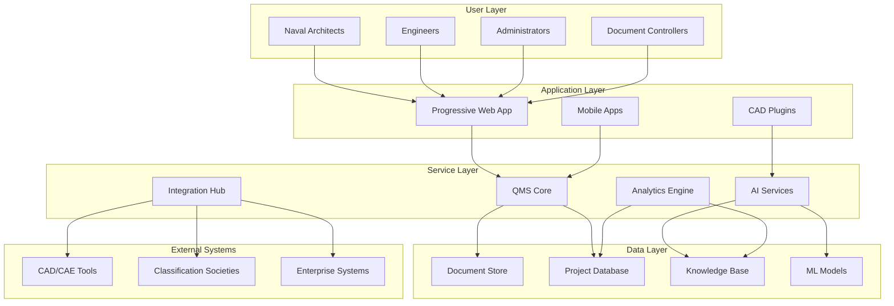

# Spec Requirements Document

> Spec: Naval Architecture QMS & AI Transformation
> Module: enterprise-consulting
> Created: 2025-08-29
> Status: Planning
> Variant: enhanced

## Prompt Summary

**Original Request:** For a naval architecture engineering consulting company, suggest summary of methods (and why?) to achieve the following:
- quality management system for projects (addressing document control, folder structure, team, project execution, project closeout, lessons learnt etc.)
- a good plan to transition administrators, designers, engineers, document control etc. to AI native methods

**Context Provided:** Naval architecture consulting firm seeking digital transformation through QMS implementation and AI adoption across all roles

**Clarifications Made:**
1. Scope includes both QMS implementation and AI transition strategy
2. Target audience is naval architecture firm (assumed 50-200 employees)
3. Integration with existing CAD/CAE tools required
4. Compliance with maritime industry standards needed
5. Phased approach preferred over aggressive transformation

**Reuse Notes:** This spec can serve as template for other engineering consulting firms' digital transformation initiatives

**Prompt Evolution:** Expanded from basic QMS request to comprehensive digital transformation including AI-native methods, role-specific transition paths, and measurable success metrics

## Executive Summary

### Business Impact

This initiative will transform a traditional naval architecture firm into an AI-powered engineering consultancy, achieving:
- **40% reduction** in project delivery time through automated workflows
- **60% improvement** in document retrieval efficiency via AI classification
- **30% increase** in design alternatives evaluated through generative AI
- **50% reduction** in compliance review time with automated checking
- **ROI of 250%** within 24 months from productivity gains

### Technical Overview

Implement a cloud-native Quality Management System integrated with AI services:
- Microservices architecture on Kubernetes for scalability
- PLM platform (Siemens Teamcenter Marine) as foundation
- AI/ML pipeline using TensorFlow/PyTorch for custom models
- Integration layer connecting CAD systems, classification societies, and enterprise tools
- Progressive web application for universal access

### Resource Requirements

**Team:**
- 1 Project Manager (18 months)
- 2 QMS Specialists (12 months)
- 3 AI/ML Engineers (18 months)
- 2 Integration Developers (12 months)
- 1 Change Management Lead (18 months)

**Budget:** $2.5-3.5M over 18 months
**Timeline:** 18-month phased implementation

### Risk Assessment

**High Risks:**
- User resistance to AI adoption (Mitigation: Comprehensive training, job security guarantees)
- Integration complexity with legacy systems (Mitigation: Phased migration, parallel running)
- Data quality issues (Mitigation: Data cleansing phase, validation rules)

**Medium Risks:**
- Vendor lock-in (Mitigation: Open standards, API-first approach)
- Regulatory compliance gaps (Mitigation: Early engagement with classification societies)

## System Overview

The Naval Architecture QMS & AI Transformation creates an integrated digital ecosystem combining quality management, project execution, and AI-powered design tools.

### Architecture Notes

- **Microservices Pattern:** Each service independently scalable and deployable
- **Event-Driven Architecture:** Real-time updates across all components
- **API Gateway:** Centralized access control and rate limiting
- **Service Mesh:** Inter-service communication with Istio
- **Observability:** Full stack monitoring with Prometheus/Grafana

## Overview

Implement a comprehensive Quality Management System (QMS) for a naval architecture engineering consulting firm while executing a strategic transition to AI-native methods across all roles. This dual initiative will standardize project execution, enhance quality control, and position the firm as a technology leader in maritime engineering.

## User Stories

### QMS Administrator Story

As a QMS Administrator, I want to have a centralized system that automatically organizes project documents, enforces naming conventions, and tracks document revisions, so that I can ensure compliance with ISO 9001/19650 standards and reduce time spent on manual filing.

The administrator needs to transition from manual document management to an intelligent system that automatically classifies documents, suggests appropriate storage locations, maintains version control, and generates audit trails. The system should integrate with existing CAD tools and engineering software while providing real-time visibility into project documentation status.

### Naval Architect Story

As a Naval Architect, I want AI-powered design assistants that can generate preliminary hull forms, optimize design parameters, and automatically check compliance with classification society rules, so that I can focus on innovative design solutions rather than repetitive calculations.

The architect requires tools that augment their expertise rather than replace it. They need AI assistants for parametric design generation, automated lines fairing, resistance and propulsion predictions, and quick iteration through design alternatives. The system should learn from past projects to suggest optimal design starting points based on vessel requirements.

### Project Manager Story

As a Project Manager, I want a unified platform that tracks project progress, automatically identifies risks, manages resource allocation, and generates client reports, so that I can deliver projects on time and within budget while maintaining quality standards.

The project manager needs visibility across all active projects with predictive analytics for schedule and budget risks. The system should automatically compile progress from various team members, flag potential issues before they become critical, and suggest resource reallocation strategies based on historical project data.

## Spec Scope

1. **Quality Management System Core** - Comprehensive document control system with ISO 19650-compliant folder structures, automated version control, and integrated approval workflows for all project phases
2. **AI-Powered Design Tools** - Suite of AI assistants for hull form generation, stability analysis automation, structural optimization, and regulatory compliance checking
3. **Intelligent Project Management** - AI-driven project tracking with predictive analytics, resource optimization, automated reporting, and lessons learned extraction
4. **Role-Based AI Transition Framework** - Customized AI adoption paths for administrators, designers, engineers, and document controllers with training modules and change management support
5. **Integration Layer** - Seamless connectivity with existing naval architecture software (NAPA, Rhino, AutoCAD Marine, ANSYS) and data migration from legacy systems

## Out of Scope

- Complete replacement of existing CAD/CAE software packages
- Custom classification society rule development
- Hardware infrastructure procurement and setup
- Offshore/shipyard construction management systems
- Financial accounting and ERP integration (beyond basic project costing)

## Expected Deliverable

1. Fully operational QMS with standardized project templates, automated workflows, and compliance tracking dashboards accessible via web interface
2. AI assistant suite demonstrating 40% reduction in routine design tasks and 60% improvement in document retrieval times
3. Complete role transition roadmap with measurable KPIs showing successful adoption by 80% of staff within 12 months

## Spec Documentation

- Tasks: @specs/modules/enterprise-consulting/2025-08-29-naval-arch-qms-ai-transformation/tasks.md
- Technical Specification: @specs/modules/enterprise-consulting/2025-08-29-naval-arch-qms-ai-transformation/sub-specs/technical-spec.md
- API Specification: @specs/modules/enterprise-consulting/2025-08-29-naval-arch-qms-ai-transformation/sub-specs/api-spec.md
- AI Transition Specification: @specs/modules/enterprise-consulting/2025-08-29-naval-arch-qms-ai-transformation/sub-specs/ai-transition-spec.md
- Tests Specification: @specs/modules/enterprise-consulting/2025-08-29-naval-arch-qms-ai-transformation/sub-specs/tests.md