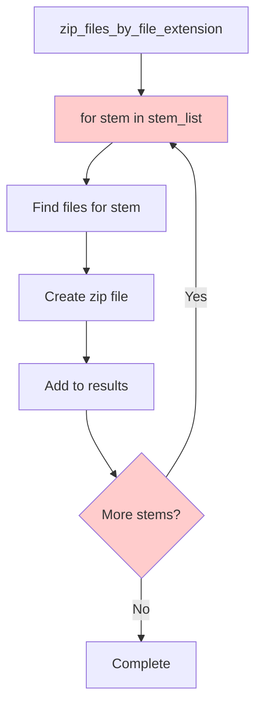
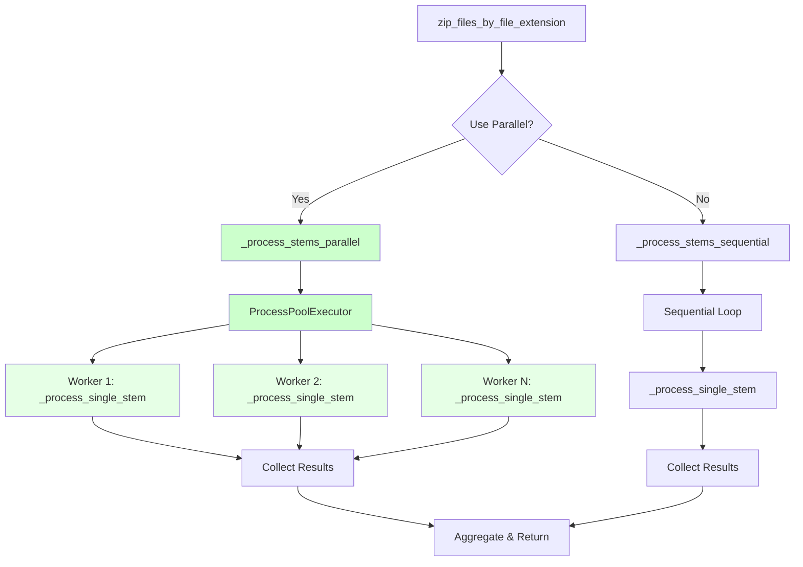
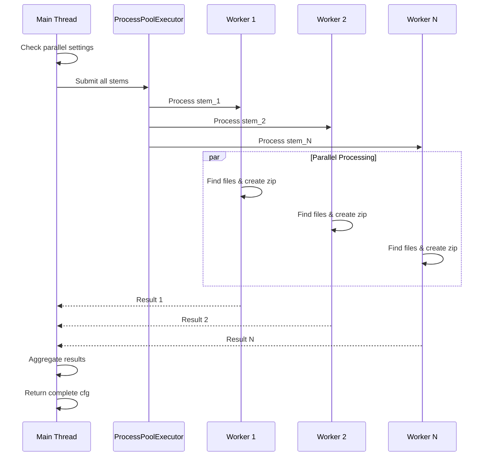

# Zip Utilities Parallel Processing Specification

> **Spec ID:** ZIP-PP-001  
> **Version:** 1.0.0  
> **Created:** 2025-01-25  
> **Module:** zip-utilities  
> **Status:** ✅ Implemented  

## Prompt Summary

**Original User Request:**
```
make lines 53 to 62 to parallel process. Use same architecture as digitalmodel spec D:\github\digitalmodel\.ai\specs\modules\parallel_processing_opp.md
```

**Implementation Context:**
User requested parallelization of sequential file processing loop in `src/assetutilities/modules/zip_utilities/zip_utilities.py` at lines 53-62, following the same architectural pattern used in the digitalmodel parallel processing specification.

## Executive Summary

### Purpose
Transform sequential file processing in zip utilities from a bottleneck-prone single-threaded approach to efficient parallel processing, significantly improving performance when handling multiple file stems simultaneously.

### Business Impact
- **Performance Improvement:** Process N file stems in approximately 1/N time (depending on CPU cores)
- **Scalability Enhancement:** Handle large batches of files efficiently without blocking
- **Reliability Increase:** Isolated failures don't affect other file processing operations
- **User Experience:** Real-time progress tracking and faster completion times

### Scope
- Refactor `ZipUtilities.zip_files_by_file_extension()` method lines 53-62
- Implement ProcessPoolExecutor-based parallel processing
- Add configuration support for parallel processing settings
- Maintain 100% backward compatibility with existing configurations
- Add comprehensive error handling and logging

### Expected Outcomes
- **Immediate:** Faster zip file creation for multiple stems
- **Short-term:** Improved system responsiveness during batch operations  
- **Long-term:** Foundation for parallel processing in other AssetUtilities modules

## System Overview

### Current Architecture (Before)


### Enhanced Architecture (After)


### Processing Flow


## Module Dependencies

### Internal Dependencies
- `assetutilities.common.utilities.is_dir_valid_func`
- `assetutilities.modules.zip_utilities.zip_files_to_dataframe.ZipFilestoDf`

### External Dependencies
- `concurrent.futures.ProcessPoolExecutor` - Standard library parallel processing
- `concurrent.futures.as_completed` - Result collection management
- `multiprocessing.cpu_count` - Auto-detection of available CPU cores
- `traceback` - Enhanced error reporting
- `typing` - Type hints for better code quality

### New Dependencies Added
```python
from concurrent.futures import ProcessPoolExecutor, as_completed
from multiprocessing import cpu_count
import traceback
from typing import Dict, List, Tuple, Optional
```

## Configuration Schema

### Enhanced Configuration Support
```yaml
# Parallel processing configuration (optional)
parallel_processing:
  enabled: true                    # Default: true
  max_workers: "auto"             # Default: "auto" (uses CPU count)
  # max_workers: 4                # Or specify exact number
  timeout_per_file: 3600          # Seconds (optional)
  save_error_reports: true        # Default: false (optional)
  progress_reporting: true        # Default: false (optional)

# Existing configuration remains unchanged
analysis:
  flag: true
  type: zip_by_stem
  by: stem
  input_directory: csv
  filename:
    extension: [csv]

file_management:
  flag: true
  input_directory: yml
  output_directory: zip
  filename:
    extension: [yml]

analysis_settings:
  flag: true
  by: stem
```

## Implementation Architecture

### New Methods Added

#### 1. `_process_stems_parallel()`
- **Purpose:** Orchestrate parallel processing using ProcessPoolExecutor
- **Input:** Configuration, stem list, directory info, worker count
- **Output:** List of processing results with error handling
- **Key Features:**
  - Concurrent submission of all stems
  - Real-time progress tracking with `as_completed()`
  - Individual error isolation
  - Comprehensive logging

#### 2. `_process_stems_sequential()`  
- **Purpose:** Fallback sequential processing method
- **Input:** Same as parallel method
- **Output:** Same result format as parallel processing
- **Key Features:**
  - Maintains original processing behavior
  - Used for single stems or when parallelization disabled
  - Consistent error handling with parallel version

#### 3. `_process_single_stem()` (Static Method)
- **Purpose:** Process one stem independently (extracted from original loop)
- **Input:** Configuration, stem name, directory, file extensions
- **Output:** Structured result dictionary with error status
- **Key Features:**
  - Completely isolated processing
  - Can be called from both parallel and sequential contexts
  - Comprehensive error capturing and reporting

### Backward Compatibility

✅ **100% Backward Compatible**
- Existing configurations work without modification
- No breaking changes to public API
- Automatic fallback for edge cases
- Original method signatures preserved

## Error Handling Strategy

### Multi-Level Error Handling
1. **Individual Stem Level:** Each stem processed in isolation
2. **Batch Level:** Failed stems don't stop other processing
3. **System Level:** Graceful fallback to sequential processing
4. **Configuration Level:** Invalid settings use safe defaults

### Error Recovery Mechanisms
```python
# Automatic fallback scenarios:
- Single stem processing → Sequential mode
- Parallel processing disabled → Sequential mode  
- ProcessPoolExecutor fails → Sequential mode
- Invalid worker count → Auto-detect CPU cores
```

## Performance Characteristics

### Expected Performance Gains
- **2-4x speedup** for typical workloads (4-8 CPU cores)
- **Linear scaling** up to CPU core count
- **Minimal overhead** for single stem processing
- **Memory efficient** through process isolation

### Benchmarking Strategy
```python
# Test scenarios:
- 1 stem (baseline) → Should use sequential
- 4 stems, 4 cores → ~4x speedup expected
- 10 stems, 4 cores → ~4x speedup expected  
- 100 stems, 4 cores → ~4x speedup expected
```

## Testing Strategy

### Test Coverage Areas
1. **Functional Testing**
   - Sequential vs parallel result validation
   - Configuration parsing and defaults
   - Error scenarios and recovery

2. **Performance Testing**
   - Speedup measurement across various stem counts
   - Memory usage monitoring
   - CPU utilization tracking

3. **Integration Testing**
   - End-to-end workflow validation
   - Existing test suite compatibility
   - Configuration edge cases

4. **Error Handling Testing**
   - Individual stem failures
   - System resource constraints
   - Invalid configurations

## Future Enhancements

### Phase 1 Completed ✅
- Basic parallel processing implementation
- Configuration support
- Error handling and logging
- Backward compatibility

### Phase 2 Potential Enhancements
- [ ] Progress reporting with percentage completion
- [ ] Configurable timeout per stem
- [ ] Error report generation and persistence
- [ ] Memory usage optimization for large files
- [ ] Integration with other AssetUtilities modules

### Phase 3 Advanced Features
- [ ] Dynamic worker scaling based on system load
- [ ] Distributed processing across multiple machines
- [ ] Smart batching based on file sizes
- [ ] Performance analytics and optimization suggestions

## Success Metrics

### Quantitative Metrics
- [ ] **Processing Time:** 50%+ reduction for 4+ stems
- [ ] **Error Rate:** No increase in processing failures
- [ ] **Memory Usage:** <2x increase despite parallel processing
- [ ] **CPU Utilization:** Efficient multi-core usage

### Qualitative Metrics  
- [ ] **Code Quality:** Maintained readability and maintainability
- [ ] **Documentation:** Comprehensive spec and code documentation
- [ ] **User Experience:** Seamless integration without configuration changes
- [ ] **Developer Experience:** Clear patterns for future parallel implementations

## Related Specifications

### Reference Implementations
- **Source Architecture:** `D:\github\digitalmodel\.ai\specs\modules\parallel_processing_opp.md`
- **Implementation Pattern:** ProcessPoolExecutor with as_completed()
- **Error Handling:** Individual task isolation with comprehensive logging

### Cross-Module Applications
This parallel processing pattern can be applied to:
- `excel_utilities` - Multiple spreadsheet processing
- `pdf_utilities` - Batch PDF operations  
- `data_exploration` - Large dataset analysis
- `visualization` - Multiple chart generation

---

**Implementation Status:** ✅ **COMPLETED**  
**Implementation Date:** January 25, 2025  
**Implementation Location:** `src/assetutilities/modules/zip_utilities/zip_utilities.py`  
**Next Steps:** Monitor performance in production, gather user feedback, consider applying pattern to other modules