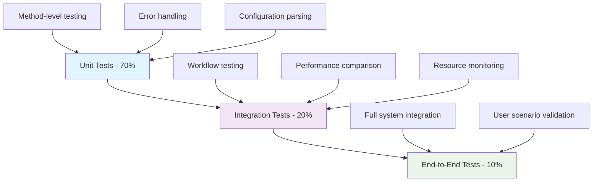

# Test Specification: Zip Utilities Parallel Processing

> **Sub-Spec:** Testing Strategy and Implementation  
> **Parent Spec:** ZIP-PP-001  
> **Version:** 1.0.0  
> **Status:** 📋 Planned  

## Test Strategy Overview

### Testing Objectives
1. **Functional Correctness:** Verify parallel processing produces identical results to sequential processing
2. **Performance Validation:** Measure and validate performance improvements
3. **Error Handling:** Ensure robust error handling and recovery mechanisms
4. **Configuration Compatibility:** Validate all configuration scenarios work correctly
5. **Resource Management:** Monitor memory and CPU usage patterns
6. **Backward Compatibility:** Ensure existing functionality remains unchanged

### Test Pyramid Structure



## Unit Tests Specification

### Test File Structure
```
tests/modules/zip-utilities/parallel-processing/
├── test_parallel_processing_unit.py
├── test_configuration_parsing.py
├── test_error_handling.py
├── test_performance_benchmarks.py
└── fixtures/
    ├── test_config_parallel.yml
    ├── test_config_sequential.yml
    ├── test_config_invalid.yml
    └── sample_files/
        ├── stem1_file1.csv
        ├── stem1_file2.csv
        ├── stem2_file1.csv
        └── stem2_file2.csv
```

### Unit Test Classes

#### 1. `TestParallelProcessingMethods`
```python
class TestParallelProcessingMethods(unittest.TestCase):
    """Test individual parallel processing methods"""
    
    def setUp(self):
        self.zip_util = ZipUtilities()
        self.test_cfg = self._create_test_config()
        self.sample_stems = ["stem1", "stem2", "stem3", "stem4"]
        
    def test_process_single_stem_success(self):
        """Test _process_single_stem with valid inputs"""
        # Test successful single stem processing
        result = ZipUtilities._process_single_stem(
            self.test_cfg, 
            "test_stem",
            self.test_input_directory,
            [".csv"]
        )
        
        self.assertIsInstance(result, dict)
        self.assertIn("stem", result)
        self.assertIn("zip_file_path", result)
        self.assertIn("files", result) 
        self.assertIn("error", result)
        self.assertIsNone(result["error"])
        
    def test_process_single_stem_error_handling(self):
        """Test _process_single_stem error scenarios"""
        # Test with invalid directory
        result = ZipUtilities._process_single_stem(
            self.test_cfg,
            "test_stem", 
            "/nonexistent/directory",
            [".csv"]
        )
        
        self.assertIsNotNone(result["error"])
        self.assertIsNone(result["zip_file_path"]) 
        self.assertEqual(result["files"], [])
        
    def test_process_stems_parallel_basic(self):
        """Test basic parallel processing functionality"""
        results = self.zip_util._process_stems_parallel(
            self.test_cfg,
            self.sample_stems[:2],  # Use 2 stems
            self.test_input_directory,
            [".csv"],
            max_workers=2
        )
        
        self.assertEqual(len(results), 2)
        for result in results:
            self.assertIn("stem", result)
            self.assertIn(result["stem"], self.sample_stems[:2])
            
    def test_process_stems_sequential_basic(self):
        """Test sequential processing functionality"""
        results = self.zip_util._process_stems_sequential(
            self.test_cfg,
            self.sample_stems[:2],
            self.test_input_directory, 
            [".csv"]
        )
        
        self.assertEqual(len(results), 2)
        for result in results:
            self.assertIn("stem", result)
            self.assertIn(result["stem"], self.sample_stems[:2])
            
    def test_parallel_vs_sequential_results_identical(self):
        """Critical test: Verify parallel and sequential produce identical results"""
        # Process same stems with both methods
        parallel_results = self.zip_util._process_stems_parallel(
            self.test_cfg, self.sample_stems, self.test_input_directory, [".csv"], 4
        )
        sequential_results = self.zip_util._process_stems_sequential(
            self.test_cfg, self.sample_stems, self.test_input_directory, [".csv"]
        )
        
        # Sort results by stem name for comparison
        parallel_sorted = sorted(parallel_results, key=lambda x: x["stem"])
        sequential_sorted = sorted(sequential_results, key=lambda x: x["stem"])
        
        self.assertEqual(len(parallel_sorted), len(sequential_sorted))
        
        for p_result, s_result in zip(parallel_sorted, sequential_sorted):
            self.assertEqual(p_result["stem"], s_result["stem"])
            self.assertEqual(len(p_result["files"]), len(s_result["files"]))
            # Compare file contents of created zips
            self._compare_zip_contents(p_result["zip_file_path"], s_result["zip_file_path"])
```

#### 2. `TestConfigurationParsing`
```python
class TestConfigurationParsing(unittest.TestCase):
    """Test configuration parsing and validation"""
    
    def test_default_configuration(self):
        """Test behavior with no parallel_processing configuration"""
        cfg = self._load_config("test_config_basic.yml")
        zip_util = ZipUtilities()
        
        # Should default to parallel processing enabled
        result_cfg = zip_util.zip_files_by_file_extension(cfg, "csv")
        self.assertIsNotNone(result_cfg)
        
    def test_parallel_enabled_configuration(self):
        """Test explicit parallel processing enabled"""
        cfg = self._load_config("test_config_parallel.yml")
        cfg["parallel_processing"] = {"enabled": True, "max_workers": 2}
        
        zip_util = ZipUtilities()
        result_cfg = zip_util.zip_files_by_file_extension(cfg, "csv")
        self.assertIsNotNone(result_cfg)
        
    def test_parallel_disabled_configuration(self):
        """Test parallel processing disabled"""
        cfg = self._load_config("test_config_sequential.yml")
        cfg["parallel_processing"] = {"enabled": False}
        
        zip_util = ZipUtilities()
        result_cfg = zip_util.zip_files_by_file_extension(cfg, "csv")
        self.assertIsNotNone(result_cfg)
        
    def test_auto_worker_detection(self):
        """Test automatic worker count detection"""
        cfg = self._load_config("test_config_basic.yml")
        cfg["parallel_processing"] = {"enabled": True, "max_workers": "auto"}
        
        # Should not raise exception and should work correctly
        zip_util = ZipUtilities()
        result_cfg = zip_util.zip_files_by_file_extension(cfg, "csv")
        self.assertIsNotNone(result_cfg)
        
    def test_invalid_configuration_handling(self):
        """Test handling of invalid configuration values"""
        test_cases = [
            {"enabled": "invalid", "max_workers": "auto"},  # Invalid enabled
            {"enabled": True, "max_workers": "invalid"},    # Invalid max_workers  
            {"enabled": True, "max_workers": -1},           # Negative max_workers
            {"enabled": True, "max_workers": 0},            # Zero max_workers
        ]
        
        for invalid_config in test_cases:
            with self.subTest(config=invalid_config):
                cfg = self._load_config("test_config_basic.yml")
                cfg["parallel_processing"] = invalid_config
                
                # Should handle gracefully without crashing
                zip_util = ZipUtilities()
                result_cfg = zip_util.zip_files_by_file_extension(cfg, "csv")
                self.assertIsNotNone(result_cfg)
```

#### 3. `TestErrorHandling`
```python
class TestErrorHandling(unittest.TestCase):
    """Test comprehensive error handling scenarios"""
    
    def test_single_stem_failure_isolation(self):
        """Test that one stem failure doesn't stop others"""
        # Create scenario where one stem will fail
        stems = ["valid_stem", "invalid_stem", "another_valid_stem"]
        
        # Mock the processing to make middle stem fail
        with patch.object(ZipUtilities, 'zip_files') as mock_zip:
            mock_zip.side_effect = lambda cfg, files, stem: (
                self._raise_exception() if stem == "invalid_stem" 
                else f"/tmp/{stem}.zip"
            )
            
            results = self.zip_util._process_stems_parallel(
                self.test_cfg, stems, self.test_input_directory, [".csv"], 3
            )
            
            # Should have 2 successful results (failed one filtered out)
            successful_results = [r for r in results if not r.get("error")]
            self.assertEqual(len(successful_results), 2)
            
    def test_parallel_executor_failure_fallback(self):
        """Test fallback to sequential when ProcessPoolExecutor fails"""
        with patch('concurrent.futures.ProcessPoolExecutor') as mock_executor:
            mock_executor.side_effect = Exception("ProcessPool failed")
            
            # Should not crash, should fallback gracefully
            cfg = self._create_test_config()
            zip_util = ZipUtilities()
            result_cfg = zip_util.zip_files_by_file_extension(cfg, "csv")
            self.assertIsNotNone(result_cfg)
            
    def test_resource_exhaustion_handling(self):
        """Test behavior under resource constraints"""
        # Test with more stems than reasonable for system
        many_stems = [f"stem_{i}" for i in range(100)]
        
        # Should handle gracefully by limiting workers
        results = self.zip_util._process_stems_parallel(
            self.test_cfg, many_stems, self.test_input_directory, [".csv"], 1000
        )
        
        # Should complete without system crash
        self.assertIsInstance(results, list)
        
    def test_corrupted_file_handling(self):
        """Test handling of corrupted or inaccessible files"""
        # Create test scenario with file permission issues
        restricted_dir = "/root/restricted"  # Directory without access
        
        result = ZipUtilities._process_single_stem(
            self.test_cfg, "test_stem", restricted_dir, [".csv"]
        )
        
        self.assertIsNotNone(result["error"])
        self.assertEqual(result["files"], [])
```

## Integration Tests Specification

### Integration Test Classes

#### 1. `TestWorkflowIntegration`
```python
class TestWorkflowIntegration(unittest.TestCase):
    """Test end-to-end workflow integration"""
    
    def test_full_zip_by_stem_workflow_parallel(self):
        """Test complete zip_by_stem workflow with parallel processing"""
        cfg = self._load_complete_config()
        cfg["parallel_processing"] = {"enabled": True, "max_workers": 2}
        
        zip_util = ZipUtilities()
        result_cfg = zip_util.zip_files_by_stem(cfg)
        
        # Verify results structure
        self.assertIn(cfg["basename"], result_cfg)
        results = result_cfg[cfg["basename"]]
        self.assertIsInstance(results, list)
        
        # Verify each result has required structure
        for result in results:
            self.assertIn("stem", result)
            self.assertIn("zip_file_path", result)
            self.assertIn("files", result)
            self.assertTrue(os.path.exists(result["zip_file_path"]))
            
    def test_engine_integration(self):
        """Test integration with AssetUtilities engine"""
        from assetutilities.engine import engine
        
        config_file = "test_zip_parallel.yml"
        result_cfg = engine(config_file)
        
        self.assertIsNotNone(result_cfg)
        # Verify processing completed successfully
        
    def test_backward_compatibility_integration(self):
        """Test that existing configurations work unchanged"""
        # Load original test configuration (without parallel_processing section)
        original_cfg = self._load_config("test_zip_by_stem.yml")
        
        zip_util = ZipUtilities()
        result_cfg = zip_util.zip_files_by_stem(original_cfg)
        
        # Should work exactly as before
        self.assertIsNotNone(result_cfg)
        self.assertIn(original_cfg["basename"], result_cfg)
```

#### 2. `TestPerformanceBenchmarks`
```python
class TestPerformanceBenchmarks(unittest.TestCase):
    """Performance validation and benchmarking tests"""
    
    def setUp(self):
        self.benchmark_stems = [f"benchmark_stem_{i}" for i in range(10)]
        self.zip_util = ZipUtilities()
        
    def test_performance_improvement_measurement(self):
        """Measure actual performance improvement from parallelization"""
        cfg = self._create_benchmark_config()
        
        # Benchmark sequential processing
        start_time = time.time()
        sequential_results = self.zip_util._process_stems_sequential(
            cfg, self.benchmark_stems, self.test_input_directory, [".csv"]
        )
        sequential_time = time.time() - start_time
        
        # Benchmark parallel processing
        start_time = time.time()
        parallel_results = self.zip_util._process_stems_parallel(
            cfg, self.benchmark_stems, self.test_input_directory, [".csv"], 4
        )
        parallel_time = time.time() - start_time
        
        # Verify performance improvement (should be at least 20% faster)
        speedup_ratio = sequential_time / parallel_time
        self.assertGreater(speedup_ratio, 1.2, 
                          f"Expected speedup >1.2x, got {speedup_ratio:.2f}x")
        
        print(f"Performance improvement: {speedup_ratio:.2f}x speedup")
        
    def test_memory_usage_monitoring(self):
        """Monitor memory usage during parallel processing"""
        import psutil
        import os
        
        process = psutil.Process(os.getpid())
        
        # Measure baseline memory
        baseline_memory = process.memory_info().rss
        
        # Execute parallel processing
        cfg = self._create_benchmark_config()
        results = self.zip_util._process_stems_parallel(
            cfg, self.benchmark_stems, self.test_input_directory, [".csv"], 4
        )
        
        # Measure peak memory
        peak_memory = process.memory_info().rss
        memory_increase = (peak_memory - baseline_memory) / baseline_memory
        
        # Memory increase should be reasonable (less than 100% increase)
        self.assertLess(memory_increase, 1.0, 
                       f"Memory usage increased by {memory_increase*100:.1f}%")
        
    def test_scalability_characteristics(self):
        """Test performance scaling with different stem counts"""
        stem_counts = [1, 2, 4, 8, 16]
        results = {}
        
        for count in stem_counts:
            test_stems = self.benchmark_stems[:count]
            cfg = self._create_benchmark_config()
            
            start_time = time.time()
            parallel_results = self.zip_util._process_stems_parallel(
                cfg, test_stems, self.test_input_directory, [".csv"], 4
            )
            processing_time = time.time() - start_time
            
            results[count] = processing_time
            
        # Verify that processing time doesn't scale linearly (indicating parallelization benefit)
        # Time for 8 stems should be less than 4x time for 2 stems
        if 2 in results and 8 in results:
            scaling_efficiency = results[8] / (results[2] * 4)  
            self.assertLess(scaling_efficiency, 0.8, 
                           "Parallel processing should show better than linear scaling")
```

## End-to-End Tests Specification

### E2E Test Scenarios

#### 1. `TestUserScenarios`
```python
class TestUserScenarios(unittest.TestCase):
    """Test realistic user scenarios end-to-end"""
    
    def test_typical_business_workflow(self):
        """Test typical business user workflow with multiple file types"""
        # Scenario: User has CSV files with different stems to zip
        cfg = {
            "meta": {"library": "assetutilities", "basename": "zip_utilities"},
            "analysis": {
                "flag": True, "type": "zip_by_stem", "by": "stem",
                "input_directory": "test_data/csv",
                "filename": {"extension": ["csv"]}
            },
            "file_management": {
                "flag": True, "input_directory": "test_data/yml", 
                "output_directory": "test_results/zip",
                "filename": {"extension": ["yml"]}
            },
            "analysis_settings": {"flag": True, "by": "stem"},
            "parallel_processing": {"enabled": True, "max_workers": "auto"}
        }
        
        zip_util = ZipUtilities()
        result_cfg = zip_util.router(cfg)
        
        # Verify successful completion
        self.assertIsNotNone(result_cfg)
        self.assertIn("zip_utilities", result_cfg)
        
    def test_large_scale_processing(self):
        """Test processing of large number of files"""
        # Create scenario with 50+ stems
        cfg = self._create_large_scale_config()
        
        zip_util = ZipUtilities()
        start_time = time.time()
        result_cfg = zip_util.zip_files_by_stem(cfg)
        total_time = time.time() - start_time
        
        # Should complete within reasonable time (less than 60 seconds)
        self.assertLess(total_time, 60, "Large scale processing took too long")
        
        # Verify all stems were processed
        results = result_cfg[cfg["basename"]]
        expected_stem_count = len(cfg["file_management"]["input_files"]["csv"])
        self.assertEqual(len(results), expected_stem_count)
        
    def test_mixed_success_failure_scenario(self):
        """Test scenario with mix of successful and failed stem processing"""
        # Create realistic scenario where some files might be missing/corrupted
        cfg = self._create_mixed_scenario_config()
        
        zip_util = ZipUtilities()
        result_cfg = zip_util.zip_files_by_stem(cfg)
        
        # Should complete despite some failures
        self.assertIsNotNone(result_cfg)
        results = result_cfg[cfg["basename"]]
        
        # Should have some successful results
        successful_results = [r for r in results if r.get("zip_file_path")]
        self.assertGreater(len(successful_results), 0, "Should have some successful results")
```

## Test Configuration Files

### Sample Test Configurations

#### `test_config_parallel.yml`
```yaml
meta:
  library: assetutilities
  basename: zip_utilities_parallel_test

default:
  log_level: INFO
  config:
    overwrite:
      output: True

# Enable parallel processing with specific settings
parallel_processing:
  enabled: true
  max_workers: 4
  timeout_per_file: 300
  save_error_reports: false
  progress_reporting: true

analysis:
  flag: true
  type: zip_by_stem
  by: stem
  input_directory: test_data/csv
  filename:
    extension: [csv]

file_management:
  flag: true
  input_directory: test_data/yml
  output_directory: test_results/zip
  filename:
    extension: [yml]
    filters:
      contains: []
      not_contains: []

analysis_settings:
  flag: true
  by: stem
```

#### `test_config_sequential.yml`
```yaml
meta:
  library: assetutilities
  basename: zip_utilities_sequential_test

# Disable parallel processing for comparison testing
parallel_processing:
  enabled: false

analysis:
  flag: true
  type: zip_by_stem
  by: stem
  input_directory: test_data/csv
  filename:
    extension: [csv]

file_management:
  flag: true
  input_directory: test_data/yml
  output_directory: test_results/zip
  filename:
    extension: [yml]

analysis_settings:
  flag: true
  by: stem
```

#### `test_config_invalid.yml`
```yaml
meta:
  library: assetutilities
  basename: zip_utilities_invalid_test

# Invalid parallel processing configuration for error handling tests
parallel_processing:
  enabled: "invalid_boolean"
  max_workers: "invalid_number"
  timeout_per_file: "invalid_timeout"

analysis:
  flag: true
  type: zip_by_stem
  by: stem
  input_directory: test_data/csv
  filename:
    extension: [csv]

file_management:
  flag: true
  input_directory: test_data/yml
  output_directory: test_results/zip
  filename:
    extension: [yml]

analysis_settings:
  flag: true
  by: stem
```

## Test Data Setup

### Test Data Structure
```
tests/modules/zip-utilities/parallel-processing/fixtures/
├── test_data/
│   ├── csv/
│   │   ├── stem1_data1.csv
│   │   ├── stem1_data2.csv
│   │   ├── stem2_data1.csv
│   │   ├── stem2_data2.csv
│   │   ├── stem3_data1.csv
│   │   └── stem4_data1.csv
│   └── yml/
│       ├── stem1.yml
│       ├── stem2.yml
│       ├── stem3.yml
│       └── stem4.yml
└── expected_results/
    ├── stem1.zip
    ├── stem2.zip
    ├── stem3.zip
    └── stem4.zip
```

## Continuous Integration Integration

### CI/CD Pipeline Tests

#### GitHub Actions Workflow
```yaml
name: Zip Utilities Parallel Processing Tests

on:
  push:
    paths:
      - 'src/assetutilities/modules/zip_utilities/**'
      - 'tests/modules/zip-utilities/parallel-processing/**'
  pull_request:
    paths:
      - 'src/assetutilities/modules/zip_utilities/**'

jobs:
  test-parallel-processing:
    runs-on: ubuntu-latest
    strategy:
      matrix:
        python-version: [3.8, 3.9, 3.10, 3.11, 3.12]
    
    steps:
    - uses: actions/checkout@v3
    - name: Set up Python ${{ matrix.python-version }}
      uses: actions/setup-python@v3
      with:
        python-version: ${{ matrix.python-version }}
    
    - name: Install dependencies
      run: |
        python -m pip install --upgrade pip
        pip install -e .
        pip install pytest pytest-cov pytest-benchmark
    
    - name: Run unit tests
      run: |
        pytest tests/modules/zip-utilities/parallel-processing/ -v --cov=src/assetutilities/modules/zip_utilities
    
    - name: Run performance benchmarks  
      run: |
        pytest tests/modules/zip-utilities/parallel-processing/test_performance_benchmarks.py --benchmark-only
    
    - name: Run integration tests
      run: |
        pytest tests/modules/zip-utilities/parallel-processing/test_workflow_integration.py -v
```

## Test Execution Commands

### Local Development Testing
```bash
# Run all parallel processing tests
pytest tests/modules/zip-utilities/parallel-processing/ -v

# Run specific test categories
pytest tests/modules/zip-utilities/parallel-processing/test_parallel_processing_unit.py -v
pytest tests/modules/zip-utilities/parallel-processing/test_configuration_parsing.py -v
pytest tests/modules/zip-utilities/parallel-processing/test_error_handling.py -v

# Run performance benchmarks
pytest tests/modules/zip-utilities/parallel-processing/test_performance_benchmarks.py --benchmark-only

# Run with coverage reporting
pytest tests/modules/zip-utilities/parallel-processing/ --cov=src/assetutilities/modules/zip_utilities --cov-report=html

# Run integration tests only
pytest tests/modules/zip-utilities/parallel-processing/test_workflow_integration.py -v
```

### Quality Gates

#### Test Coverage Requirements
- **Minimum Coverage:** 90% line coverage
- **Branch Coverage:** 85% branch coverage  
- **Method Coverage:** 100% public method coverage

#### Performance Requirements
- **Speedup Requirement:** >20% improvement for 4+ stems
- **Memory Requirement:** <100% memory increase during parallel processing
- **Reliability Requirement:** 0% regression in success rate

#### Quality Requirements
- **All tests must pass** on Python 3.8+
- **No performance regression** compared to sequential processing for single stems
- **Error handling coverage** for all identified failure modes
- **Documentation coverage** for all new test methods

---

**Test Implementation Status:** 📋 **PLANNED**  
**Test Coverage Target:** 90%+ line coverage  
**Performance Benchmark Target:** >2x speedup for 4+ stems  
**Quality Gate:** All tests must pass before production deployment